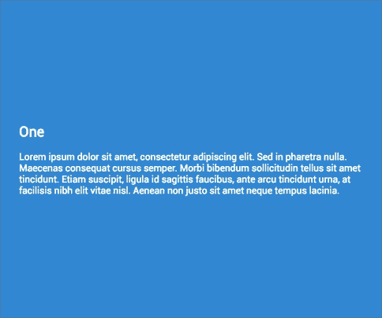

# 模块周一 11:滚动魔术，多图像上传，订阅部分及更多

> 原文：<https://dev.to/tyrw/module-monday-11-scroll-magic-multi-image-upload-subscribe-section--more-5g77>

## 你可以在任何地方使用的五个开源网站模块

下面的一切都是开源的，可以在你选择的任何项目中免费使用。Anymod 是一项为您的网站或网络应用快速添加功能的服务。

单击一个 mod 来查看它的运行及其源代码。

### 卷轴魔法一

滚动时出现的彩色内容窗格。
[查看 mod](https://anymod.com/mod/bkkkk?v=20)
  

### 多张图片上传

轻松上传图片，与 Cloudinary 配合使用。
[查看 mod](https://anymod.com/mod/dbbbr?v=20)
  

### 订阅章节(MailChimp)

允许访问者订阅您的 MailChimp 列表。
[查看 mod](https://anymod.com/mod/rdddb?v=20)
  

### 不屑一顾的警惕

可编辑的警告部分，通知用户你想去的地方。
[查看 mod](https://anymod.com/mod/lrrra)
  

### 脸书喜欢按钮

经典的喜欢按钮，没有麻烦。
[查看 mod](https://anymod.com/mod/kbbbm)
  

* * *

Anymod 支持开发者和开源，Module Mondays 是我们回馈开发者社区的一种方式，有助于建立一个更加开放、包容的网络。

我每周一都会在这里发布新的模块——我希望你会觉得它们有用！

快乐编码✌️