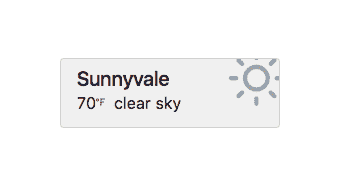
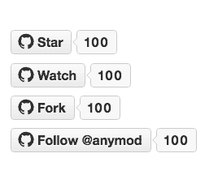

# 模块 16:悬停翻转画廊，环形导航，实时天气和更多

> 原文：<https://dev.to/tyrw/module-monday-16-hover-flip-gallery-ring-nav-live-weather--more-i9f>

## 任何网站的快速功能

以下所有内容都是开源的，可以在任何网站、web 应用程序或其他任何地方免费使用。Anymod 可以让你快速添加这些功能。

单击一个 mod 来查看它及其源代码。

### 环形导航

扩展循环链接:编辑内容、颜色和数量。
[查看 mod](https://anymod.com/mod/lmlrm?v=20)
  

### 悬停翻转图库

悬停时，每个图像都会翻转。每个图像都有一个链接。
[查看 mod](https://anymod.com/mod/rbaba?v=20)
  

### 各城市实时天气

添加您的城市和一个 OpenWeatherMap 键，它就可以工作了。
[查看 mod](https://anymod.com/mod/bbabd?v=20)
  

### Gif 卡

在带有链接的经典卡片布局中添加 gif。
[查看 mod](https://anymod.com/mod/nbknn?v=20)
  

### GitHub 按钮

配置星形、观察形、分叉形或跟随形。链接到您的帐户或回购。
[查看 mod](https://anymod.com/mod/aklmr?v=20)
  

* * *

我每周一都会在这里贴上新的 MODS-我希望你会觉得它们有用！

快乐编码✌️