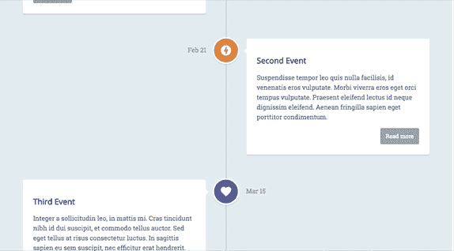
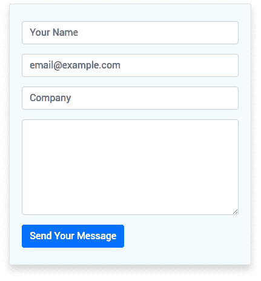
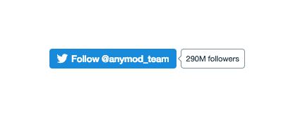
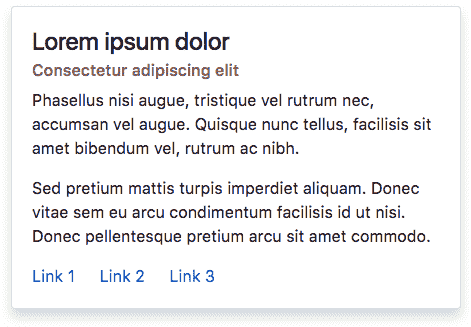

# 模块周一 7:动画时间线、大小合适的图像、公司联系表格等

> 原文：<https://dev.to/tyrw/module-monday-7-animated-timeline-right-sized-image-company-contact-form--more-26kl>

## 开源代码&适用于任何网站或网络应用的特性

每周一我都会发布免费的开源 mods，你可以用它来为你的网站或网络应用快速添加功能。

下面的一切都是开源的，可以在你选择的任何项目中免费使用。Anymod 是一项让你轻松构建&并添加这些功能的服务。

单击一个 mod 来查看它的运行及其源代码。

### 动画时间轴

添加和编辑事件来讲述您的故事。
[查看 mod](https://anymod.com/mod/nmnko?v=30)
  

### 大小合适的图像

由屏幕尺寸决定的图像分辨率:用于高质量和快速的移动下载。
[查看 mod](https://anymod.com/mod/kbadr?v=20)
  

### 公司联系方式

自动工作:公司联系你的简单方法。
[查看 mod](https://anymod.com/mod/lraln?v=30)
  

### 推特跟随按钮

添加您的用户名，然后就完成了。
[查看 mod](https://anymod.com/mod/mlbao?h1=1&h2=1)
  

### 带链接的基本卡片

一个简单的文本卡片，有可编辑的内容和链接。
 [
T8】](https://anymod.com/mod/enbmb?h1=50&h2=100&v=20)

* * *

Anymod 支持开发者和开源，Module Mondays 是我们回馈开发者社区的一种方式，有助于建立一个更加开放、包容的网络。

我每周一都会在这里发布新的模块，希望你会觉得有用！

快乐编码✌️