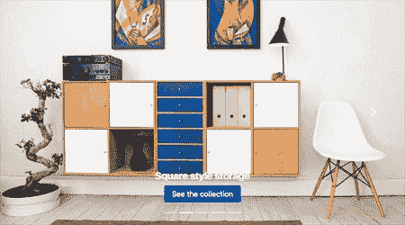
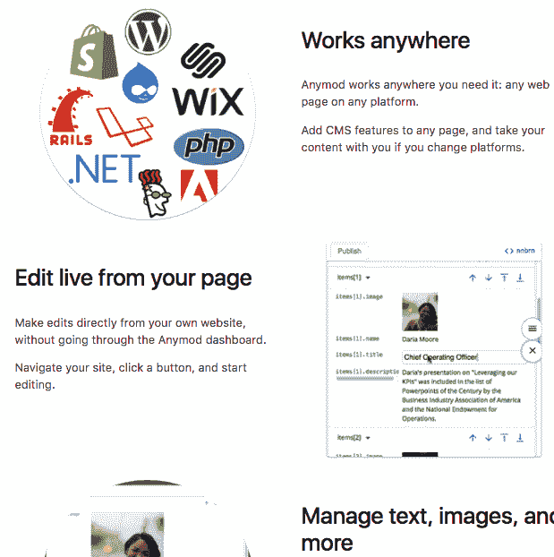
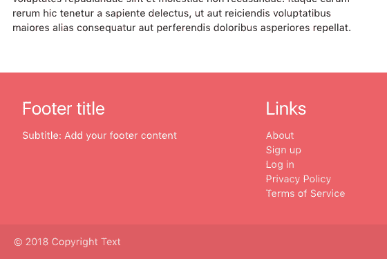
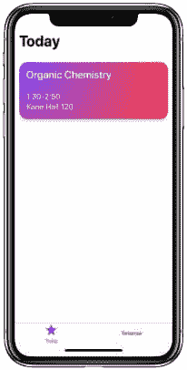

# 周一模块:轮播幻灯片，粘滞页脚，电话覆盖等

> 原文：<https://dev.to/tyrw/module-monday-carousel-slideshow-sticky-footer-phone-overlay-more-4o1i>

Mods 是功能强大、随时可用的网络模块，适用于任何平台上的任何网站。

## 开源:fork 或 copy +随处使用

下面所有的 mod 都是由 Anymod 开源的，可以在你选择的任何项目中免费使用，无论是否在 Anymod 上。

我们支持开发者和开源，模块星期一是我们回馈开发者社区的一种方式，有助于培养一个更加开放、包容的网络。我们希望你喜欢！

### 转盘滑块

带有自定义图像的响应式滑块。
[查看 mod](https://anymod.com/mod/dbdkb?v=20)
  

### 特征部分

带有交替文本和图像的页面(我们在 anymod.com 使用它🤓)
[查看 mod](https://anymod.com/mod/rdoll?v=20)
  

### 粘页脚

可重复使用的页脚停留在任何窗口大小的页面底部。
[查看 mod](https://anymod.com/mod/ondrb?v=20)
  

### 手机图像叠加

上传您的图像，它会显示在手机屏幕上。
[查看 mod](https://anymod.com/mod/rdoal?v=20)
  

### 团队页面

可编辑的团队部分，自动裁剪图像。
[查看 mod](https://anymod.com/mod/moalk?v=20)
  

## 投稿

如果你想贡献 mod 或想法，让其他开发者受益，你可以[请求 mod](https://guide.anymod.com/v1/community/requests.html)或[提交 mod](https://guide.anymod.com/v1/community/contributing.html) 。

每周一我会在这里发布新的模块[——我希望你会觉得它们有用！](https://dev.to/tyrw)

快乐编码✌️