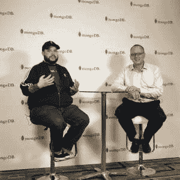
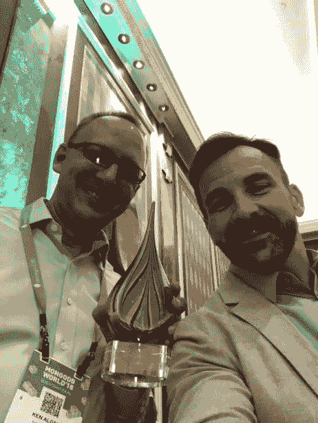

# MongoDB World 2018 回顾与回顾

> 原文：<https://dev.to/kenwalger/mongodb-world-2018-a-review-and-retrospective-1816>

每年 [MongoDB](https://www.mongodb.com) 都会举办一场名为 MongoDB World 的会议。2018 年，会议于 6 月 26 日和 27 日重返纽约市和中城希尔顿酒店。有很多令人兴奋的公告，要参加的会议，要见的人。

与 2000 多名与会者相比，我的经历略有不同。我收到了一些不同活动的邀请，并在几个不同的会议上做了介绍。我想用这篇帖子来谈谈我在 MongoDB World 2018 的经历。希望它能为你提供一些参加明年活动的动力。或者，如果去纽约太远，可以参加当地的 MongoDB 社区活动。

## MongoDB 世界日 2018 年 6 月 1 日至 26 日

会议的第一天有几个不同的产品。首先，有全天的实践研讨会。这使得人们可以获得一些详细的、亲身体验 MongoDB 的机会。话题从数据建模到安全性。虽然我没有参加这些会议，但我从其他人那里听到了关于他们的好消息。

那么我是如何度过 MongoDB World 2018 第一天的呢？MongoDB 的开发者权益团队进行了一天的学习。它还提供了对一些关键团队成员的访问。 [Jay Gordon](https://twitter.com/jaydestro) 是我们开发者宣传日的主持人，他在议程上做得很好。MongoDB 团队访问和以职业为导向的谈话很好地结合在一起。

### MongoDB 世界开发者宣传日

几名 MongoDB 员工在那天的大部分时间都在那里，包括 [Michael Lynn](https://twitter.com/mlynn) (开发者权益全球总监)[Joe Drumgoole](https://twitter.com/jdrumgoole)(EMEA 开发者权益总监)和 [Aydrian Howard](https://twitter.com/aydrianh) (开发者权益)。在这个只接受邀请的会议上，他们回答了大约 60 名开发者的问题。此外，与会的几位 MongoDB 大师也很乐意与他们交谈。此外，见到来自全国各地和世界各地的人是令人兴奋的。

#### 技术

有几个会议涵盖了 MongoDB 的许多产品，如 [Stitch](https://www.kenwalger.com/blog/nosql/mongodb/mongodbs-baas-offering-stitch/) 和 [Atlas](https://www.kenwalger.com/blog/nosql/mongodb/mongodb-atlas/) 。 [Francesca Krihely](https://twitter.com/francium) 提供了一些关于 [MongoDB 加速器项目](https://www.mongodb.com/startup-accelerator)的精彩信息，很值得了解。

我们有机会邀请到 MongoDB 的联合创始人兼首席技术官 Elliot Horowitz 参加我们在 T2 的问答环节。他回答了几个关于 MongoDB 过去、现在和未来的问题。这是许多重大公告发布的前一天，因此许多答案的范围相当广泛。但是，在这种紧密团结的环境中接触霍洛维茨先生是令人敬畏的。

另一个很棒的会议是 MongoDB 产品和工程师的小组讨论。这提供了另一个难得的机会来回答关于特定产品特性的问题。此外，它允许我们了解 MongoDB 提供的各种产品的一些内部情况。

#### 面向职业的讨论

###### 照顾你的工程经理

来自 [Slack](https://slack.com/) 的 Jenna Zeigen 提供了一个很好的话题，讲述了作为一个工程部门的个人贡献者应该考虑的事情。听到她作为前经理的真知灼见真是太好了。点击这里查看她的幻灯片。

###### 烙印

Brandy Morgan 做了一个关于社交媒体营销的内容丰富的演讲。她讲述了管理企业和个人品牌需要做和考虑的事情。她做得很好，通过一些技巧来增加一个人的社交媒体存在。如果你对这样做感兴趣，她将在 2018 年 9 月推出一家新公司和网站，提供建议。现在就报名参加 creatorscode.co 的[活动，或者点击这里](http://www.creatorscode.co/)查看[的演讲。](https://www.linkedin.com/feed/update/urn:li:activity:6419623184194166784/)

###### 社区参与

我给这群开发者做了一个演讲。主题是参与社区以促进你的职业发展。我谈到了我在 MongoDB 社区的旅程，一些参与的方式，以及这种参与如何有利于您的职业生涯。包括我自己生活中的个人例子。幻灯片可在[这里](https://www.slideshare.net/KenAlger1/getting-involved-in-the-mongodb-community-to-advance-your-career-104456406)获得，我很乐意回答任何关于如何开始的问题。

MongoDB 世界日 2–2018 年 6 月 27 日

###### 会话

林恩先生和我在周三的第一次会议上做了一个报告。话题是*MongoDB&NodeJS:80 分钟内从零到英雄*。会谈中出现了一些计划外的技术问题，使得我们不得不中途改变演示计划。然而，我们成功了，并收到了一些对整个会议的积极反馈。如果你感兴趣，你可以在这里探索 GitHub [仓库，了解更多关于 Node.js 和 MongoDB 的信息。](https://github.com/kenwalger/mdbw18)

###### 视频采访

杰伊·戈登再次抓住我进行了一次简短的坐下来的采访，讨论我对这次活动的想法。

<figure> 

<figcaption>杰·戈登(左)&肯·w·阿尔杰访谈</figcaption>

</figure>

###### 创新奖

大会结束后的周三晚上， [2018 创新奖](https://dev.to/mongodb/2018-mongodb-innovation-award-winners-39c3-temp-slug-161675)颁奖典礼举行。MongoDB 认可公司“使用 MongoDB 实现大梦想，提供令人难以置信的大胆创新的解决方案，推动行业发展，改善生活。”

埃森哲、查尔斯·施瓦布和比特币基地等公司因其由 MongoDB 支持的创造性和创新性开发解决方案而获奖。和他们一起呆在房间里感觉很棒。了解 MongoDB 是如何被利用的总是很有趣。

了解 7-11 如何利用 T2 地图集是非常有趣的。医疗设备提供商 Humana 因其物联网类别的实施而获奖。作为一个对物联网感兴趣的人，我觉得这很有趣

<figure> 

<figcaption>2018 年威廉佐拉社区卓越奖。Ken W. Alger(左)与 MongoDB</figcaption>

</figure>

全球开发者权益总监 Michael Lynn(右)

# 总结起来

MongoDB World 2018 是一个壮观的事件。他们还没有宣布 MongoDB 2019 将在哪里。无论在哪里，我都强烈建议你参加。

[](http://www.facebook.com/sharer.php?u=https%3A%2F%2Fwww.kenwalger.com%2Fblog%2Fnosql%2Fmongodb%2Fmongodb-world-2018-review-retrospective%2F&t=MongoDB%20World%202018%20a%20Review%20and%20Retrospective&s=100&p%5Burl%5D=https%3A%2F%2Fwww.kenwalger.com%2Fblog%2Fnosql%2Fmongodb%2Fmongodb-world-2018-review-retrospective%2F&p%5Bimages%5D%5B0%5D=https%3A%2F%2Fi0.wp.com%2Fwww.kenwalger.com%2Fblog%2Fwp-content%2Fuploads%2F2018%2F07%2Fworld2018.png%3Ffit%3D125%252C125%26ssl%3D1&p%5Btitle%5D=MongoDB%20World%202018%20a%20Review%20and%20Retrospective)

帖子 [MongoDB World 2018 回顾与回顾](https://www.kenwalger.com/blog/nosql/mongodb/mongodb-world-2018-review-retrospective/)最早出现在肯·w·阿尔杰的[博客上。](https://www.kenwalger.com/blog)