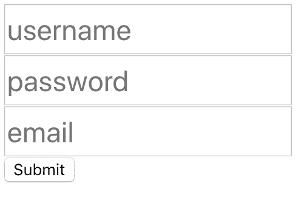

# Mongoose 模式指南

> 原文：<https://dev.to/mcarpenter/mongoose-schemas-guide-fh>

Mongoose 是 Node 的对象数据建模器(ODM)。它为您提供了一个简单的验证和查询 API 来帮助您与 MongoDB 数据库进行交互。把 mongose 想象成一个组织者，当数据从客户机返回时，mongose 根据你的模型(模式)验证和构造你的数据。您将始终知道数据库中存储了哪些数据以及存储的方式。让我们看一个例子。

### 什么是图式？

上面我提到了结构和验证，这是你的猫鼬模式。假设您的页面上有一个注册表单。您可能不希望用户名中包含某些字符，或者您可能希望确保电子邮件地址在存储到数据库中时是有效的。

本教程假设你知道如何使用 NPM 或纱在你的项目中包含猫鼬。

我们首先要求猫鼬。

```
//import mongoose NPM module
import mongoose from "mongoose";

// Save a reference to the Schema constructor `mongoose.model`
let Schema = mongoose.Schema; 
```

Enter fullscreen mode Exit fullscreen mode

上面我们使用了模式构造函数`mongoose.schema`，并将其保存在一个名为`Schema`的变量中。

下面我们创建一个`new` `Schema`，并命名为`UserSchema`。

```
const UserSchema = new Schema({
  // `username` must be of type String
  // `username` will trim leading and trailing whitespace before it's saved
  // `username` is a required field and throws a custom error message if not supplied
  username: {
    type: String,
    trim: true,
    required: "Username is Required"
  },
  // `password` must be of type String
  // `password` will trim leading and trailing whitespace before it's saved
  // `password` is a required field and throws a custom error message if not supplied
  // `password` uses a custom validation function to only accept values 6 characters or more
  password: {
    type: String,
    trim: true,
    required: "Password is Required",
    validate: [
      function(input) {
        return input.length >= 6;
      },
      "Password should be longer."
    ]
  },
  // `email` must be of type String
  // `email` must be unique
  // `email` must match the regex pattern below and throws a custom error message if it does not
  email: {
    type: String,
    unique: true,
    match: [/.+@.+\..+/, "Please enter a valid e-mail address"]
  }
}); 
```

Enter fullscreen mode Exit fullscreen mode

上面，我们告诉我们的模式如何验证和存储我们的数据。我们基本上是在说，我期待下面的信息回来。你的用户名必须是一个字符串，它会删除你的字符串前后的所有空格，或者在你提交空白时抛出一个错误。

### 创建您的模型&导出

```
// This creates our model from the above schema, using mongoose's model method
let User = mongoose.model("User", UserSchema);

// Export the User model
module.exports = User; 
```

Enter fullscreen mode Exit fullscreen mode

### 使用模型

[T2】](https://res.cloudinary.com/practicaldev/image/fetch/s--UT7PhqkX--/c_limit%2Cf_auto%2Cfl_progressive%2Cq_auto%2Cw_880/https://thepracticaldev.s3.amazonaws.com/i/kbcu3i8tuqf18v6hwwe4.png)

因此，您已经在前端创建了一个简单的登录，并在后端创建了一个 post 路由，通过 mongoose 将数据存储在我们的 mongoDB 中。看看下面我们的邮政路线。我们创建了一个`User`的`new`实例，并传入了`req.body`。我们`create`在数据库中创建一个新文档，如果信息无效，将`user`返回给客户端或一个错误。

```
const User = require("./userModel.js");

app.post("/submit", function(req, res) {
         /*req.body {
             username: "mongod", 
             password: "pass123", 
             email: "none@none.com"
            } 
  Create a new user using req.body (this data came from the client)*/
  let user = new User(req.body);

  User.create(user)
    .then(function(dbUser) {
      // If saved successfully, send the the new User document to the client
      res.json(dbUser);
    })
    .catch(function(err) {
      // If an error occurs, send the error to the client
      res.json(err);
    });
}); 
```

Enter fullscreen mode Exit fullscreen mode

### 结论

Ta-Da，我们刚刚创建了一个 mongoose 模式，并使用它来验证存储在 mongoDB 中的数据。在构建 mongoDB 时，这是一个非常有用的工具，您可以完全控制输入的内容以及内容到达后的存储方式。感谢阅读！