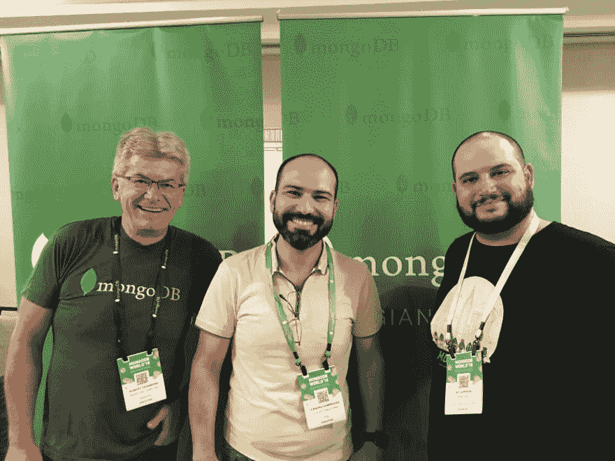

# 蒙戈沃世界连续四年！

> 原文：<https://dev.to/delbussoweb/mongoworld-pelo-4-ano-consecutivo-a1c>

这是私人恩怨吗 blz？今天我在纽约纽约的布赖恩特公园写作我在镇上的第二个星期，而且很酷，除了美元以外！rssss(消歧义)

上周在纽约举行的 MongoWorld 第五届大会上，我连续四年有机会参加这次活动！这是非常好的。

### 宣传日

在“核心活动”的前一天，为合作伙伴和宣传中心成员举办了一系列独特的活动。

我参加了宣传日，这一天充满了以 Jay Gordon 为首的社区为中心的内容( [@jaydestro](https://dev.to/jaydestro) 。我们在 4.0 版中讨论了实现交易的过程，了解了 Stitch 和 Compass 的开发团队 Q &，这是与创始人 Eliot Horowitz 独家合作的，我们可以在其中了解 mongodb 作为产品和公司的发展方向，最后还会与 Brandy 一起讨论数字存在问题

除此之外，我还能见到朋友，亲自见见那些只说 Linkedin 或 Slack 的人，交新朋友。哦，是吗-我...。他们还干杯，顺便说一句，很不错，其中一个是装有传感器的物联网工具包(我保证使用)！

### 展览厅

展览馆也很不错。充满蒙戈布合作伙伴演示产品的解决方案和应用程序。突出介绍 NetApp，他们出席了我的朋友 Rodrigo nacio((@ logwriter)的超级棒的演讲，并作出了贡献，感谢 Amazon Dot！我还强调了 dbKoda 的存在，我见到了工具的创建者 Guy Harrison，看到了所有可用资源的非常酷的演示，这也是一个关于它的帖子的承诺。

除了所有合作伙伴之外，我们的工程团队成员还准备好向专家提问或讨论解决方案，更不用说蒙戈大学的展位，以及蒙戈布本身的一个非常酷的空间(衬衫、帽子、刺绣和许多网络)。

说到网络，它就在那个亭子里。无论是在看台之间散步还是和伙伴们喝啤酒，很多人聊天，很多想法换衣服，最后-我...。一个很好的空间！我发现 Dani Monteiro (@danimonteirodba)正在现场直播，讲述事件的来龙去脉，甚至亚当·托托内(Adam tonte(@ adamotomate)也阻止了我，让我谈论 percona 和其他的事情！

### 注释记号和轨道

第二天一切都很早就开始了早餐和两次会议都在我的日程表上讨论交易。我了解了构建这一新功能的整个团队，并了解了他们在来到这里之前所面临的挑战。

在 keynote 中，我们有几个客户使用 mongbod 讲述他们的案例，有些客户如何解决了各种性能或可扩展性问题，甚至有些客户将 mongbod 升级到了我不知道的程度！这些客户是 CEO Dev Ittycheria (@dittycheria)介绍的。

在这些使用案例之后，等待已久的 mongb4 4.0 功能的广告出现了，而我只是在等待交易。我告诉你，包裹里有很多东西！

1.  多文档 ACID 事务
2.  聚合管道生成器没有 MongoDB 指南针
3.  $convert 运算符
4.  MongoDB Stitch 查询
5.  MongoDB 缝合函数
6.  MongoDB 缝合触发器
7.  MongoDB 图表
8.  全球书写的蒙戈布地图集
9.  mongodb 免费监控云服务[请看这里如何实施](https://www.youtube.com/watch?v=GZ4R5BmQcoY)
10.  MongoDB Mobile

这些是本版本中的一些内容，接下来几周我将逐一详细介绍，并向大家展示。

### 然后就结束了

是的，这两天很不错，我只需要感谢邀请和机会今年多参加。就像我说的，下周我在镇上还有更多的事情要做，而且有一个惊人的消息，只是我只打算在星期一发言！

Abs，下次见！

### 照片

