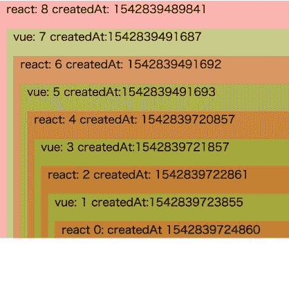
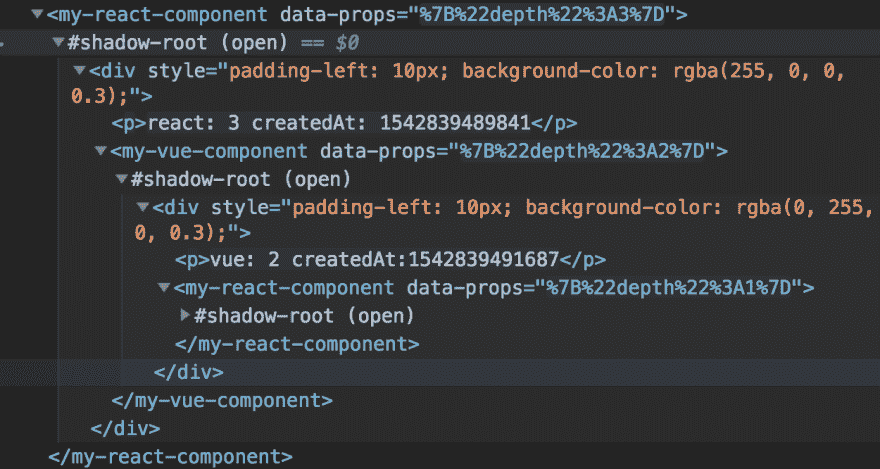

# 在 react with webcomponents 中挂载 vue 组件

> 原文：<https://dev.to/mizchi/mount-vue-component-in-react-with-webcomponents-3dcn>

我尝试帮助者通过 webcomponents 挂载 react 和 vue 组件。

[https://github.com/mizchi/wc-helpers](https://github.com/mizchi/wc-helpers)

我的目标是尝试微前端。

```
import {
  vueElementFactory,
  reactElementFactory,
  encodeProps
} from "@mizchi/wc-helpers";

// register
customElements.define("my-react-component", reactElementFactory(MyReactApp));
customElements.define("my-vue-component", vueElementFactory(MyVueApp));

// run
const state = { a: 0 };
const encoded = encodeProps(state);
document.body.innerHTML = `
  <my-react-component data-props="${encoded}"></my-react-component>
  <my-vue-component data-props="${encoded}"></my-vue-component>
`; 
```

## 装上另一个平台

*   my-react-component(深度=n) => my-vue-component(深度=n-1)
*   my-vue-component(深度=n) => my-react-component(深度=n-1)

[T2】](https://camo.githubusercontent.com/962476ebcc8ed34d034d1bf767babd7b3ff7752e/68747470733a2f2f6779617a6f2e636f6d2f30616461626236303064643530376462326163303239313965613233613032662e676966)

超文本标记语言

[T2】](https://res.cloudinary.com/practicaldev/image/fetch/s--BnHyhJLO--/c_limit%2Cf_auto%2Cfl_progressive%2Cq_auto%2Cw_880/https://i.gyazo.com/08d8a34a99f7e1f417f1ae7314ef5807.png)

代码

```
import Vue from "vue";
import Component from "vue-class-component";
import React from "react";
import { vueElementFactory, reactElementFactory, encodeProps } from "..";

// Vue
@Component({
  props: ["depth"]
})
class MyVueApp extends Vue {
  now: number = Date.now();
  render(h: any) {
    const depth = parseInt(this.$props.depth, 10);
    if (depth > 0) {
      return h(
        "div",
        {
          style: {
            paddingLeft: "10px",
            backgroundColor: "rgba(0, 255, 0, 0.3)"
          }
        },
        [
          h("p", {}, `vue: ${depth} createdAt:${this.now}`),
          h("my-react-component", {
            attrs: {
              "data-props": encodeProps({ depth: depth - 1 })
            }
          })
        ]
      );
    } else {
      return h(
        "p",
        {
          style: {
            paddingLeft: "10px",
            backgroundColor: "rgba(0, 255, 0, 0.3)"
          }
        },
        `vue: 0 - createtAt:${this.now}`
      );
    }
  }
}
customElements.define("my-vue-component", vueElementFactory(MyVueApp));

// React
class MyReactApp extends React.PureComponent<{ depth: string }> {
  now: number = Date.now();
  render() {
    const h = React.createElement;
    const depth = parseInt(this.props.depth, 10);
    if (depth > 0) {
      return h(
        "div",
        {
          style: {
            paddingLeft: "10px",
            backgroundColor: "rgba(255, 0, 0, 0.3)"
          }
        },
        h("p", {}, `react: ${depth} createdAt: ${this.now}`),
        h("my-vue-component", {
          "data-props": encodeProps({ depth: depth - 1 })
        })
      );
    } else {
      return h(
        "p",
        {
          style: {
            paddingLeft: "10px",
            backgroundColor: "rgba(255, 0, 0, 0.3)"
          }
        },
        "react 0: createdAt " + this.now
      );
    }
  }
}
customElements.define("my-react-component", reactElementFactory(MyReactApp));

// run
// const root = document.querySelector(".root");

let state = { depth: 4 };
const entry = document.createElement("my-react-component");
entry.setAttribute("data-props", state.depth.toString());
document.body.appendChild(entry);

setInterval(() => {
  state = { depth: state.depth + 1 };
  entry.setAttribute(
    "data-props",
    encodeProps({ depth: (state.depth % 6) + 3 })
  );
}, 1000); 
```

## 工作原理

*   将 json 编码为安全字符串
*   定义组件
*   听听`data-props`的`attributeChangedCallback`
*   重新渲染

参见实现(114 行)[https://github.com/mizchi/wc-helpers/blob/master/index.ts](https://github.com/mizchi/wc-helpers/blob/master/index.ts)

## 为什么`wc-helper`需要编码

WebComponents 仅将属性作为字符串。如果需要处理事件处理程序，试试`lit-html`和`lit-html/lib/lit-extended`。

[https://github.com/Polymer/lit-html](https://github.com/Polymer/lit-html)