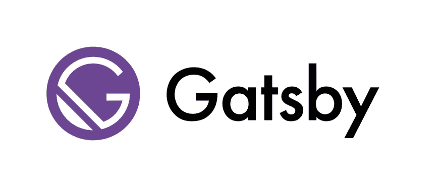

# 从 create-react-app 迁移到 Gatsby.js

> 原文：<https://dev.to/khaled_garbaya/moving-from-create-react-app-to-gatsbyjs-447c>

[T2】](https://res.cloudinary.com/practicaldev/image/fetch/s--smUIENk---/c_limit%2Cf_auto%2Cfl_progressive%2Cq_auto%2Cw_880/https://images.ctfassets.net/4x6byznv2pet/B8BpyFB720SAM8qW68qgY/0b2020576a2d44640a9de1302b6e9ff8/businessman-2108029_1280.jpg)

create-react-app 是一个构建 cli，它帮助你引导一个新的 react app，而不需要配置工具。像[网络包](https://github.com/webpack/webpack)或者[巴别塔](https://github.com/babel/babel)。

> 它们是预先配置和隐藏的，因此您可以专注于代码。

如果你遇到盖茨比，你会注意到他们之间有很多相似之处。在这篇博文中，我将解释两者之间的主要区别。

## 盖茨比是什么？

[T2】](https://res.cloudinary.com/practicaldev/image/fetch/s--KgKoZw94--/c_limit%2Cf_auto%2Cfl_progressive%2Cq_auto%2Cw_880/https://images.ctfassets.net/4x6byznv2pet/4OW1X9ex1mImko8G4w4WAK/a16fceab310b718c7f375a760c4e1e16/logo-gatsby-0603eb9dd6bdfec9599dbc7590f891be-347ea.jpg)

Gatsby 是一个速度极快的静态站点生成器。其实还不止这些。可以把它想象成一个 PWA(渐进式 Web 应用程序)框架，其中包含了最佳实践。举例来说:你得到现成的代码和数据分割。

## 为什么要搬到盖茨比身边？

[T2】](https://res.cloudinary.com/practicaldev/image/fetch/s--P4FH1HcS--/c_limit%2Cf_auto%2Cfl_progressive%2Cq_auto%2Cw_880/https://images.ctfassets.net/4x6byznv2pet/3KWkbincyQaSCOE2SIkS88/4e89a683e737c99688d662cd7786468d/tools-864983_1280.jpg)

让我们使用现代的 web stack，而不用担心设置问题。凭借其灵活的插件系统，它可以让你带来自己的数据源。像[内容丰富的](https://contentful.com)，数据库或者你的文件系统。

当你建立你的 Gatsby.js 网站时，你最终会得到静态文件。它们很容易部署在许多服务上，比如 Netlify T1、T2、亚马逊 S3 T3 等等。

Gatsby.js 提供了现成的代码和数据拆分。它首先加载关键的 HTML 和 CSS。加载后，它会为其他页面预取资源。这样点击起来感觉很快。

Gatsby.js 使用 React 组件作为视图层，因此您可以跨页面/项目共享和重用它们。一旦它加载了页面的 javascript 代码，你的网站就变成了一个完整的 React 应用。

Gatsby.js 使用 [GraphQL](https://graphql.org/learn/) 跨页面共享数据。您只能在页面中获得您需要的数据。在构建时，Gatsby 将解析查询并将其嵌入到您的页面中。

## Gatsby.js 项目文件夹结构

```
├── LICENSE
├── README.md
├── gatsby-config.js
├── gatsby-node.js
├── node_modules
├── package-lock.json
├── package.json
├── src
│   ├── layouts
│   ├── pages
│   └── templates
└── static 
```

Enter fullscreen mode Exit fullscreen mode

## 从 React Routes 到 Gatsby 页面

[T2】](https://res.cloudinary.com/practicaldev/image/fetch/s--42V52MzH--/c_limit%2Cf_auto%2Cfl_progressive%2Cq_auto%2Cw_880/https://images.ctfassets.net/4x6byznv2pet/3PdoKQ8J1uscaW0s2IMuEo/8bce2e060e4a6ec7791c9fe8d6e2cfb6/road-601871_1280.jpg)

有两种类型的路线，静态当你知道所有的部分将定义你的路线像`/home`。而当你的路线的一部分像`blog/:slug`一样只有在运行时才知道的时候就是动态的。

让我们假设在我们的 create-react-app 项目中有以下静态路由:

```
<Route exact path='/' component={Home}/>  
<Route path='/blog' component={Blog}/>  
<Route path='/contact' component={Contact}/> 
```

Enter fullscreen mode Exit fullscreen mode

在 Gatsby.js 中，要拥有这些路由，您需要在 pages 文件夹中创建一个名称类似于 route path 的组件。它会为您创建路线。好消息是 react 组件已经创建好了，所以只需要复制/粘贴它们。除了主页之外，你需要把它命名为 index.js。你最终会得到这样的结果

```
├── LICENSE
├── README.md
├── gatsby-config.js
├── gatsby-node.js
├── node_modules
├── package-lock.json
├── package.json
├── src
│   ├── layouts
│   ├── pages
│   │    ├──  index.js
│   │    ├──  blog.js
│   │    ├──  contact.js
│   └── templates
└── static 
```

Enter fullscreen mode Exit fullscreen mode

现在您已经转换了静态路由，让我们来处理动态路由。

在这种情况下，我将以从 Contentful 加载的博客帖子为例。每篇博文都有一个 uniq slug 用于加载其内容。

在一个普通的 react 应用程序中，路线看起来像这样。

```
<Route path='/blog/:slug' component={BlogPost}/> 
```

Enter fullscreen mode Exit fullscreen mode

您的`BlogPost`组件看起来会像这样:

```
// a function that request a blog post from the Contentful's API  
import { getBlogPost } from './contentful-service'
import marked from 'marked'

class BlogPost extends Component {

  constructor(...args) {
    super(args)
    this.state = { status: 'loading', data: null }
  }
  componentDidMount() {
    getBlogPost(this.props.match.slug)
      .then((data) => this.setState({ data }))
      .catch((error) => this.setState({ state: 'error' }))
  }
  render() {
    if (!this.state.status === 'error') {
      return <div>Sorry, but the blog post was not found</div>
    }
    return (
      <div>
        <h1>{this.state.data.title}</h1>
        <div dangerouslySetInnerHTML={{ __html: marked(this.state.data.content) }} />
      </div>
    )
  }
} 
```

Enter fullscreen mode Exit fullscreen mode

要在 Gatsby.js 中动态创建页面，您需要在`gatsby-node.js`文件中编写一些逻辑。要想了解在构建时可以做些什么，请查看 Gatsb.js Node.js API [文档。](https://www.gatsbyjs.org/docs/node-apis)

我们将使用 [createPages](https://www.gatsbyjs.org/docs/node-apis/#createPages) 函数。

按照令人满意的例子，我们需要为每篇文章创建一个页面。要做到这一点，首先我们需要获得所有博客帖子的列表，并根据它们的 uniq slug 为它们创建页面。

代码将如下所示:

```
const path = require("path");

exports.createPages = ({ graphql, boundActionCreators }) => {
  const { createPage } = boundActionCreators
  return new Promise((resolve, reject) => {
    const blogPostTemplate = path.resolve(`src/templates/blog-post.js`)
    // Query for markdown nodes to use in creating pages.  
    resolve(
      graphql(
        `  
     {  
       allContentfulBlogPost(limit: 1000) {  
         edges {  
           node {  
               slug  
           }  
         }  
       }  
     }  
   `
      ).then(result => {
        if (result.errors) {
          reject(result.errors)
        }

        // Create blog post pages.  
        result.data.allContentfulBlogPost.edges.forEach(edge => {
          createPage({
            path: `${edge.node.slug}`, // required  
            component: blogPostTemplate,
            context: {
              slug: edge.node.slug // in react this will be the `:slug` part  
            },
          })
        })

        return
      })
    )
  })
} 
```

Enter fullscreen mode Exit fullscreen mode

因为您已经有了 BlogPost 组件，所以形成您的 react 项目。移动到`src/template/blog-post.js`。

您的 Gatbsy 项目将如下所示:

```
├── LICENSE
├── README.md
├── gatsby-config.js
├── gatsby-node.js
├── node_modules
├── package-lock.json
├── package.json
├── src
│   ├── layouts
│   ├── pages
│   │    ├──  index.js
│   │    ├──  blog.js
│   │    ├──  contact.js
│   └── templates
│   │    ├──  blog-post.js
└── static 
```

Enter fullscreen mode Exit fullscreen mode

您需要对您的 Blogpost 组件做一些小小的修改。

```
import React from "react";

class BlogPost extends React.Component {
  render() {
    const post = this.props.data.contentfulBlogPost;

    return (
      <div>
        <h1>{post.title}</h1>
        <div dangerouslySetInnerHTML={{ __html: post.content.childMarkdownRemark.html }} />
      </div>
    );
  }
}

export default BlogPost

export const pageQuery = graphql`
 query BlogPostBySlug($slug: String!) {  
   contentfulBlogPost(fields: { slug: { eq: $slug } }) {  
     title

      content {

        childMarkdownRemark {

          html

       }

      }  
   }  
 }  
` 
```

Enter fullscreen mode Exit fullscreen mode

注意在创建页面时通过上下文传递的`$slug`部分，以便能够在 GraphQL 查询中使用它。

Gatsby.js 将选择导出的`pageQuery`常量，并通过`graphql`标记知道它是 GraphQL 查询字符串。

## 从 React 状态到 GraphQL

[T2】](https://res.cloudinary.com/practicaldev/image/fetch/s--aLFXdA25--/c_limit%2Cf_auto%2Cfl_progressive%2Cq_auto%2Cw_880/https://images.ctfassets.net/4x6byznv2pet/xodXA1B5OCGKW6eAkqi8e/47789915812c2ab95512f97efb1fcb79/files-1614223_1280.jpg)

我不会深入讨论如何管理一个反应状态，因为有很多方法可以实现。有新的 [React 16 上下文 API](https://reactjs.org/docs/context.html) 或使用 [Redux](https://github.com/reduxjs/react-redux) 等...使用 Gatsby.js，您可以使用 GraphQL 数据层请求所需的数据，如前面的示例所示。该选项仅在根组件中可用。这将在 v2 中使用静态查询特性来改变。GraphQL 不够用的话还可以用 [Redux 搭配 Gatsby.js](https://github.com/gatsbyjs/gatsby/tree/master/examples/using-redux) 看你用。

## 部署

[T2】](https://res.cloudinary.com/practicaldev/image/fetch/s--6v5PRY0S--/c_limit%2Cf_auto%2Cfl_progressive%2Cq_auto%2Cw_880/https://images.ctfassets.net/4x6byznv2pet/2xjoMXpIKoAwAM4sqeOCcA/721945e76b4b5861476a9ce8781a326c/server-2160321_1280.jpg)

由于 Gatsby.js 构建了“静态”文件，因此您可以在大量服务上托管它们。我最喜欢的一部电影是《网上生活》。还有 [AWS S3](https://aws.amazon.com/s3/) 等等。

## 资源

*   [内容丰富的教程](https://howtocontentful.com/)
*   [Contentful 的盖茨比视频系列](https://www.contentful.com/blog/2018/02/28/contentful-gatsby-video-tutorials/)
*   [盖茨比入门文档](https://www.gatsbyjs.org/docs/)