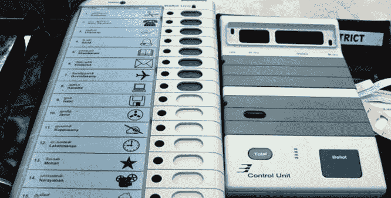
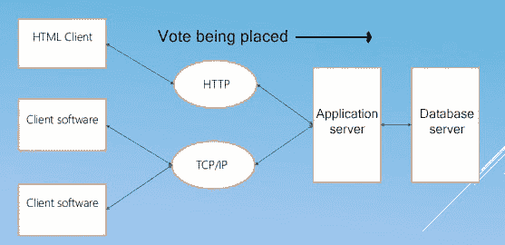
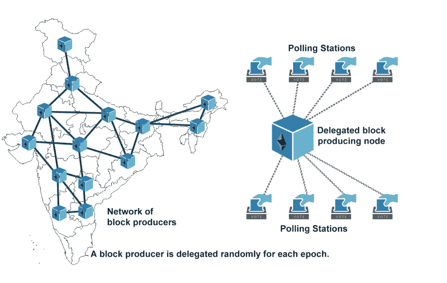

# 在区块链上为 10 亿人设计投票系统(上)

> 原文：<https://dev.to/prnthh/muchain---designing-a-voting-system-for-1-billion-on-the-blockchain---part-1-4ab1>

选举国家管理机构的投票制度是民主的核心概念。在其最早的形式中，斯巴达人通过向有标记的碗中投掷石块来民主选举他们的领袖。今天，我们使用“尖端”技术来进行这些至关重要的选举程序，但由于利害攸关的是对人口的控制，选举继续成为一个意图夺取权力的恶意候选人的容易目标。随着最近区块链的复兴以及对去中心化、共识和 Merkle 树的兴趣增加，也许我们现在更有能力解决大规模投票的技术。

## 投票过去

 每台机器可容纳 3840 张选票，投票机由人工运送到中央投票委员会进行计票。这一过程既困难又耗时，而且也有报道称该程序容易出现人工错误或故意数错 [1](https://www.firstpost.com/politics/how-does-india-count-its-millions-of-votes-all-you-need-to-know-1523733.html) 。

最近，印度选举委员会设计了一个名为“选民可核实的书面审计跟踪”(VVPAT)的系统，该系统将选民的选择印在一张物理收据上，收据在投入密封箱之前会短暂展示。这使投票人知道投票是正确的，并解决了之前的担忧，即选票被投给了潜在作弊机器上的默认候选人。此外，书面记录将增加计票过程中的责任，除非，不知何故，大量的人会错过:^).

该系统的主要优势在于:
a .硬件设计非常坚固，即使在偏远地区断电时也可以使用 6 伏碱性电池。
b .投票离线，所有机器归还给负责防止选民舞弊的选举委员会。
c .印度人对纸质的可验证系统更有信心，因为他们觉得纯粹基于软件的解决方案更容易被操纵。

它不止于此。尼泊尔、不丹、纳米比亚和肯尼亚已经购买了印度制造的 EVM，打算在全国选举中使用。我开始担心，更多地依赖劳动密集型的人工计数过程可能不是最好的出路。

此外，我们也应该避免在您的注册投票选区中实际识别您自己的手动身份验证方法，这可能会允许人们在自己的家乡为候选人投票，即使他们正在旅行，这可能会大大增加投票率。

## 软件投票

 
在传统的投票系统中，投票在客户端进行(或者是专用的，或者是通过网站)，然后将选择提交给服务器，服务器上的中央数据库会跟踪所有的投票。每张选票都存储在数据库中，因此可以重新计算所有选票，而不是仅仅用计数器跟踪每个候选人的选票。这使得更容易验证没有发生选民欺诈，例如没有重复投票或没有投票。由于投票在发送到服务器之前不会被放置，因此我们可以确保服务器验证投票者的身份和选择以防止欺诈。

虽然软件应用程序的任何更明显的安全问题都可能适用，但一些更特定于领域的问题是:

1.  单个投票服务器将不能处理来自同时放置的许多投票的负载。我们将需要使用分片或允许选民把选票放在许多服务器之一。
2.  随着投票服务器数量的增加，确保服务器之间没有重复投票变得更加困难。
3.  攻击者可以通过网络伪造投票机的签名并进行未经授权的投票。

## 为什么要用区块链？

区块链架构为我们的许多关键问题提供了出色的解决方案:

1.  高容量:由于投票是分散的，投票可以放在网络的节点上，不需要一个中央服务器承担所有的负载。
2.  Merkle trees:可以确保只有最长的验证投票链被接受，从而很难放置未授权的投票或修改已经放置的投票。
3.  冗余:在投票时会创建多个投票结果的精确副本。有必要在所有冗余服务器上假装投票。

区块链在中本聪比特币中的最初实现使用了一种称为工作证明的技术，以向链中添加新的区块。这种方法要求网络上的所有矿工解决一个困难的数学问题以获得奖励，同时还将所有以前的交易添加到链中。这可能是非常密集的，我的一个教授沾沾自喜地告诉我，这将花费卢比。250 在全国宣传一个战俘区块链的投票。

共识是确保每个节点都同意所有已投票的过程，并且它们的分类帐是完全相同和更新的。在各种 ico 和专注于加密货币的创业公司的聚光灯下，更快地达成大规模共识是一个问题。这将导致更快的交易确认，这可能会使我们更接近完美的解决方案。目前，确认一笔比特币交易需要 15-30 分钟，这是整整半个小时的时间来怀疑你是否将它发送到了错误的地址，或者至少接收方在访问它之前必须等待的时间。相比之下，Visa 每秒可以处理大约 24000 笔交易。这还差不多。

## 委托股权证明

委托利益证明(DPoS)是一种较快的共识算法，由 EOS 令牌使用。他们声称在 21 台“授权”服务器上每秒钟确认 3，000 笔交易。利害关系证明的问题是，EOS 的目标不是在所有可用节点上达成共识。在每个确认回合(称为 epoch)中，随机选择一个服务器作为“块生产者”，该节点负责创建新块并将其发送给所有其他代表。然后，块生成器会统计放在它上面的所有投票，并将其发送给所有其他代表进行确认。如果任何未经授权的节点试图不按顺序提议一个块，该块将被其对等节点拒绝，因为只有为每个时期选择的代表才被允许提议一个块。

可以为投票提出类似的体系结构，投票机充当常规节点，一组专用服务器充当投票确认的代表。
[T3】](https://res.cloudinary.com/practicaldev/image/fetch/s--a9s-VZ7n--/c_limit%2Cf_auto%2Cfl_progressive%2Cq_auto%2Cw_880/https://thepracticaldev.s3.amazonaws.com/i/qp8u0e1mo5dd7x1jhiot.png)

当网络向链中添加一组投票时，随机选择一个“代表”来确认组成当前组的投票的有效性。然后，该块被传播给所有其他代表，以就已经放置的投票达成共识。恶意参与者将不得不绕过投票人身份验证方法，并成功地将无效投票放在随机选择的代理服务器上。

通过将投票确认工作分配给多个代表，我们可以平均分配投票过程中面临的负载。通过在每个时期确定性地选择块生产者，我们可以确保系统在某些代表经历过载或意外故障的情况下保持冗余。通过这种方式，我们将设计一个容错系统，大大简化投票过程。

我以前从未真正写过这样的文章，我不太确定如何写结论，所以我在寻找建议和反馈:)

在[第 2 部分](https://dev.to/prnthh/designing-a-voting-system-for-1-billion-on-the-blockchain-part-2---how-to-keep-a-secret-1l1g)中，我们讨论了投票过程，包括选民认证、生物特征哈希、离线投票。