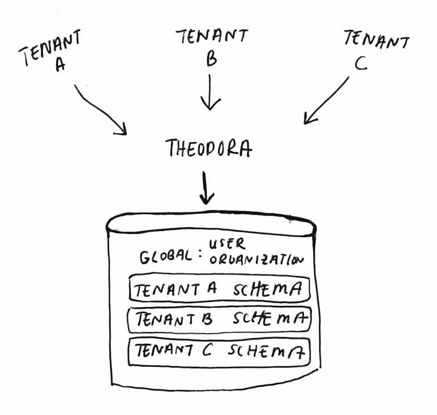
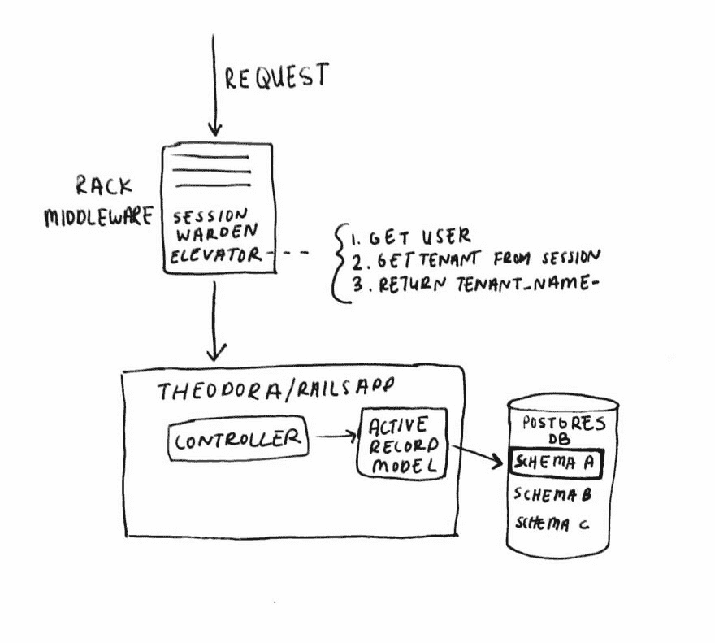

# Rails 中的多租户与公寓

> 原文：<https://dev.to/ketoaustin/multi-tenancy-in-rails-with-apartment-3h6e>

我正在为非营利组织管理开发一个具有多租户功能的 [Rails 应用。这意味着应用程序的单个实例将支持多个独立的用户。今天，我们将讨论如何使用带有会话的](https://codehannah.nyc/theodora)[公寓](https://github.com/influitive/apartment)库来配置多租户。

[T2】](https://res.cloudinary.com/practicaldev/image/fetch/s--Vx9T-YJ6--/c_limit%2Cf_auto%2Cfl_progressive%2Cq_auto%2Cw_880/https://i.imgur.com/rfUkqo9.png)

## 什么是多租户？

多租户是一种允许应用程序在一个系统上运行多个客户端的设计架构。因此，您可以让多个客户(客户==租户==非营利管理组织)登录同一个软件。Slack、Discord 和 Trello 就是多租户应用的例子。以下是多租户软件的一些主要特征:

*   每个租户的数据隔离
*   针对每个租户的定制
*   面向所有客户的通用基础架构

> 注意:多租户可以很棒，但有时你并不需要它。例如，如果您正在构建一个主要思想是共享数据的社交网络平台，那么您不需要使用多租户来分离数据。

[T2】](https://res.cloudinary.com/practicaldev/image/fetch/s--OGuCvnCX--/c_limit%2Cf_auto%2Cfl_progressive%2Cq_auto%2Cw_880/https://i.imgur.com/HPBBuhI.jpg)

## 公寓入门

Apartment 让您可以轻松地基于租户隔离数据，从而帮助您添加多租户。要使用 Apartment，您需要将它添加到您的 Gemfile 中，然后使用`bundle exec rails generate apartment:install`运行安装任务。现在，你已经准备好开始使用公寓。

## 创建租户

为了选择租户，我们必须首先创建一个租户。由于租户直接映射到提奥多拉的组织，因此在创建组织时创建租户是有意义的。为此，我简单地使用了一个`after_create` ActiveRecord 回调，该回调使用 Apartment 来创建租户。

```
class Organization < ApplicationRecord
  has_many :organization_users
  has_many :users, through: :organization_users

  after_create :create_tenant

  def tenant_name
    "organization_#{self.id}"
  end

  private

  def create_tenant
    Apartment::Tenant.create(self.tenant_name)
  end
end 
```

Enter fullscreen mode Exit fullscreen mode

## 配置公寓

当你安装这个 gem 时，它会创建`config/initializers/apartment.rb`文件作为配置文件。有很多旋钮可以调节，但是对于我们的基本用法，我们只需要触及最基本的。

### 设置多租户模型

在提奥多拉，每个租户都有自己的模式，但共享同一个数据库。一些多租户应用程序为每个帐户使用单独的数据库，或者通过用唯一的 id 分隔数据来使用限定范围的访问。我使用 Apartment 和 Postgres 通过模式分离方法隔离我的数据。使用模式进行分离提供了强大的数据隔离，并允许为每个租户单独运行迁移，这意味着一次要迁移的数据较少。

创建的模型是 Organization、User 和 OrganizationUser，它们都在全局模式中(Postgres 中的“public”)。这些模型是全球性的，因为它们都与租用有关(租户名称来自组织名称)，或者与谁有权访问租户有关。一旦我完成了多租户支持，我将能够充实应用程序的其余部分，这将被隔离到所选的租户。

> 例如:一个单独的赠款管理者可能在称为伞式组织的非营利组织中工作，在伞式组织中，多个具有重叠使命的非营利组织将作为一个组织运作，但可能接收和报告单独的赠款。例如，一个名为“儿童中心”的组织可能有三个地方项目，在三个不同的全州办公室下运行，如儿童宣传中心(CAC)、CASA(法院指定的特别倡导者)、家庭暴力热线(DVH)，它们都作为一个组织存在，因为它们的使命都与服务虐待受害者有关。授权经理需要能够无缝地访问所有组织，而不需要重复的帐户。

您可以在下面看到包含在全局名称空间中的模型包含在下面。您还可以看到模式分离的配置是如何由`tenant_name`决定的，它是从组织名中派生出来的。

```
Apartment.configure do |config|
  config.excluded_models = %w{Organization User OrganizationUser}
  config.tenant_names = -> { Organization.all.map(&:tenant_name) }
end 
```

Enter fullscreen mode Exit fullscreen mode

```
 def tenant_name
    "organization_#{self.id}"
  end 
```

Enter fullscreen mode Exit fullscreen mode

### 配置中间件

[T2】](https://res.cloudinary.com/practicaldev/image/fetch/s--RupPCUTa--/c_limit%2Cf_auto%2Cfl_progressive%2Cq_auto%2Cw_880/https://i.imgur.com/R0DfSEO.jpg)

使用公寓时，你通常会使用电梯。在公寓中，电梯根据每个请求帮助配置选定的租户。电梯是在 HTTP 请求到达 Rails 应用程序之前运行的机架中间件。使用子域多租户方法是非常常见的
, Apartment 内置了对这种方法的支持。然而，由于我将在一个免费的
Heroku 服务器上托管这个应用程序，所以我不想为获得一个定制的通配符 SSL 证书来安全运行这个应用程序而纠结。因此，我需要
定制如何选择租户，所以我使用了`Apartment::Elevators::Generic`，它允许您选择自己的策略。

由于选择的租户自然是用户与应用程序会话的一部分，我决定使用请求会话来跟踪他们正在使用哪个租户。下面，我检查以确保用户使用 Warden 登录，并且已经选择了一个租户。然后，我
查找租户(一个组织)，范围是当前用户，以确保他们有权选择租户。最后，如果找到授权的
组织，我将租户名称返回给公寓使用。对于请求的其余部分，任何 ActiveRecord 调用将被隔离到从该电梯返回的租户
。由于我使用 Postgres，这意味着发送到数据库的所有查询将被限制在租户的 Postgres 模式中，这就像一个存放表的文件夹。

```
Rails.application.config.middleware.insert_after Warden::Manager, Apartment::Elevators::Generic, -> (request) { 
  if request.env['warden'].user && request.session[:selected_organization_id]
    org_id = request.session[:selected_organization_id]
    current_user = request.env['warden'].user

    if org_id.present?
      org = current_user.organizations.find_by(id: org_id)
      org.tenant_name if org
    end
  end
} 
```

Enter fullscreen mode Exit fullscreen mode

### 设置租户

用户登录后，系统会提示他们选择要管理的组织。这由前面提到的电梯
使用，它在每个请求上设置租户(和 Postgres 模式)。这里，我简单地获取发送到服务器的 ID，并将其设置在电梯所期待的
会话密钥中。

```
class TenantSelectorController < ApplicationController
  def index
    @organizations = current_user.organizations
  end

  def create
    org = current_user.organizations.find(params[:id])
    session[:selected_organization_id] = org.id

    redirect_to root_path
  end
end 
```

Enter fullscreen mode Exit fullscreen mode