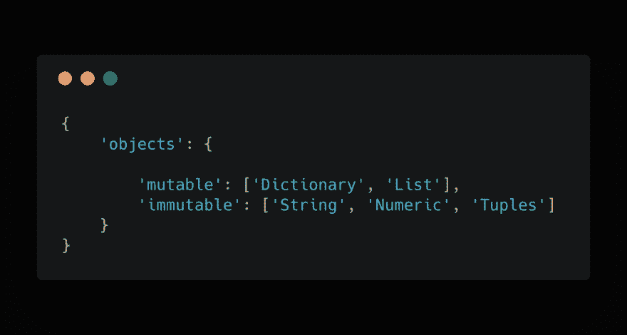
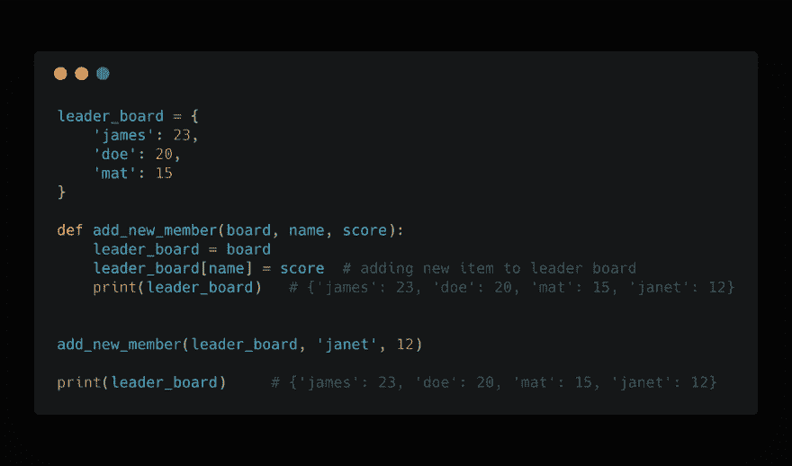
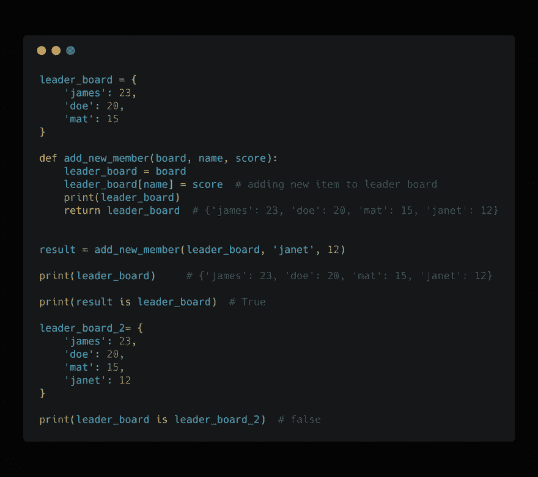

# 可变对象与 Python 函数。

> 原文：<https://dev.to/adekoder/mutable-objects-vs-python-functions-1dhd>

我们知道 python 中的每一个事物都是一个对象，可以分为可变和不可变，其中可变对象是构造后状态可以改变的对象，而不可变对象是构造后状态不能改变的对象。

 

<figcaption>代码片段由[https://carbon . now . sh](https://carbon.now.sh)</figcaption>

python 中的 Dictionary 和 List 都是可变的，因此在作为参数传递给函数时要小心，因为它们是通过引用传递的，而不是通过值传递的，这意味着当作为参数传递给函数时，对象是被引用的，并且不会创建对象的副本，这可能会导致错误，具体取决于您试图用代码实现什么。

下面是一个代码片段，用来理解当你将一个可变对象传递给一个函数时会发生什么。

 

<figcaption>代码片段由[https://carbon . now . sh](https://carbon.now.sh)</figcaption>

在上面的代码片段中，我有一个变量 **"leader_board"** ，它引用了一个保存排行榜分数数据的 dictionary 对象，还有一个向我的排行榜添加新成员的函数，函数 **"add_new_member"** 接受排行榜的 dictionary 对象、新成员的名字和分数，当这个函数被调用并在 **"leader_board"** 对象中传递时，新成员的名字 **('janet')** 和分数

> **leader_board[name] = score**

上面这个状态在函数中添加了一个新的键:值对数据到内存中的 leader board 对象。

当函数 **"add_new_member"** 被调用时，它引用内存中的 leader_board 对象，并在我们得到的函数中打印 leader_board 时就地更改值。

> { '詹姆斯':23，'多伊':20，'马特':15，'珍妮特':12}

同样，当 leader_board 对象在函数之外打印时，我们得到相同的结果。为了确认这一点，让我们通过更新代码来运行一个对象测试，从函数中返回 leader_board，并使用 **"is"** 操作符来进行对象测试。

 

<figcaption>代码片段由[https://carbon . now . sh](https://carbon.now.sh)</figcaption>

> 打印(结果是 leader_board)

上面的语句将返回 True，因为 **"is"** 操作符正在检查两个操作数(即 result 和 leader_board)是否引用同一个对象并且值相等。

我还在下面的代码库中添加了一个新的代码块，以显示 **"is"** 操作符实际上做了它所做的事情**" print(leader _ board is leader _ board _ 2)"**将返回 False，因为两者在内存中是不同的对象，即使它们有相同的数据，它们也必须引用相同的对象。