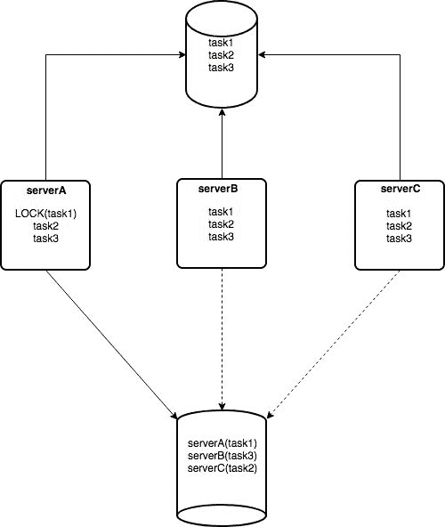

# 使用 go 和 consul 的互斥

> 原文：<https://dev.to/mariomazo/mutual-exclusion-using-go-and-consul-4gf6>

# 互斥工人利用戈朗和执政官

实现互斥的工人是有趣和有用的。在这篇文章中，我将展示如何使用客户端[leader election](https://www.consul.io/docs/guides/leader-election.html)with consult 来实现这种模式(不要在产品中使用)。

我选择 consul 来完成这个任务的原因是因为它已经在我们的基础设施中可用，但是同样的事情也可以通过不同的工具来实现，例如`AWS dynamoDB`。基本上你只需要一个支持锁的`Key-Value`商店。

文章中的所有代码片段都来自于一个 github repo 示例,在这里你可以找到完整的实现。

## 问题

我们有一个`job`服务器，它每小时会连接到一个 postgreSQL 数据库，读取一些任务，然后继续执行上一小时创建的任务，如果任务成功完成，它会写回数据库。

这样做的问题是它不能扩展。这些工作开始花费越来越长的时间，如果机器崩溃，所有的任务都无法执行

## 解-互斥工人(分布式锁)

我们知道我们需要运行作业服务器的多个实例。但是每个任务只能执行一次。所以我们决定用`distributed locks`搭配`consul`。经过快速搜索，我们意识到实现[领导人选举](https://www.consul.io/docs/guides/leader-election.html) *算法*是我们的最佳解决方案。

所以整个概念很简单。所有的作业服务器都获得一个要执行的任务列表，然后它们遍历任务列表，在任务
上获得一个`lock`，这样所有其他的作业服务器都跳过这个任务，继续下一个任务。这样，我们可以让多个节点同时处理不同的任务。

[T2】](https://res.cloudinary.com/practicaldev/image/fetch/s--xrPjfyQv--/c_limit%2Cf_auto%2Cfl_progressive%2Cq_auto%2Cw_880/https://raw.githubusercontent.com/mario-mazo/mutual-exclusion-consul/master/assets/mutual-exclusion.jpg)

在图像中，我们看到`serverA`锁定`task1`并且*执行*任务，用实线箭头将它发送到管道中。`ServerB`和`ServerC`有虚线箭头，我的意思是`task1`不能被那两个服务器执行。稍后`serverB`会锁定另一个任务，依此类推。

### 客户端领导人选举

[领袖选举](https://www.consul.io/docs/guides/leader-election.html) *算法*非常简单，只需两步:

*   在咨询中创建会话
*   尝试在该会话中添加一个`Lock`。如果你成功了，你就是`leader`如果没有...你不是`leader`

#### *步骤 1:* 创建会话

首先，我们将围绕会话创建创建一个小的包装器函数。因此，不管我们是否能完成特定的任务，我们总是会创建一个会话。

```
func (ec *exclusiveWorker) createSession() error {
    sessinConf := &api.SessionEntry{
        TTL:      ec.sessionTimeout,
        Behavior: "delete",
    }

    sessionID, _, err := ec.client.Session().Create(sessinConf, nil)
    if err != nil {
        return err
    }

    fmt.Println("sessionID:", sessionID)
    ec.sessionID = sessionID
    return nil
} 
```

Enter fullscreen mode Exit fullscreen mode

我们将把配置参数传递给 [go consul 客户端](https://github.com/hashicorp/consul/api)

*   这是会议的暂停时间。这段时间过后，执政官将执行*行为*。我已经为这个例子设置了`15s`

*   `Behavior`:这个`delete`行为意味着在达到 TTL 之后，会话被删除，与之相关的密钥也被删除

如果你想更好地理解`behaviors`是如何工作的，请阅读官方的[咨询会议](https://www.consul.io/docs/internals/sessions.html)文档。但主要观点是:

> 如果正在使用释放行为，则释放与会话相关联的任何锁，并递增该项的 ModifyIndex。或者，如果使用删除行为，对应于任何持有的锁的键被简单地删除。这可以用来创建由 Consul 自动删除的临时条目。

#### *第二步:*获取会话

一旦我们有了一个会话，我们就试图获得这个会话。如果我们成功了，在它上面放一个`Lock`并返回*成功*。我们是领导者。如果我们未能获得锁，这意味着*任务*已经被另一个服务器执行了。这是相互排斥发生的地方。

同样，我们将把它封装在一个简单的函数中，以便于处理

```
func (ec *exclusiveWorker) acquireSession() (bool, error) {
    KVpair := &api.KVPair{
        Key:     ec.key,
        Value:   []byte(ec.sessionID),
        Session: ec.sessionID,
    }

    aquired, _, err := ec.client.KV().Acquire(KVpair, nil)
    return aquired, err
} 
```

Enter fullscreen mode Exit fullscreen mode

我们需要向 consul 客户端传递 3 个值

*   `Key`:这是任务的标识符。为了遵循惯例，我选择了`service/<TASK_NAME>/leader`，但也可以是更符合您需求的任何东西。我真的想过用`service/<APP_NAME>/<TASK_NAME>`。
*   当你使用 consul 进行分布式锁定时，这并不重要。为了便于调试，我选择了当前的`sessionID`(不过是一个 UUID)。但很可能是`rambo`或`goku`
*   `Session`:是我们将要尝试*锁定*的会话的 ID

### *第三步:*

没有第三步。这就是领袖选举的全部内容。但是我们仍然需要几个助手函数，我们需要用一种更真实的方式来完成这项工作。

#### 销毁会话

一旦我们的任务完成，我们必须友好地释放锁。我们可以等待`TTL`和`beahvior`开始工作，但这并不好。因此，让我们实现
一个基本的销毁会话函数，我们可以在任务完成时调用它，我们所需要的只是 sessionID。

```
func (ec *exclusiveWorker) destroySession() error {
    _, err := ec.client.Session().Destroy(ec.sessionID, nil)
    if err != nil {
        erroMsg := fmt.Sprintf("ERROR cannot delete key %s: %s", ec.key, err)
        return errors.New(erroMsg)
    }

    return nil
} 
```

Enter fullscreen mode Exit fullscreen mode

#### 更新会话

如果任务占用的时间超过了`TTL`，会话和密钥将被`behavior`删除。如果发生这种情况，不同的服务器可能锁定完全相同的任务，您将执行两次相同的任务，这是我们试图避免的。

所以我们需要不断更新会话以避免触发`behavior`。consul 客户机附带了一个方便的函数`RenewPeriodic()`来做这件事。所以让我们写包装:

```
func (ec *exclusiveWorker) renewSession(doneChan <-chan struct{}) error {
    err := ec.client.Session().RenewPeriodic(ec.sessionTimeout, ec.sessionID, nil, doneChan)
    if err != nil {
        return err
    }
    return nil
} 
```

Enter fullscreen mode Exit fullscreen mode

这里我们需要三样东西:

*   `sessionTimeout`:这是原来的`TTL`。客户端将使用它来刷新每个`TTL/2`的会话
*   `sessionID`:我们想要更新的会话的 Id
*   `doneChan`:通道是我们使用的信号，表示我们需要继续更新会话，或者如果我们关闭通道，则表示我们已完成任务，不再需要更新会话

## 演示

在附带的 [github repo](https://github.com/mario-mazo/mutual-exclusion-consul) 中有一个完整的工作实现。它也很简单，是为了学习目的而设计的。
你需要一个 work go 安装程序来编译代码，还需要`docker`和`docker-compose`来运行 consul 服务器。让我们来看看演示:
第一次启动领事

```
$ docker-compose up 
```

Enter fullscreen mode Exit fullscreen mode

然后打开两个终端，在第一次运行代码时，您应该会看到类似这样的内容:

```
$ go run main.go
sessionID: bac7cf19-285e-9907-98ad-e8189a07cbd9
I can work. YAY!!!
Starting to work 
```

Enter fullscreen mode Exit fullscreen mode

您现在可以检查 consul [的 web 界面 http://localhost:8500/ui/dc1/kv](http://localhost:8500/ui/dc1/kv)
来验证密钥是由`TTL`创建、锁定和销毁的，或者是完成任务，或者是中断任务。

在第二个例子中，如果你运行代码，你可以看到任务执行时代码退出

```
$ go run main.go
sessionID: d0f26b95-11cb-236c-bba7-601441f2ae74
I can NOT work. YAY!!!
$ 
```

Enter fullscreen mode Exit fullscreen mode

如果你通过做`Ctrl+C`来中断任务，你应该看到清理正在进行

```
$ go run main.go
sessionID: 4685d391-251d-9f6d-1c2c-5ab6fdbd9f98
I can work. YAY!!!
Starting to work
^C2018/09/13 11:16:04 Job interrupted. Cleaning up 
```

Enter fullscreen mode Exit fullscreen mode

如果您尝试在任务完成后立即连接，您会发现无法连接。这是由于咨询文件的[会议](https://www.consul.io/docs/internals/sessions.html)部分中记录的`lock-delay`。

## 最后的想法

我邀请您查看 github repo ,因为那里的代码充满了关于实现的注释，可能对真正的实现有用。

还有一些东西我没有实现，比如`stop()`或者`Discovering the Leader`，但是实现应该很简单。请随意提交拉动式需求。

## 链接

*   [https://www.consul.io/docs/guides/leader-election.html](https://www.consul.io/docs/guides/leader-election.html)
*   [https://www.consul.io/docs/internals/sessions.html](https://www.consul.io/docs/internals/sessions.html)
*   [https://github.com/mario-mazo/mutual-exclusion-consul](https://github.com/mario-mazo/mutual-exclusion-consul)