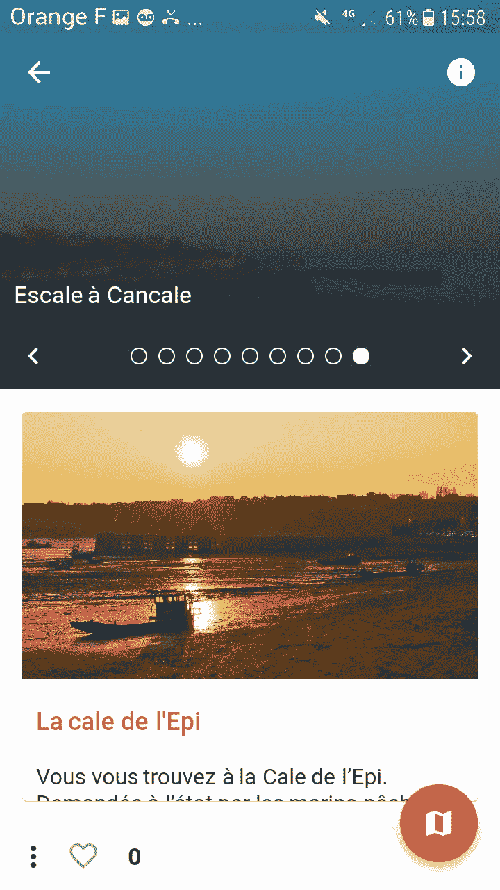

# 我的颤振应用

> 原文：<https://dev.to/eimji/my-application-with-flutter-m3m>

你好，

我是一个全栈开发者，主要以 Nodejs 为后端，Angular(网页)和 Swift(iOS)为前端。几个月前，我开始学习 Flutter 和 Dart，我终于有了一个分享徒步旅行路线或旅行日记的社交网络应用程序。我为黑客马拉松开发了我的应用程序。
下面是链接
[安卓版本](https://play.google.com/store/apps/details?id=com.orange.labs.spilhenn)
T5】iOS 版本

[T2】](https://res.cloudinary.com/practicaldev/image/fetch/s--84lUuXBi--/c_limit%2Cf_auto%2Cfl_progressive%2Cq_auto%2Cw_880/https://thepracticaldev.s3.amazonaws.com/i/tbkxb4rsmm0pzo5hjq3t.png)

没有完全被颤动说服。有了 Flutter，Android 就比 iOS 好用了(也可能我漏掉了什么，我应该改进我的代码！有人对颤振有经验吗？我希望得到你的反馈来讨论你对颤振的看法。