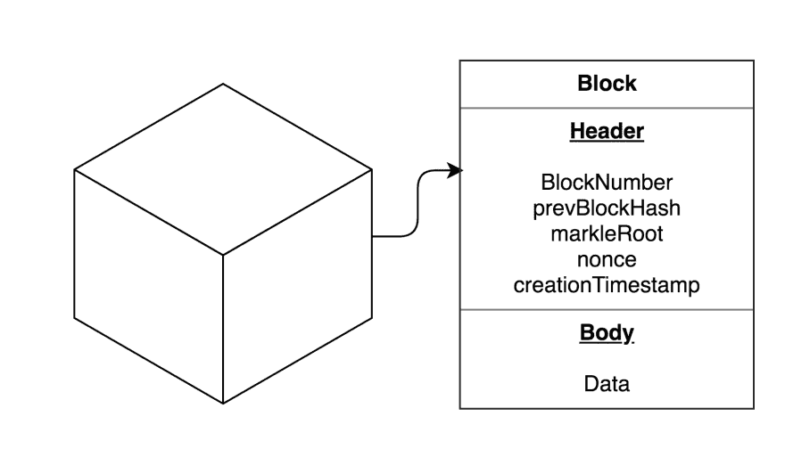
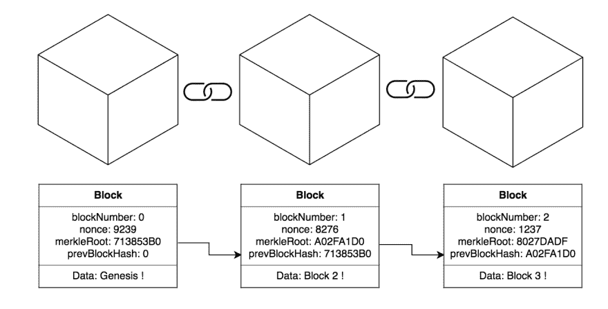

# 解释区块链基础知识

> 原文：<https://dev.to/gmfcastro/my-best-shot-explaining-blockchain-4873>

通过对区块链的研究，我致力于更深入地理解什么是区块链以及它是如何运作的。当然，你们中的许多人可能已经知道它是什么，但是我将与你们分享我到目前为止所学到的。

# 简单的话是什么？

区块链是一个虚拟的账本，其中的每个记录都是一个区块。记录分布在网络中，每个人都可以读写，但不能改变其中的信息。为了更好地理解这一点，让我们先了解什么是块，块里面有什么，然后了解块如何与其他块连接。对于这个解释，我将解释基于比特币实现的区块链。

# 解剖一块

每个块包含一个头和一个体。

[T2】](https://res.cloudinary.com/practicaldev/image/fetch/s--RNhkqjst--/c_limit%2Cf_auto%2Cfl_progressive%2Cq_auto%2Cw_880/https://thepracticaldev.s3.amazonaws.com/i/ps5ay7rlfco877p7eua7.png)

这些是每个区块拥有的数据。除此之外，每个块都有一个由开发者定义的最大字节数。当达到此最大值时，该块将被添加到区块链，并开始创建新的块。我将在下面解释每一项。

#### 块号

区块链中的每一个方块都有一个数字，代表你在链条中的位置。添加到链中的第一个块有一个特殊的名字，它们被称为**创世纪块**。

#### PrevBlockHash

每个块在标题中都有前一个块散列号的参考。这真的很重要，因为这是区块链保持一致和控制不变性的方法。
创世纪块，没有任何引用前一个块的内容，因为它是第一个块。

#### 香椿

merkleRoot 是块内所有事务的散列结果。如果块内有任何更改，这个散列也会更改，并使更改的块和下一个块无效。现在你可能想知道:为什么这个字段被称为 MerkleRoot 而不是 blockHash？这是因为比特币使用 [Merkle 树](https://en.wikipedia.org/wiki/Merkle_tree)从区块数据中生成散列。

#### Nonce

这是一个 32 位的数字，与区块的开采过程相关。该数字仅用于查找与区块链难度匹配的哈希一次。稍后我会写一些关于采矿的东西，希望这能让你更清楚。

#### 创造时间戳

这是块创建的时间戳。

#### 数据

所有交易数据都保存在这里。

## 散列法

我讲了很多关于哈希的内容，对吗？这里使用的是哪种哈希算法？这实际上取决于区块链的每个实现，但对于我在这里谈到的情况，这应该是一个单向散列算法。比特币使用 256 位长度的 SHA-256(安全哈希算法)。如果你想了解更多: [SHA-2](https://en.wikipedia.org/wiki/SHA-2)

现在我们知道了块中有什么，使用了什么类型的散列，让我们看看它是如何在区块链中的。

# 区块链

这里是我们将块通过 prevBlockHash 链接在一起的地方，如下所示。

[T2】](https://res.cloudinary.com/practicaldev/image/fetch/s--C4LeSuVE--/c_limit%2Cf_auto%2Cfl_progressive%2Cq_auto%2Cw_880/https://thepracticaldev.s3.amazonaws.com/i/a521yws9wrjbjz9tn482.png)

merkleRoot 值是从数据信息中生成的，如果其中有任何变化，merkleRoot 也将发生变化，并且在发生变化的块之后链接 prevBlockHash 的其余块将不再有效。这就是为什么区块链是不变的。

我认为这是一个良好的开端，如果你想了解更多，有一个非常好的网站，你可以用来玩一玩，更好地理解我在这里说的话:[安德斯区块](https://anders.com/blockchain/block.html)和[安德斯区块链](https://anders.com/blockchain/blockchain.html)。你也可以阅读来自比特币匿名创造者中本聪的《T4》白皮书。

希望这篇文章能帮助你更多地了解区块链，在我的下一篇文章中，我会解释一下区块链网络。