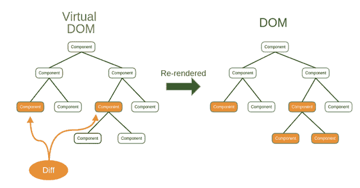

# 我收集的 React 面试问题(第一部分)

> 原文：<https://dev.to/migueloop/my-collection-of-react-interview-questions-part-13-1d0b>

[第一部分](https://dev.to/migueloop/my-collection-of-react-interview-questions-part-13-1d0b)
[第二部分](https://dev.to/migueloop/my-collection-of-react-interview-questions-part-23-540a)
第三部分

# +10 面试问题直接从我的金库里反应过来

从最典型的问题开始，问一些会让你大吃一惊的问题。我们走吧。目标是给出简明扼要的答案

> ### 1。 **What is a reaction?**

React 是脸书在 2011 年开发的前端 JavaScript 库。

*   它遵循基于组件的方法，这有助于构建可重用的 UI 组件。
*   它用于开发复杂的交互式 web 和移动 UI。
*   尽管它在 2015 年才开源，但它拥有最大的社区之一来支持它。

> ### 2。 **What are the characteristics of React?**

*   它使用虚拟 DOM 而不是真实的 DOM。
*   它使用服务器端渲染。
*   它遵循单向数据流或数据绑定

> ### 3。 **What is the difference between React and other JS frameworks?**

这里要注意的有趣事实是，ReactJS 只是一个前端库，而不是一个完整的框架，它处理 MVC(模型-视图-控制器)的视图组件。

此外，在 React 中，一切都是组件。考虑一个乐高房子作为一个完整的应用。然后将每个乐高积木与一个作为积木的组件进行比较。这些块/组件被集成在一起以构建一个更大的动态应用程序。

> ### 4。 **What is your understanding of virtual DOM? Explain how it works.**

虚拟 DOM 是一个轻量级的 JavaScript 对象，它最初只是真实 DOM 的副本。它是一个节点树，将元素、它们的属性和内容作为对象及其属性列出。React 的渲染函数从 React 组件中创建一个节点树。然后，它更新该树，以响应由用户或系统所做的各种动作引起的数据模型中的突变。

这个虚拟 DOM 通过三个简单的步骤工作:

1.  每当底层数据发生变化时，整个 UI 都会以虚拟 DOM 表示重新呈现。
2.  然后计算以前的 DOM 表示和新的 DOM 表示之间的差异。
3.  一旦计算完成，真正的 DOM 将只更新实际发生变化的内容。

[T2】](https://res.cloudinary.com/practicaldev/image/fetch/s--rorQuVGd--/c_limit%2Cf_auto%2Cfl_progressive%2Cq_auto%2Cw_880/https://thepracticaldev.s3.amazonaws.com/i/d5amy5j4ly0ruq1inyet.png)

> ### 5。**React 中的一个事件是什么？**
> 
> 在 React 中，事件是对鼠标悬停、鼠标点击、按键等特定动作的触发反应。

处理这些事件类似于处理 DOM 元素中的事件。但是有一些语法上的不同，例如:

*   事件使用 camel case 命名，而不是仅仅使用小写字母。
*   事件作为函数而不是字符串传递。

事件参数包含一组特定于事件的属性。每个事件类型都包含自己的属性和行为，只能通过其事件处理程序进行访问。

> ### 6 .**什么是 JSX？**

JSX 是 React 使用的一种类似 XML/HTML 的语法，它扩展了 ECMAScript，因此类似 XML/HTML 的文本可以与 JavaScript/React 代码共存。该语法旨在由预处理程序(即 Babel 之类的 transpilers)用来将 JavaScript 文件中类似 HTML 的文本转换成 JavaScript 引擎将解析的标准 JavaScript 对象。

> ### 7。 **Why can't the browser read JSX?**

浏览器只能读取 JavaScript 对象，但 JSX 不是一个普通的 JavaScript 对象。因此，要使浏览器能够读取 JSX，首先，我们需要使用像巴别塔这样的 JSX 转换器将 JSX 文件转换成 JavaScript 对象，然后将它传递给浏览器。

> ### 8。 **What is the difference between ES6 syntax of React and ES5?**

从 ES5 到 ES6，语法在以下方面发生了变化:

*   **要求** vs **进口**

```
// ES5
var React = require('react');

// ES6
import React from 'react';

export vs exports 
```

Enter fullscreen mode Exit fullscreen mode

*   **出口** vs **出口**

```
// ES5
module.exports = Component;

// ES6
export default Component; 
```

Enter fullscreen mode Exit fullscreen mode

*   **组件**和**功能**

```
// ES5
var MyComponent = React.createClass({
    render: function() {
        return <h3>Hello Edureka!</h3>;
    }
});

// ES6
class MyComponent extends React.Component {
    render() {
        return <h3>Hello Edureka!</h3>;
    }
} 
```

Enter fullscreen mode Exit fullscreen mode

*   **道具**

```
// ES5
var App = React.createClass({
    propTypes: { name: React.PropTypes.string },
    render: function() {
        return <h3>Hello, {this.props.name}!</h3>;
    }
});

// ES6
class App extends React.Component {
    render() {
        return <h3>Hello, {this.props.name}!</h3>;
    }
} 
```

Enter fullscreen mode Exit fullscreen mode

*   **状态**

```
// ES5
var App = React.createClass({
    getInitialState: function() {
        return { name: 'world' };
    },
    render: function() {
        return <h3>Hello, {this.state.name}!</h3>;
    }
});

// ES6
class App extends React.Component {
    constructor() {
        super();
        this.state = { name: 'world' };
    }
    render() {
        return <h3>Hello, {this.state.name}!</h3>;
    }
} 
```

Enter fullscreen mode Exit fullscreen mode

> ### 9。 **What are the different stages of the life cycle of React components?**

React 组件的生命周期有三个不同的阶段:

*   **初始呈现阶段:**这是组件即将开始其生命之旅并走向 DOM 的阶段。
*   **更新阶段:**一旦组件被添加到 DOM 中，只有当属性或状态发生变化时，它才可能更新和重新呈现。那只发生在这个阶段。
*   **卸载阶段:**这是组件生命周期的最后一个阶段，在这个阶段，组件被销毁并从 DOM 中删除。

> ### 10。 **Explain the life cycle method of React components in detail**

一些最重要的生命周期方法是:

*   **componentWillMount()**–在客户端和服务器端呈现之前执行。
*   **componentidmount()**–仅在第一次渲染后在客户端执行。
*   **componentWillReceiveProps()**–从父类收到属性后，在调用另一个渲染之前调用。
*   **shouldcomponentdupdate()**–根据特定条件返回真或假值。如果你想让你的组件更新，返回真，否则返回假。默认情况下，它返回 false。
*   **componentWillUpdate()**–在 DOM 中呈现之前调用。
*   **componentDidUpdate()**–在渲染发生后立即调用。
*   **componentWillUnmount()**–从 DOM 中卸载组件后调用。它用于清理内存空间。

【更新 1】感谢

[](/themindfuldev)

## [蒂亚戈·罗梅罗·加西亚](/themindfuldev)

[Software Engineer driven by empathy, kindness and creativity. Also capoeirista, dog daddy, platelets donor, sober and vegan.](/themindfuldev)

仅提及最近发生的一些变化:在 React 16.3.0 中，一些生命周期方法已经被弃用:

*   **componentWillMount()**
*   **组件别墅接收插件()**
*   **componentWillUpdate()**

它们现在仍然可以使用，但是你需要给它加上前缀 *UNSAFE_* ，比如*UNSAFE _ component willmount*、*UNSAFE _ component will receive props*和*UNSAFE _ component will update*。

这些预计将在 React 17 上移除。

我们有了一些新的方法来弥补这一点:

*   getDerivedStateFromProps(props，state) -在组件被实例化之后和重新呈现之前调用。它可以返回一个对象来更新状态，或者返回 null 来表示新的 props 不需要任何状态更新。

*   **getSnapshotBeforeUpdate(prev props，prevState)** -在发生突变之前调用(例如，在 DOM 更新之前)。这个生命周期的返回值将作为第三个参数传递给 *componentDidUpdate* 。(这种生命周期并不经常需要，但在重新呈现期间手动保留滚动位置等情况下会很有用。)