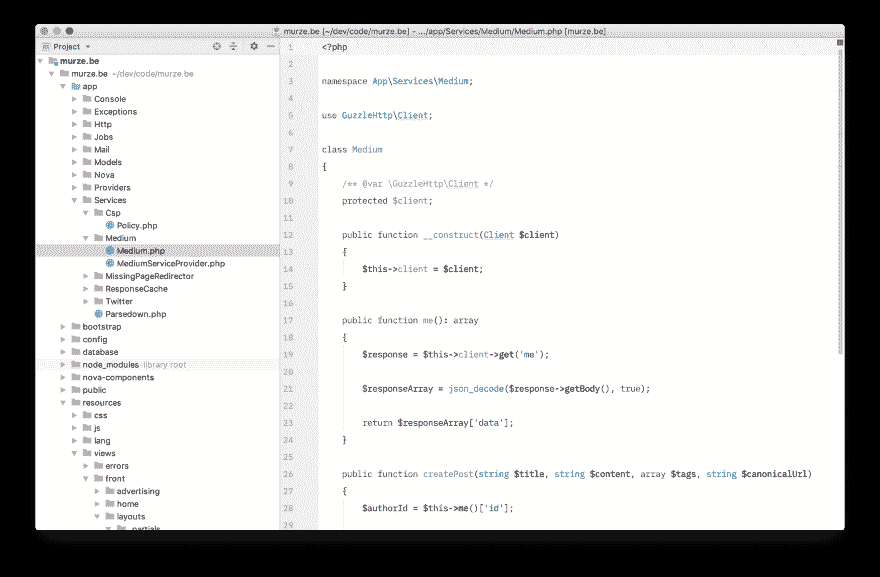
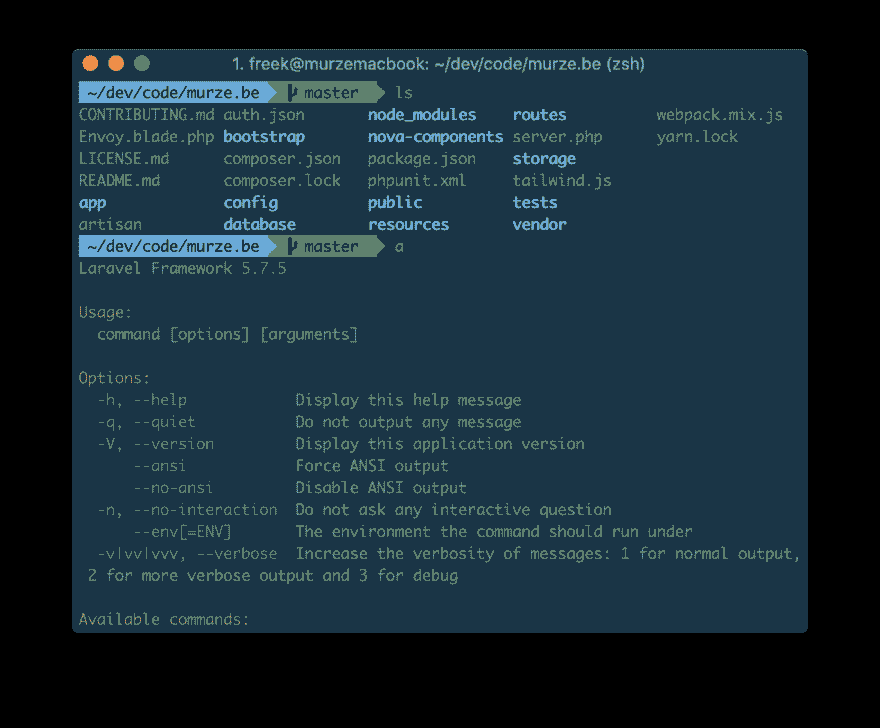
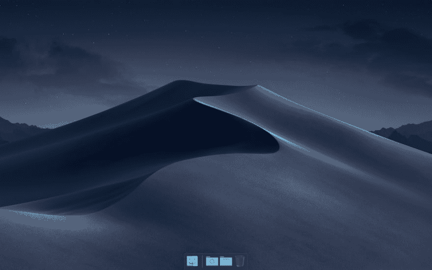
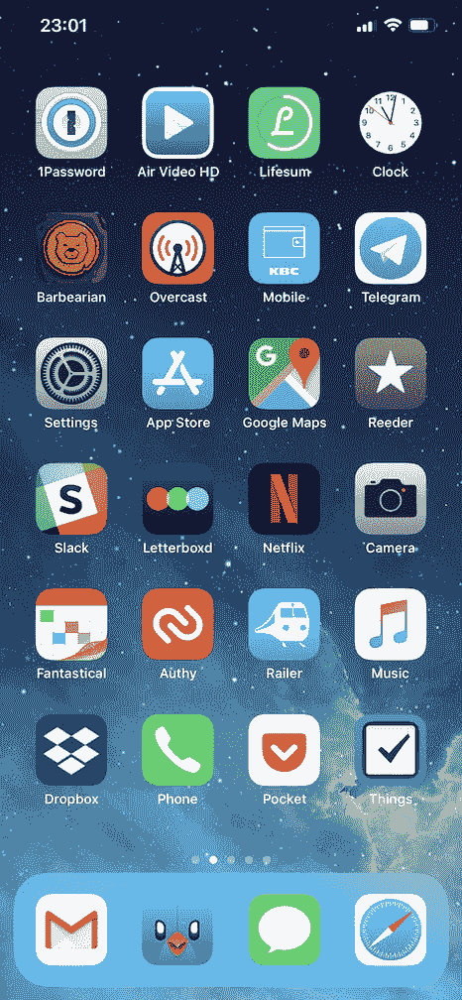
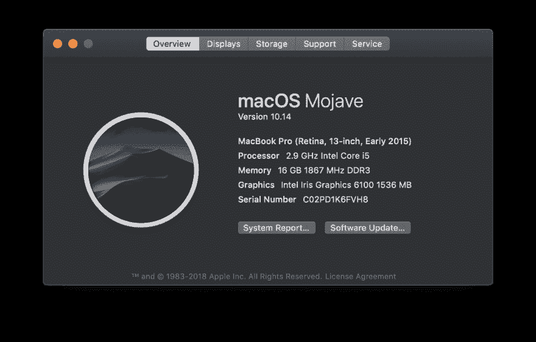

# ★我的当前设置(2018 版)

> 原文：<https://dev.to/freekmurze/my-current-setup-2018-edition-1ac>

在推特上发布一个截图后，它经常会收到关于我使用了哪个编辑器、T2 字体或配色方案的问题。我决定只写下我正在使用的设置和应用，而不是单独回答这些问题。

## [这里](#ide)

我主要是编程 PHP。大部分时间我都是用[PHP form](https://www.jetbrains.com/phpstorm)开发的。下面是它的截图:

[T2】](https://res.cloudinary.com/practicaldev/image/fetch/s--iJg7Ctkm--/c_limit%2Cf_auto%2Cfl_progressive%2Cq_auto%2Cw_880/https://freek.dev/uploads/media/setup-2018/ide.png)

你可以在这个报告中找到我使用的配色方案[。使用的字体是 IBM Plex Mono:这是一种很棒的字体，你可以在 T2 的 IBM 官方回购处免费下载。](https://github.com/freekmurze/phpstorm-color-schemes)

就像在截图中看到的，我隐藏了很多 PhpStorm 用户界面的东西。我喜欢保持它最小化。我使用 PhpStorm 的[设置同步功能](https://www.jetbrains.com/help/phpstorm/sharing-your-ide-settings.html#settings-repository)将我的设置备份到 GitHub 上的[这个 repo 中。](https://github.com/freekmurze/phpstorm-settings)

我喜欢使用基于灯光的主题。在某些圈子里，这可能有点争议。观看[这个由我的同事 Brent 制作的精彩视频](https://youtu.be/rDMI1dpNfdw?t=353)，了解使用基于灯光的主题的好处。

## 终端

这是我的终端截图。

[T2】](https://res.cloudinary.com/practicaldev/image/fetch/s--b9_PJWm4--/c_limit%2Cf_auto%2Cfl_progressive%2Cq_auto%2Cw_880/https://freek.dev/uploads/media/setup-2018/terminal.png)

我所有的终端设置都保存在[我的点文件库](https://github.com/freekmurze/dotfiles)中。如果您想要相同的环境，请遵循 repo 的安装说明。

我选择的终端是 [iTerm2](https://www.iterm2.com/) 。我用的是 [Z 壳](https://en.wikipedia.org/wiki/Z_shell)和[哦我的 Zsh](https://ohmyz.sh/) 。

所用的配色方案是[一个稍加修改的日晒深色版本](https://github.com/freekmurze/dotfiles/blob/master/misc/Solarized%20Dark%20Corrected.itermcolors)。使用的字体是[Menlo](https://github.com/freekmurze/dotfiles/blob/master/misc/Menlo-Powerline.otf)的补丁版本。我正在使用几个手工制作的[别名](https://github.com/freekmurze/dotfiles/blob/master/shell/.aliases)和[函数](https://github.com/freekmurze/dotfiles/blob/master/shell/.functions)。

## MacOS

我是 MacOS 的第一天升级者，所以我总是使用最新版本。当人们说 MacOS 足够稳定时，我有时也敢于使用它的测试版。

默认情况下，我隐藏菜单栏和 dock。我喜欢保持我的桌面超级干净，即使是硬盘也不允许放在那里。在我的码头上没有任何粘性程序。只有正在运行的应用程序在那里。我只有一叠下载和桌面永久在那里。这里有一个截图，我故意把我的指针向下移动，这样 dock 就显示出来了。

[T2】](https://res.cloudinary.com/practicaldev/image/fetch/s--MfzxJn2n--/c_limit%2Cf_auto%2Cfl_progressive%2Cq_auto%2Cw_880/https://freek.dev/uploads/media/setup-2018/dock.png)

我还隐藏了正在运行的应用程序的指示器(每个应用程序下面的点)，因为如果它在我的 dock 上，它就在运行。

在[我的点文件报告](https://github.com/freekmurze/dotfiles)中，你会发现[我的定制 MacOS 设置](https://github.com/freekmurze/dotfiles/blob/master/macos/set-defaults.sh)。

这些是我正在使用的一些应用程序:

*   为了在本地运行项目，我使用 [Laravel Valet](https://laravel.com/docs/5.7/valet) 。
*   我不能没有阿尔弗雷德。我正在使用几个工作流程。首先是由[的](https://twitter.com/sebdedeyne) [syn 和 assoc](https://github.com/sebastiandedeyne/naming-things-alfred-workflow)Sebastian De Deyne帮助命名事物。 [phpstorm](https://github.com/bchatard/jetbrains-alfred-workflow) 通过 [bchatard](https://github.com/bchatard) 轻松打开最近的 phpstorm 项目。最后，我使用 [Laravel 文档工作流](https://github.com/tillkruss/alfred-laravel-docs) by [直到 Krüss](https://twitter.com/tillkruss) 来轻松搜索 Laravel 文档。
*   要连接到 S3，ftp(？)和我用的 sftp 服务器[传输](https://panic.com/transmit/)。
*   有时我需要运行任意一段代码。CodeRunner 是一款出色的应用。
*   [Paw](https://paw.cloud/) 是一款执行 API 调用的神奇 app。
*   [Moom](https://manytricks.com/moom/) 用于快速调整 windows 四分之一、一半和全屏大小。
*   数据库由 [SequelPro](https://sequelpro.com/) 管理
*   [MySQLWorkbench](https://www.mysql.com/products/workbench/) 用于绘制实体关系图。尽管界面有点糟糕，但它完成了任务。
*   我最喜欢的云存储方案是 [Dropbox](https://dropbox.com) 。我所有的个人文件都在那里，在 T2 电影节上，我们也广泛使用它。
*   如果你没有使用密码管理器，你就做错了。我使用[1 密码](https://1password.com/)。个人密码被同步到存储在 Dropbox 上的保险箱中。对于斯帕蒂，我们有一个团队帐户。
*   我的应用程序的所有设置都通过 [Mackup](https://github.com/lra/mackup) 备份到 Dropbox。这是一款非常棒的软件，可以将你所有的偏好都转移到 Dropbox 上，并对它们进行符号链接。
*   我不使用时间机器，我的备份是用 Backblaze 处理的。
*   用 [Tweetbot](https://tapbots.com/tweetbot/mac/) 发推文。
*   我在 [Reeder](http://reederapp.com/mac/) 里通过 RSS 订阅看了很多博客。
*   邮件在 [Mailplane](https://mailplaneapp.com/) 中读写，Mailplane 是 Gmail 网络界面的包装器。
*   我选择的浏览器是谷歌浏览器。为了屏蔽某些网站上的广告，我使用了幽灵插件[。](https://www.ghostery.com/)
*   我喜欢在作家之家写长文
*   日历在[fantastic 2](https://flexibits.com/fantastical)中管理
*   我不经常发布视频，但当我发布时，我会使用 [ScreenFlow](https://www.telestream.net/screenflow/overview.htm) 创建它们。
*   尽管我不是设计师，但有时我不得不编辑图片。为此我使用了[像素化器](https://www.pixelmator.com/pro/)。
*   为了快速改变 iTunes 中的音量，我使用了[咝咝作响的按键](http://www.yellowmug.com/sizzlingkeys/)。
*   GrandPerspective 是一个隐藏的宝石，可以帮助你确定你的磁盘空间是如何被使用的。
*   我有一个乐队。我们自己做所有的录音。为此我使用了[收割者](https://www.reaper.fm)。

## iOS

这是我当前主屏幕的截图。

[T2】](https://res.cloudinary.com/practicaldev/image/fetch/s--bw6S3Tuh--/c_limit%2Cf_auto%2Cfl_progressive%2Cq_auto%2Cw_880/https://freek.dev/uploads/media/setup-2018/phone2.jpeg)

我不使用文件夹，并试图将安装的应用程序数量保持在最低水平。我大部分时间是在 Safari，Pocket，Reeder，Tweetbot 中度过的。除了“信息”之外，所有应用程序的通知和通知徽章都已关闭。

以下是目前主屏幕上一些应用的概要:

*   1Password:我最喜欢的密码管理器
*   Air Video HD:我发现将视频同步到这个股票视频应用程序要可靠得多。不需要 iTunes。
*   Lifesum:我目前正在努力减肥。我用这个应用程序来跟踪我的体重。我只是用免费版的。
*   时钟:滴答，滴答，...
*   Barbara Ian:我倾向于在手机上一次玩一个游戏，目前是 Barbara Ian，一个有趣的黑客和杀手。
*   阴:一个优秀的播客客户端
*   手机:可怕的名字，这是我银行的手机银行应用程序
*   里德:一个 RSS 客户端
*   Slack:用于与我的团队和其他一些社区交流
*   信箱 d:漂亮的 imdb。我用它来记录我看的每部电影
*   Railer:轻松查找比利时的火车时刻表
*   口袋:我最喜欢的稍后阅读服务
*   事情:包含我的待办事项

## 硬件

[T2】](https://res.cloudinary.com/practicaldev/image/fetch/s--PEzB8lQx--/c_limit%2Cf_auto%2Cfl_progressive%2Cq_auto%2Cw_880/https://freek.dev/uploads/media/setup-2018/macos.png)

我用的是 13 寸的 Macbook Pro，内存 16GB，硬盘 1TB。我选择了那个大硬盘来存储我所有的音乐和照片。现在，iTunes 音乐和照片服务已经出现，如果我今天要买一台新机器，我可能会选择一个更小的 HD。

我在家和办公室都有这些:

*   带有数字键的无线 Apple Magic 键盘
*   苹果 Magic Trackpad 2
*   一个 [LG 27UD59P-B](https://www.lg.com/ca_en/desktop-monitors/lg-27UD59P-B) 外部显示器

在家里，我用 HomePod 立体声音响播放音乐。为了在通勤和办公室时处于“最佳状态”，我戴上了我的 [QuietComfort 35 无线耳机](https://www.bose.com/en_us/products/headphones/over_ear_headphones/quietcomfort-35-wireless-ii.html)。

我现在的手机是 iPhone Xs Max，64 GB 存储。

## 在关闭

我希望你喜欢这个我正在使用的东西的概述。我打算每年都写一篇这样的帖子。

如果你对这些应用和服务有任何疑问，欢迎在下面的评论中提问。