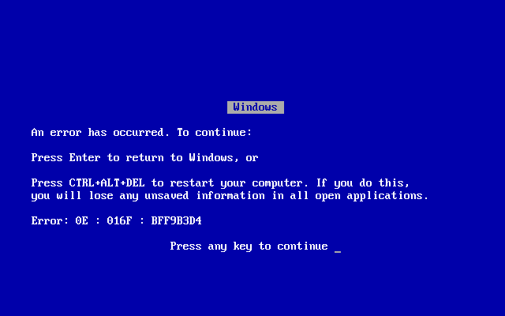
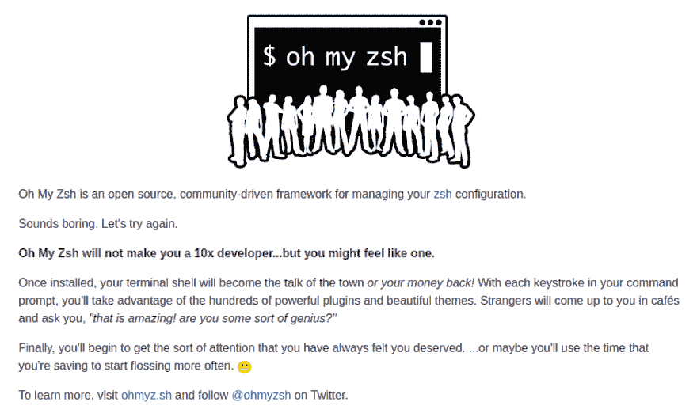
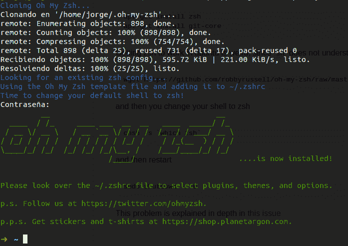
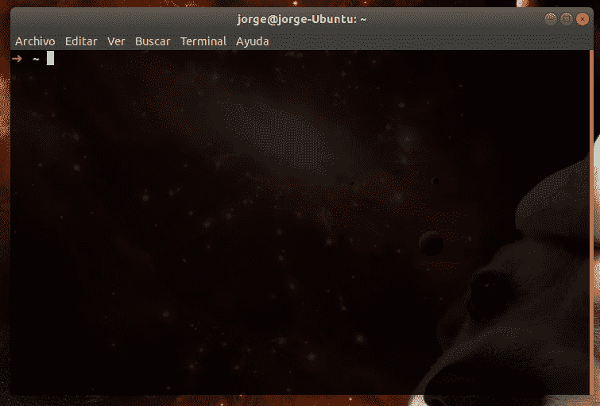
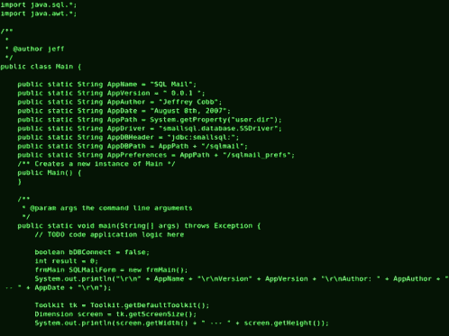

# 我的开发环境设置(第 1 部分)

> 原文：<https://dev.to/jorge_rockr/my-development-environment-setup-part-1-4a33>

上周在工作中，我得到了一个新项目。NET 框架。作为一名优秀的开发人员，我尝试使用。NET Core，但是我失败了，我工作的笔记本电脑没有安装 Windows，我该怎么办？。

[T2】](https://res.cloudinary.com/practicaldev/image/fetch/s--APxp7Dox--/c_limit%2Cf_auto%2Cfl_progressive%2Cq_66%2Cw_880/https://thepracticaldev.s3.amazonaws.com/i/llyxlk1dn1wc4amuqlpc.gif)

所以，我跑去技术支持区，告诉他们这个问题，经过一些研究，唯一的解决方案是:*删除 Linux，安装 Windows，然后再安装 Linux*。

该死的窗户。😡

[T2】](https://res.cloudinary.com/practicaldev/image/fetch/s--ZhWJmtwX--/c_limit%2Cf_auto%2Cfl_progressive%2Cq_auto%2Cw_880/https://i.kym-cdn.com/photimg/original/000/176/261/Windows_9X_BSOD.png)

但是这启发了我写这篇文章。

这就是我所认为的在办公室里快速、轻松、最酷地发展的好环境。不要评判我！

附:我用 Ubuntu 18.04 是因为为什么不用？我有 Fedora 27 之前，一切都发生了，它仍然是我最喜欢的，但我会给 Ubuntu 再试一次。

我们开始吧！

## 1。安装必要的工具

我们需要最基本的东西，如果你没有它们，你会很痛苦:

```
sudo apt-get update
sudo apt-get install build-essential git curl xclip 
```

Enter fullscreen mode Exit fullscreen mode

## 2。安装 zsh

*Zsh* (也叫 Z shell)是*伯恩 Shell (sh)* 的扩展版本。相对于原版 *bash* ，它有很多很酷的特性:

*   插件和主题支持
*   拼写纠正
*   自动 **cd**
*   还有更多！

只需用下面的命令安装它:

```
sudo apt-get install zsh 
```

Enter fullscreen mode Exit fullscreen mode

## 3。安装哦我的 Zsh

现在我们有一个好的外壳，太好了。但是[哦，我的 Zsh](https://github.com/robbyrussell/oh-my-zsh) 会给我们额外的动力:

[T2】](https://res.cloudinary.com/practicaldev/image/fetch/s--vE_KrlWN--/c_limit%2Cf_auto%2Cfl_progressive%2Cq_auto%2Cw_880/https://thepracticaldev.s3.amazonaws.com/i/hxzoy1s0opswq3o0j2gh.png)

然后，只需复制以下命令:

```
 sh -c "$(curl -fsSL https://raw.github.com/robbyrussell/oh-my-zsh/master/tools/install.sh)" 
```

Enter fullscreen mode Exit fullscreen mode

你会得到这个:

[T2】](https://res.cloudinary.com/practicaldev/image/fetch/s--RXYCiCRx--/c_limit%2Cf_auto%2Cfl_progressive%2Cq_auto%2Cw_880/https://thepracticaldev.s3.amazonaws.com/i/gkgtegq2tnvt0loywl6m.png)

## 4。默认开始使用 zsh

如果您重启您的终端，它将再次使用 bash。为什么？因为您需要使用下面的命令来显式地更改它:

```
# Change the shell to zsh
chsh -s `which zsh` 
```

Enter fullscreen mode Exit fullscreen mode

坏消息是你需要重启电脑🙄。

```
# WARNING! It will shutdown immediately :(
sudo shutdown -r 0 
```

Enter fullscreen mode Exit fullscreen mode

但是重启后会是这样的结果😍：

[T2】](https://res.cloudinary.com/practicaldev/image/fetch/s--BC-PWgbE--/c_limit%2Cf_auto%2Cfl_progressive%2Cq_auto%2Cw_880/https://thepracticaldev.s3.amazonaws.com/i/1p32t7p51dnbrmk5agt2.png)

## 5。安装 vim

是时候进入黑客模式了👨‍💻：

[T2】](https://res.cloudinary.com/practicaldev/image/fetch/s--OvV-Wyml--/c_limit%2Cf_auto%2Cfl_progressive%2Cq_66%2Cw_880/https://thepracticaldev.s3.amazonaws.com/i/dxo5y90fl2wefn6hvtnm.gif)

开玩笑的。

根据我的经验，与 *vim* 一起工作是最好的主意，因为:

*   它很轻
*   它无处不在(甚至在 Window 的 Git bash 上)
*   我觉得我写代码更快了
*   甚至不要使用触摸板(或鼠标)
*   我被迫学习诸如包名之类的东西，并理解它们的用途
*   许多编程语言的语法亮点
*   作为 Sublime 文本或 Visual Code Studio 的快捷方式

那么，你为什么不试试呢？

```
sudo apt-get install vim 
```

Enter fullscreen mode Exit fullscreen mode

第一部分到此结束😋。

在下一篇文章中，我将介绍:

*   配置 *vim* 并添加类固醇
*   修复一些奇怪的错误
*   掌握 vim

下一篇文章再见！

第二部分:[https://dev . to/Jorge _ rockr/my-development-environment-setup-part-2-4c K9](https://dev.to/jorge_rockr/my-development-environment-setup-part-2-4ck9)