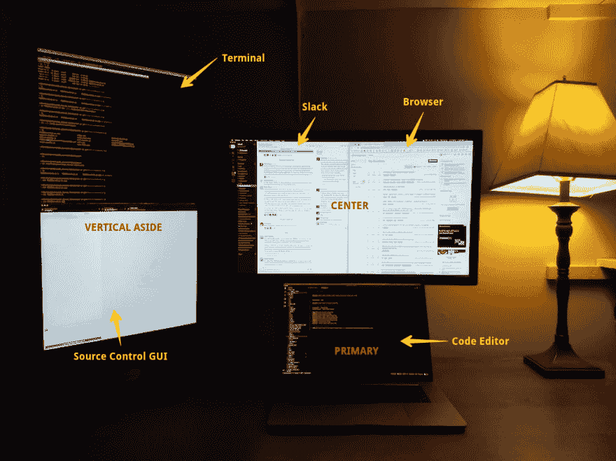

# 我的外部显示器设置

> 原文：<https://dev.to/bradymholt/my-external-display-setup-173p>

我对我的多显示器布置非常满意，并愿意分享我的设置。

[T2】](https://res.cloudinary.com/practicaldev/image/fetch/s--qmQmcNZ_--/c_limit%2Cf_auto%2Cfl_progressive%2Cq_auto%2Cw_880/https://www.geekytidbits.com/media/multiple-displays.jpg)

## 初级

我的 MacBook Pro 在前面和中间。我用它作为我的主屏幕、键盘和触摸板。有些人对我这样做感到惊讶，因为更典型的外部显示器设置是使用外部显示器作为主显示器和外部键盘/触控板。但我喜欢它的原因是:

*   MacBook retina 显示屏真的很棒。当我可以充分利用它的时候，为什么要在翻盖模式下浪费屏幕或者把它放到一边呢？
*   我喜欢 MacBook 触控板。这是笔记本电脑上最好的触控板，无与伦比。
*   我喜欢触控板相对于键盘的接近度。我喜欢我不需要移动手指很远就可以在按键和触控板之间切换。我觉得更少的手动旅行让我更有效率。
*   因为我是远程工作，所以我会时不时地把笔记本电脑带出门外，在咖啡店等其他地方工作。当我在那里时，我只有我的笔记本电脑。如果我在家时将笔记本电脑屏幕作为我的主要显示器/键盘/触控板，那么当我没有外部显示器时，我会感觉同样舒适。当我来回切换时，不需要用新的设置重新定位自己。
*   将我的 MacBook 放在一个外接显示器下面的中心位置是在近距离内拥有两个外接显示器的有效方法。我只是上下扫视我的眼睛，而不是左右扫视，可能还要转动我的脖子。

我用 primary 来编辑代码和做我的“主要”工作。

## 居中

我的 MacBook 上方的外部显示器位于前方中央，就在我的 MacBook 上方的右侧*。我的眼睛很容易从 MacBook 转移到这个显示器上。让它*居中*在笔记本电脑上方对我来说很重要。在我面前的显示器连接之前，我曾经使用过两个外部显示器。这是一种浪费，迫使我转过头或移动眼睛去看屏幕。*

我在这个显示器上并排显示了两个应用程序窗口，左边是 Slack，右边是我的浏览器。我在这个显示器上还有一个辅助桌面(桌面 2 ),它有一个全屏浏览器，打开我的浏览器 DevTools 进行调试。我可以用三个手指向左滑动，轻松进入 macOS 上的桌面 2。

## 竖在一旁

左边的显示屏明显旋转了 90 度。这使我不必把脖子转得太远就能看到它，但仍然给了我更大显示屏的好处。我将这个显示用于我的终端和源代码控制 GUI。我不常看这个展示，这也是它放在旁边的原因。