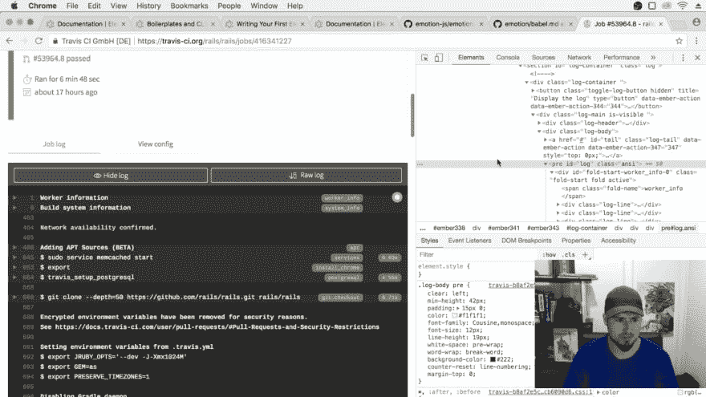
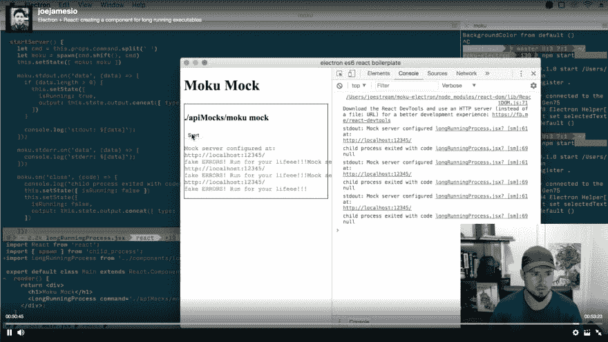

# 我的第一个反应是“啊哈”。这是反模式吗？

> 原文：<https://dev.to/theundefined/my-first--react-aha-moment-is-this-an-antipattern-3hd8>

twitch 上的流媒体我的第一个使用 react 的项目，不仅仅是遵循一个教程或在线课程，有点令人生畏，但也令人振奋。公开编写项目代码的一个好处是，我可以更容易地分享我正在学习的课程。

通过在线课程，我已经了解了 React 是如何工作的，但是我还没有将构建 React 项目的一些核心概念内化。我确信信息就在那里，只是我的大脑没有空间吸收所有的信息。

## 上下文

我的第一个启示发生在我开始为 STDOUT 和 STDERR 缓冲区构建日志组件时——就像您在 CI 工具上看到的那样。我在 Travis CI 上找到了一个随机的开源示例，看看标记是如何组合在一起的:

[T2】](https://res.cloudinary.com/practicaldev/image/fetch/s--tviy4jzd--/c_limit%2Cf_auto%2Cfl_progressive%2Cq_auto%2Cw_880/https://thepracticaldev.s3.amazonaws.com/i/3jpnyd4asgg6hapuxkt6.png)

我决定假设我的简单工具，STDOUT 文本应该是绿色的，STDERR 文本应该是红色的。我控制着正在运行的可执行文件，所以我可以做出这样愚蠢的决定...至少目前是这样。

## 反模式

我的第一次尝试是将包含文本的样式跨度(`Stdout`和`Stderr`)推入存储在状态:
中的数组

```
moku.stdout.on('data', data => {
  this.setState({
    output: this.state.output + <Stdout>data.toString()</Stdout>
  });
});

moku.stderr.on('data', data => {
  this.setState({
    output: this.state.output + <Stderr>data.toString()</Stderr>
  });
});

render() {
  return <Container>
    <pre>{this.state.output}</pre>
  </Container>
} 
```

Enter fullscreen mode Exit fullscreen mode

当我意识到我在状态中存储的是 HTML，而不是数据时，警钟就敲响了。我决定我应该把 React 组件`state`想成一个数据存储，因为我不会把表示标记泵入数据库(除非它是为一个所见即所得的字段),因为这限制了你可以用它做什么。如果我存储原始内容，那么我有更多的灵活性和可重用性。

选择通向最多选项的路径。

## 以数据为中心重构

我决定存储一个对象数组，每个对象都有一个可以设置为`stdout`或`stderr`的`type`属性，然后使用一个三元表达式在`render`函数中为该对象选择合适的组件:

```
moku.stdout.on('data', data => {
  this.setState({
    output: this.state.output.concat({
      type: 'stdout',
      data: data.toString()
    })
  });
});

moku.stderr.on('data', data => {
  this.setState({
    output: this.state.output.concat({
      type: 'stderr',
      data: data.toString()
    })
  });
});

render() {
  return <Container>
    <pre>
      {this.state.output.map(
        (obj, index) =>
          obj.type === 'stdout' ? (
            <Stdout key={index}>{obj.data}</Stdout>
          ) : (
            <Stderr key={index}>{obj.data}</Stderr>
          )
      )}
    </pre>
  </Container>
} 
```

Enter fullscreen mode Exit fullscreen mode

[T2】](https://res.cloudinary.com/practicaldev/image/fetch/s--n_IPkyB_--/c_limit%2Cf_auto%2Cfl_progressive%2Cq_auto%2Cw_880/https://thepracticaldev.s3.amazonaws.com/i/oemvc132zim0kj9pehwz.png)

## 总结

这个例子很简短，但是它展示了我所认为的反模式:不要在组件状态中存储 HTML。如果你不同意，那么不要保持沉默，我是新的反应，并会感谢指点！*对代码的任何反馈*将不胜感激。

对于我的流式实验，这对我写这篇文章帮助很大！我可以重新浏览视频，查看我写的导致 git 提交的代码。

## 跟着一起走

阅读这篇文章也让你免于看我的喃喃自语——我正专注于更好地展示现场编码。如果你想了解我的反应/电子进展，我主要在周一蒸，但我会写下我在这里学到的任何教训:)

[https://www.twitch.tv/joejamesio](https://www.twitch.tv/joejamesio)