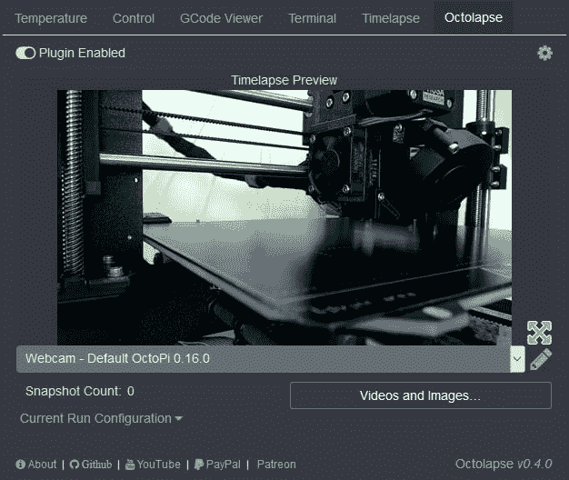
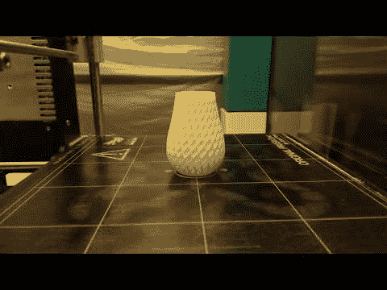

# 我第一次怀孕

> 原文：<https://dev.to/bdmorin/my-first-octolapse-2a0p>

[https://www.youtube.com/embed/FBltPLZQpF4](https://www.youtube.com/embed/FBltPLZQpF4)

看看你的章鱼！！

##  [前潜伏者](https://github.com/FormerLurker) / [八月飞逝](https://github.com/FormerLurker/Octolapse)

### Octoprint 的稳定时间间隔

<article class="markdown-body entry-content container-lg" itemprop="text">

# 八分差

[The New and Improved Octolapse Tab](https://github.com/FormerLurker/Octolapse/wiki/V0.4---Octolapse-Tab)

Octolapse 不提供任何形式的担保。通过安装 Octolapse，您同意接受由 Octolapse 直接或间接造成的任何损害的所有责任。小心使用，切勿让打印机无人看管。T3】

## Octolapse 做什么

Octolapse 旨在尽可能减少麻烦，使您的打印时间稳定，并且它是非常可配置的。现在你可以创建一个如丝般平滑的延时，而不需要定制相机，也不需要定制 GCode。

[A Timelapse of a Double Spiral Vase Made with Octolapse](https://www.thingiverse.com/thing:570288 "view model on thingiverse")

Octolapse 在拍摄每张快照前将印刷床和挤压机移动到位，为您提供每一帧的清晰图像。可以在每次层变化时、在特定的高度增量处、在一段时间过去之后或者在检测到某些 g 代码时拍摄快照。

**重要事项**:*octoplass 需要 OctoPrint v1.3.9 或更高版本，部分功能* …

</article>

[View on GitHub](https://github.com/FormerLurker/Octolapse)

这里有一个优秀的[教程](https://hackaday.com/2018/07/02/coolest-way-to-watch-3d-printing-lights-camera-octolapse/)。

*封面照片致谢:[伊内斯·Á·阿尔瓦雷斯·费兹](https://unsplash.com/@powwpic?utm_medium=referral&utm_campaign=photographer-credit&utm_content=creditBadge)*T5】