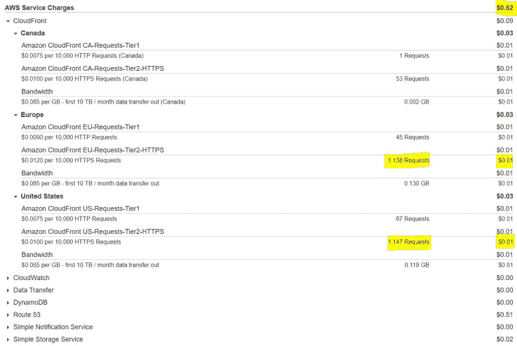

# 我的第一个 React 和 AWS 产品组合

> 原文：<https://dev.to/georginagrey/my-first-portfolio-with-react-and-aws-2g73>

你好戴夫.托。所以，我建立了我的第一个作品集，想记录下这个过程，但是在开始之前，声明如下:

*   我相信为工作选择正确的工具，对投资组合使用 React 可能看起来有点矫枉过正，但我决定使用它，主要是因为我想在这方面做得更好。
*   出于同样的原因，我选择 AWS 来部署它，而不是 Github 或 Netlifly。AWS 是个野兽，我想尽可能多的学习。

唷！好吧，我们开始吧。哦，这是投资组合[https://georginagrey.com](https://georginagrey.com)

## 趣闻趣事

在编写应用程序时，我学到了一些我认为值得分享的新技巧。

### React 的上下文 API

我的投资组合是多语言的，为了实现这一点，我使用了 [React 的上下文](https://reactjs.org/docs/context.html)，重点是要有一种**【全局】**状态，可以被其他可以深度嵌套的组件访问，从而避免传递**道具**到链的许多级别。这是它如何帮助我实现语言切换器的:

**供应商**

在 *LanguageContext.js 上*是文本翻译和*上下文*被创建和导出的地方。

```
//LanguageContext.js
export const languages = {
    en: {...
    },
    es: {...
    }
}

export const LanguageContext = React.createContext({
    langText: languages.en,
    toggleLanguage: () => { }
}); 
```

Enter fullscreen mode Exit fullscreen mode

*App* 组件是最外层的组件，这里实际实现了 *toggleLanguage* 功能。*语言语境。Provider* 组件包装需要使用*“全局”状态*的所有其他子组件。

注意，当共享访问*状态*的函数时，这些函数需要通过使用 *super(props)* 关键字或 *bind(this)* 方法被*显式绑定*到*状态*，否则执行该函数的深层组件将抛出错误。

```
// App.js
...
import { LanguageContext, languages } from './LanguageContext';
...

constructor(props) {
    super(props);

    this.state = {
        language: 'en',
        langText: languages.en,
        toggleLanguage: this.toggleLanguage
    }
}

toggleLanguage = () => {...
}

render() {
    return (
        <div id="app" className={app}>
            <LanguageContext.Provider value={this.state}>
                <Menu />
                <Main />
                <Footer />
            </LanguageContext.Provider>
        </div>
    )
} 
```

Enter fullscreen mode Exit fullscreen mode

**消费者**

由于使用了*语言上下文，所以*语言选择器*组件嵌套了大约 3 层。消费者*组件，这就是如何访问*状态*的方法。

```
// LanguagePicker.js
const LanguagePicker = () => (
  <LanguageContext.Consumer>
    {({ toggleLanguage, language }) => (
      <div className={main} onClick={() => toggleLanguage()}>
        ...
        <span>{language}</span>
      </div>
    )}
  </LanguageContext.Consumer>
) 
```

Enter fullscreen mode Exit fullscreen mode

这本来也可以用 Redux 来实现，但我不需要它来做其他任何事情。但是不应该轻易使用*上下文 API* ,所以要记住这一点。

* * *

* * *

### 路口观察器 API

如果某个元素在视口内可见时需要触发某个行为，这将非常有用。我用它来触发一些动画，但最有意义的用例与改善网站的**加载时间**、**第一次内容丰富的绘画**和**更低的带宽使用率**有关。

``标签可以立即呈现源代码中的任何内容，即使组件还没有安装，因此用户将下载可能永远也不会看到的图像。第一次令人满意的描绘中的减速也是意料之中的。

这里的技巧是使用一个占位符，将原始图像缩小到大约 10x10 的像素比。只有当 *IntersectionObserver* 开始工作时，我们才能获取原始图像。下面是实现的一个片段:

```
// Proyects.js
componentDidMount() {
    this.observe();
}

observe() {
    var options = {
        threshold: [0.1]
    }

    const observer = new IntersectionObserver(entries => {
        entries.forEach(entry => {
            if (entry.intersectionRatio > 0) {
                const image = entry.target;
                const src = image.dataset.src;

                this.fetchImage(src).then(() => {
                    image.src = src;
                });
            }
        });
    }, options);

    const images = document.querySelectorAll('img');
    images.forEach(i => observer.observe(i));
} 
```

Enter fullscreen mode Exit fullscreen mode

专业提示:我使用了 [Cloudinary](https://cloudinary.com/) ，而不是自己缩小图像，当 url:
`https://res.cloudinary.com/georginagrey/image/upload/c_scale,h_12,w_12/v1532709273/portfolio/portfolio.jpg`中提供了 *c_scale* 时，你可以动态地转换图像，如果你去掉这一部分，你就会得到原始图像。

**注意:**intersection observer 并不完全被所有浏览器[支持](https://caniuse.com/#feat=intersectionobserver)，所以你可能想要使用 pollyfill 或者一个后备。

* * *

* * *

### 用户界面

这是我最薄弱的地方，直到最近我才开始理解 CSS3，或者说我是这么想的，直到我开始陷入每一个可能的“陷阱”,只使用普通的 CSS 来设计组件。我不得不重新写了几次，直到我决定使用 **[情感](https://emotion.sh)** ，尽管 *css-in-js* 引起了一些愤怒，我决定试一试，我喜欢它，我不再需要担心在不同组件上工作时超越规则。

布局非常简单，我采用了移动优先的方法，只使用了 **flexbox** 就成功了。

* * *

* * *

## 堆栈

简而言之，这是一个 React 静态网站，托管在由 CloudFront 和 Route53 服务的 S3 桶上。

*   [创建-反应-应用](https://reactjs.org/docs/create-a-new-react-app.html)
*   [情感](https://emotion.sh) (css-in-js)
*   [燃烧基](https://firebase.google.com/)(用于联系方式)
*   [AWS S3 桶](https://aws.amazon.com/es/s3/)(静态文件托管)
*   [AWS Cloudfront](https://aws.amazon.com/es/cloudfront/) (CDN，SSL 证书，文本压缩)
*   [AWS 路由 53](https://aws.amazon.com/es/route53/) (DNS 路由)

### 我怎么会落得如此下场？！

在编写了主要的 React 组件并对大多数组件进行了样式化之后，我偶然发现了谷歌的 [Lighthouse](https://developers.google.com/web/tools/lighthouse/) 审计工具，我下载了 Chrome 扩展并生成了一份报告(本地)，几秒钟之内我就获得了结果和一系列*优化机会*，例如，通过在服务器中启用*【文本压缩】*，在我的情况下，应用程序的加载速度应该会快 3 秒左右。

我不知道那是什么意思，所以在谷歌搜索了一下后，我看到了 [Cloudfront](https://aws.amazon.com/es/cloudfront/) ，除此之外，你还可以免费申请一个 **SSL 证书**。

设置一切并不像听起来那么困难，[这里的](https://gist.github.com/bradwestfall/b5b0e450015dbc9b4e56e5f398df48ff)是一个非常方便的指南。你会得到什么？托管、提高的性能、更快的交付和安全的 HTTPs。

#### 免费吗？

S3 和 CloudFront 本质上并不是免费的，而是现收现付的服务，所以对于一个低流量的网站，如果有的话，我们会在 1 年免费期到期后，讨论每月支付**美分**。

Route53 是 DNS 提供商，每个托管区域的固定价格为每月 0.51 美元，所以我们只谈论每年 6 美元。在这种情况下，我已经在 Godaddy 中注册了一个域名，为了让它工作，我只是抓取了 Route53 提供给我的 DNS 名称，并将它们保存在 Godaddy 中的*管理名称服务器*表单中。

#### 缓存并使 CloudFront 失效

正如预期的那样，每次请求进入 CloudFront 时，它都会提供缓存的内容，而不是每次都去你的 S3 桶中寻找文件，内容缓存多长时间，取决于配置的**默认 TTL** 时间框架，在这里阅读更多信息[。](https://docs.aws.amazon.com/AmazonCloudFront/latest/DeveloperGuide/Expiration.html)

由于我仍然在网站上工作，我将默认 TTL 设置为
3600 秒(1 小时)，我还添加了一个头`cache-control:max-age=0`，到原始 S3 桶的元数据。但很快我将恢复这一点，并使用[失效](https://docs.aws.amazon.com/AmazonCloudFront/latest/DeveloperGuide/Invalidation.html)来代替，它强制刷新缓存，而不需要等待它过期。这样做实际上也更便宜。

**编辑:**
我拿到了我的月结单！因此，这里有一个使用这种设置的 AWS 打印示例:
[](https://res.cloudinary.com/practicaldev/image/fetch/s--MnQ1zjmr--/c_limit%2Cf_auto%2Cfl_progressive%2Cq_auto%2Cw_880/https://thepracticaldev.s3.amazonaws.com/i/ud902i91parjgi8ga9h8.JPG)

*CloudFront* 为美洲/欧洲层提供了+2300 个请求。加上 *DNS* 路由和存储**总计 0.62 美元**。它不会变得比这更贵，因为预计交通量不会激增。

* * *

* * *

就是这样！...我认为🤔

这不是我第一次与 AWS 打交道，但这是我第一次编写网站前端代码，因此非常感谢任何评论。

谢谢你的来访👋

###### 编辑 07/30:追加 IntersectionObserver 警告。

###### 编辑 08/03:新增 AWS 账单。