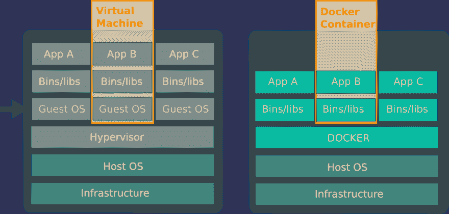
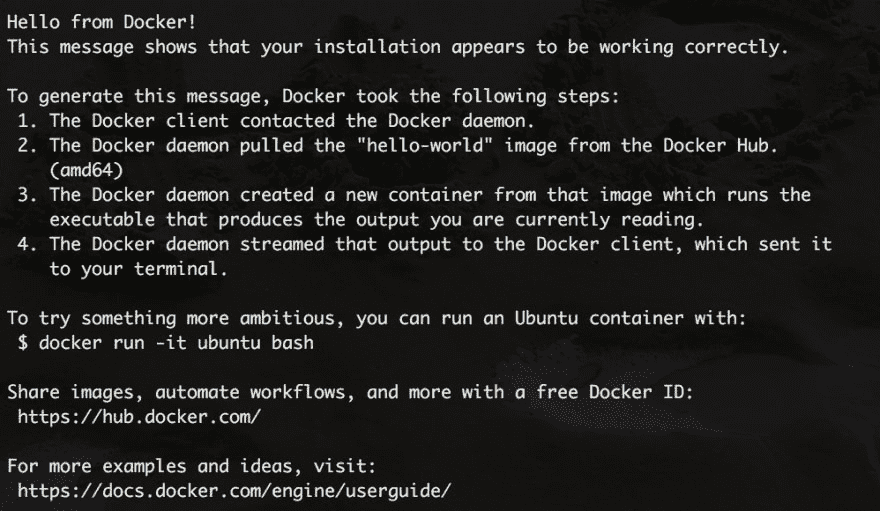
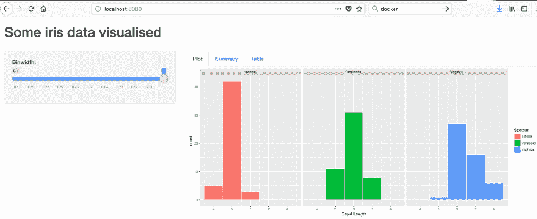

# 我第一个闪亮的 docker“R”形象

> 原文：<https://dev.to/bettyes/my-first-shiny-docker-image-1jp7>

虽然我不是 Docker 专家，但我最近还是尝试构建了自己的 Docker 容器，因为这使得在操作系统(os)之间转移应用程序变得更加容易。然而，每一个开始都是具有挑战性的，因此，我觉得记录我的第一步可能会对渴望打包离开的人有用。我正在使用 mac os，并为 R-shiny 应用程序构建了一个容器。这篇文章最初发表在[我的网站](https://schirrmeister.wordpress.com/2018/08/10/my-first-shiny-docker-image/)

## 什么是 Docker

Docker 于 2013 年在圣克拉拉的 PyCon 向公众介绍(我推荐你观看 5 分钟。这里谈。

Docker software 旨在促进项目实施，将您的应用程序放入 Linux-containers(容器化)中，这将包括您的应用程序所需的所有库。它类似于虚拟机，但是，它的优点是不模拟整个计算机操作系统，而是只模拟必要的部分。因此，docker 容器优于虚拟机。

一些短语解释:容器是运行应用程序的隔离的软件环境。它保存了一个静态的 docker-image，其中包含了你的应用程序需要的所有东西，例如代码、库和配置文件。图像的源代码存储在 docker 文件中。假设每个人都喜欢烘焙:图像是食谱，容器是蛋糕。

## Docker 与虚拟机

每个虚拟机都拥有其应用程序正在使用的完整操作系统的副本。因此，虚拟机将占用大量空间和内存，因此计算成本高且速度慢。另一方面，Docker 是建立在主机操作系统之上的，因此不需要额外的操作系统，并且在性能和存储需求方面表现出色。

[](https://res.cloudinary.com/practicaldev/image/fetch/s--g-cmwMzg--/c_limit%2Cf_auto%2Cfl_progressive%2Cq_auto%2Cw_880/https://thepracticaldev.s3.amazonaws.com/i/t5k021w9fk316mtd7s38.png) 
图 1:左边是使用虚拟机部署的应用程序(A-C)。使用 docker 容器部署的正确应用程序。Docker 使用主机操作系统，并淘汰额外的客户操作系统。

## 为什么要使用 Docker

作为一个 R 用户，我最大的优势之一是 R 版本和相应包的稳定性和可重用性。虽然您经常会遇到当前 R 版本不再支持的库的问题，但是 docker 存储了所需的 R 环境和使用过的库。

此外，Docker 易于部署，可以省去您在不同机器上安装和设置 webapps 的麻烦。

## 如何指导你的第一张 Docker 图片

(本指南重点介绍 mac os)
- [安装 docker](https://store.docker.com/editions/community/docker-ce-desktop-mac)
-打开 docker(点击图标)
-打开终端并检查:

```
docker info #basic system information  (how many containers, images, running etc.) 
```

Enter fullscreen mode Exit fullscreen mode

#### 在你用 app 搭建自己的容器之前，先看看 docker 提供的容器

-登录您的 Docker 帐户并运行 hello-world 容器

```
docker run hello-world #runs hello-world container example from docker 
```

Enter fullscreen mode Exit fullscreen mode

[T2】](https://res.cloudinary.com/practicaldev/image/fetch/s--EpaGoRO5--/c_limit%2Cf_auto%2Cfl_progressive%2Cq_auto%2Cw_880/https://thepracticaldev.s3.amazonaws.com/i/3dy9o9z897dp6o1mpws9.png)

因为上面的 hello-world 图像在本地找不到，所以将从 Docker Hub 中提取。如果你看到上面的文字，它的工作。

-查看您的 docker 图像:

```
docker images #displays the images on your machine 
```

Enter fullscreen mode Exit fullscreen mode

[T2】](https://res.cloudinary.com/practicaldev/image/fetch/s--gE48y-GP--/c_limit%2Cf_auto%2Cfl_progressive%2Cq_auto%2Cw_880/https://thepracticaldev.s3.amazonaws.com/i/mylaexxpry3cizij98si.png)

#### 为你的应用创建一个本地 docker 容器

-创建一个目录并转到该目录:

```
mkdir DockerRep # created new directory
cd DockerRep # change directory 
```

Enter fullscreen mode Exit fullscreen mode

-创建您的应用程序和运行文件:

app。r(我在另一个[博客](https://dev.to/bettyes/make-your-code-shiny--598d)中创建了那个应用)
app_run。r(参见下面的内容):

```
require(shiny) #loads shiny package
shiny::runApp("app.R", launch.browser = FALSE, port = 8080, host = "0.0.0.0") #runs shiny app in port 8080 localhost 
```

Enter fullscreen mode Exit fullscreen mode

-创建一个 Dockerfile(我用的是 vi 命令行编辑器。随便用你喜欢的任何东西)

Dockerfile(下图):

```
#build an image on top of the base image for r version 3.5.1 from [rocker] (https://hub.docker.com/r/rocker/r-ver/~/dockerfile/)
FROM rocker/r-ver:3.5.1 
#install necessary libraries
RUN R -e "install.packages(c('ggplot2','shiny'))"

#copy the current folder into the path of the app
COPY . /usr/local/src/app
#set working directory to the app
WORKDIR /usr/local/src/app

#set the unix commands to run the app
CMD ["Rscript","app_run.R"] 
```

Enter fullscreen mode Exit fullscreen mode

所以在我的~/path/DockerRep/我有三个文件:1) app。r；2) app_run。r；3) Dockerfile。

最后，阅读食谱并烘焙蛋糕，或者只是构建图像并运行容器:

```
#build an image named "mydockerapp"(needs to be lower case)
docker build -t mydockerapp .

#run the image "mydockerapp" in the container "DOCKERapp" in port 8080 
docker run --name DOCKERapp -p 8080:8080 mydockerapp 
```

Enter fullscreen mode Exit fullscreen mode

[T2】](https://res.cloudinary.com/practicaldev/image/fetch/s--_9MhD-yJ--/c_limit%2Cf_auto%2Cfl_progressive%2Cq_auto%2Cw_880/https://thepracticaldev.s3.amazonaws.com/i/hvusprqf4xy5rtzdgrkt.png)

在你的网络浏览器中调用 https:/localhost:8080，你现在可以使用你的容器化闪亮应用了。此外，你可以将你的容器运送到一个服务器，另一台机器等。你的容器中的环境将保持不变，你的应用将流畅运行，即使你碰巧更新了你的 R 版本。

[T2】](https://res.cloudinary.com/practicaldev/image/fetch/s--0ntghsXR--/c_limit%2Cf_auto%2Cfl_progressive%2Cq_auto%2Cw_880/https://thepracticaldev.s3.amazonaws.com/i/cnd1dk37dd3wbjfa94eb.png)

### 几个进一步的注解:

如果要查看哪些容器正在运行和已经运行:

```
docker ps #running
docker ps -a #have run 
```

Enter fullscreen mode Exit fullscreen mode

请注意，每次使用 docker run image-name 时，您都在创建一个新的容器。相反，您可以运行 docker run -rm image-name，这将确保容器随后被删除。

如果您想删除容器:

```
docker rm -f containerName #remove a container 
```

Enter fullscreen mode Exit fullscreen mode

## 
  
TOP 5 Docker 命令

下面是我觉得有用的 docker 命令列表。在评论区为你最喜欢的命令投票。

```
1- docker run -t -i ubuntu /bin/bash #running an ubuntu machine

2-docker PS #还有集装箱运行吗

3- docker 图像#显示 docker 图像

4-docker build #构建 docker 图像

5-docker RM-f container name #删除不再需要的集装箱 
```

Enter fullscreen mode Exit fullscreen mode

#### 
  
有用链接

[https://www.docker.com/](https://www.docker.com/)

[https://docs.docker.com/get-started/#docker-concepts](https://docs.docker.com/get-started/#docker-concepts)(从哪里开始的详细说明)

[https://docs . docker . com/docker-for-MAC/](https://docs.docker.com/docker-for-mac/)(MAC-get 开始的 docker)

[https://ropenscilabs.github.io/r-docker-tutorial/](https://ropenscilabs.github.io/r-docker-tutorial/)(关于如何在容器中运行 Rstudio 的一些说明，一般在 R 和 docker 上)

[Rocker 简介:R 的 Docker 容器](https://journal.r-project.org/archive/2017/RJ-2017-065/RJ-2017-065.pdf)

更多关于 [Dockerfiles](https://ropenscilabs.github.io/r-docker-tutorial/05-dockerfiles.html)

Docker:在几秒钟内拥有一台 Ubuntu 开发机器，从 Windows 或 Mac
(一些关于如何构建和使用一台 unix 机器的指导)