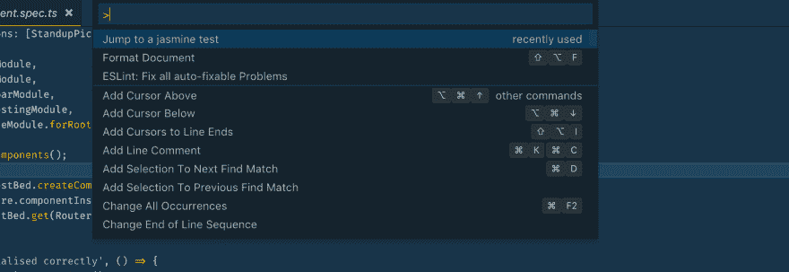

# 我的第一个视觉代码扩展

> 原文：<https://dev.to/mokkapps/my-first-visual-code-extension-4l5f>

我真的是[可视化代码](https://code.visualstudio.com)的忠实粉丝，并把它作为我软件开发的主要 IDE。可供选择的扩展(见[扩展市场](https://marketplace.visualstudio.com/VSCode))是惊人的。

当我开始使用可视代码时，我找到了我正在寻找的每一个扩展。但是上周我偶然发现了一个功能，我找不到它的扩展。所以我决定写我的第一个 VS 代码扩展，让你知道我在开发过程中的经历。

# 我想解决的问题

目前我正在做大量的 [Angular](https://angular.io/) 开发，因此使用 [Jasmine](https://jasmine.github.io/) 进行单元测试。我第一个用于网络开发的 IDE 是基于 IntelliJ 理念的[网络风暴](https://www.jetbrains.com/webstorm/)。在 WebStorm 中，我经常使用并喜欢 Jasmine 测试的插件[d descriptor](https://github.com/andresdominguez/ddescriber):

`Intellij plugin to quickly transform a JavaScript test block from describe() to ddescribe() and a test it() into iit()` 

这是一个很好的功能，但我经常使用插件列出所有可用的规格，然后跳转到某个`describe()`或`it()`块:

 `Just type Ctrl + Shift + D (Command + Shift + D on a Mac) to launch a dialog that lets you choose which suites or unit tests you want to include or exclude.` 

这在包含许多`describe()`或`it()`块的大型单元测试中很有用。

由于我找不到一个可以解决这个问题的 VS 代码扩展，我决定写我自己的第一个 VS 代码扩展。

# 分机应该处理什么

扩展的第一个版本应该能够:

*   在编辑器中打开的文件中，将所有`describe()`或`it()`块作为下拉列表列出
*   如果选择了一个块，将光标移动到该块

## 如何开始？

为 VS 代码团队关于如何构建你自己的 VS 代码扩展的惊人的[文档](https://code.visualstudio.com/docs/extensions/overview)鼓掌。

使用[扩展生成器](https://code.visualstudio.com/docs/extensions/yocode)获取一个示例项目或创建一个新的项目并开始工作真的很容易。另外，[运行和调试你的新扩展](https://code.visualstudio.com/docs/extensions/developing-extensions#_running-and-debugging-your-extension)非常容易。

通过搜索[扩展 API 文档](https://code.visualstudio.com/docs/extensionAPI/overview),我找到了这个方法

 `showQuickPick<T extends QuickPickItem>(items: T[] | Thenable<T[]>, options?: QuickPickOptions, token?: CancellationToken): Thenable<T | undefined>` 

哪个功能被描述为:

 `Shows a selection list allowing multiple selections.` 

在 VS 代码中，如果调用:

[T2】](https://res.cloudinary.com/practicaldev/image/fetch/s--iwBJqfZI--/c_limit%2Cf_auto%2Cfl_progressive%2Cq_auto%2Cw_880/https://www.mokkapps.de/blog/img/vs-code-quick-pick.png%23c)

因此，这听起来像是一个列出所有测试块并提供接收所选值的方法的好机会。

所以基本上我必须实现这些步骤:

*   在打开的编辑器中抓取所有包含`it(`或`describe(`的字符串以及该字符串对应的行号
*   将它们传递给`showQuickPick`方法
*   接收选择并将光标移动到相应的行号

Jasmine 测试文件的最终输出如下所示:

[T2】](https://res.cloudinary.com/practicaldev/image/fetch/s--LJ-oZ-is--/c_limit%2Cf_auto%2Cfl_progressive%2Cq_auto%2Cw_880/https://www.mokkapps.de/blog/img/jasmine-test-selector.png%23c)

## 发布扩展

另一个非常好的体验是 VS 代码扩展非常简单的发布过程。基本上，我只需按照官方文档进行操作，这需要一个 [Visual Studio Team Services](https://docs.microsoft.com/vsts/accounts/create-account-msa-or-work-student) 账户。

发布的扩展可以在 [Visual Studio 代码市场](https://marketplace.visualstudio.com/items?itemName=Mokkapps.jasmine-test-selector#overview)中获得。

# 结论

总之，开发 VS 代码体验非常有趣。文档和提供的例子非常好，我很高兴为我最喜欢的代码编辑器添加了一个我一直缺少的功能。

# 链接

*   [从市场下载扩展](https://marketplace.visualstudio.com/items?itemName=Mokkapps.jasmine-test-selector#overview)
*   [GitHub 上的源代码](https://github.com/Mokkapps/jasmine-test-selector)