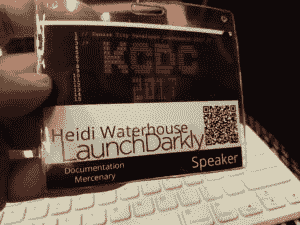
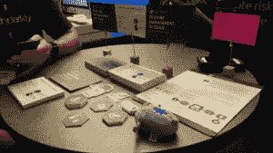
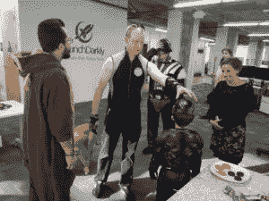
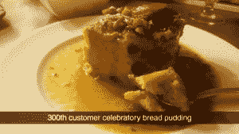
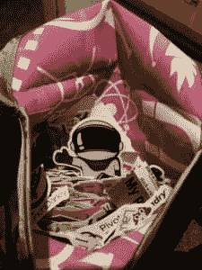
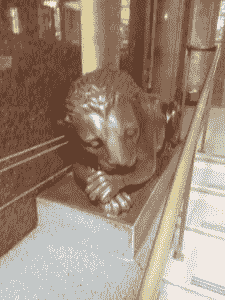
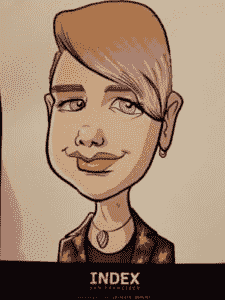
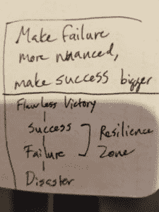
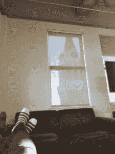
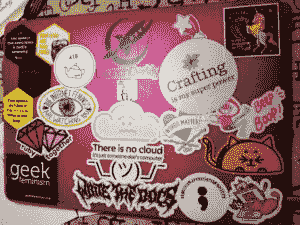

# 我的第一年，个人回顾

> 原文：<https://dev.to/wiredferret/my-first-year-a-personal-review-17bd>

今天我醒来时收到一封令人振奋的电子邮件，告诉我我四分之一的股票期权已经授予。那意味着我已经和 LaunchDarkly 在一起整整一年了！(还有更糟的周年庆笔记要拿)。

这是多么美好的一年啊。我想写一篇关于我去年参加的所有会议的摄影论文，但是今年实际上有 36 个会议，除了 5 个，我都有发言时间，而在这 5 个中，我在 3 个有空位。图片太多了！

我去了另外三个国家——澳大利亚、圣多明各和加拿大。我在我的航空公司获得了白金地位，错过了我孩子的 13 岁生日和每一场音乐会，穿坏了一个 TravelPro 行李箱。我交了一群新朋友和熟人，更好地了解了其他人，并努力学习新的职业。

当我开始的时候，我有整整一天的时间在办公室里拿我的新笔记本电脑，见我的新同事，并就贴纸进行热情而有影响力的谈话。然后去了堪萨斯城开发者大会，这是我作为一个官方开发者倡导者的第一次正式会议。

只能说我很高兴我做了充分的面试准备！

[T2】](https://res.cloudinary.com/practicaldev/image/fetch/s---Na8tgnd--/c_limit%2Cf_auto%2Cfl_progressive%2Cq_auto%2Cw_880/http://www.heidiwaterhouse.com/wp-content/uploads/2018/07/20170803_094536-300x225.jpg)

你可以看到我的贴纸对话结束的很好。我想这是纽约的速度。

[T2】](https://res.cloudinary.com/practicaldev/image/fetch/s--IZ3fbhbn--/c_limit%2Cf_auto%2Cfl_progressive%2Cq_auto%2Cw_880/http://www.heidiwaterhouse.com/wp-content/uploads/2018/07/Snapchat-1757033784-300x169.jpg)

我赶回奥克兰参加丽莎和办公室的万圣节派对

[T2】](https://res.cloudinary.com/practicaldev/image/fetch/s--jd8iq59V--/c_limit%2Cf_auto%2Cfl_progressive%2Cq_auto%2Cw_880/http://www.heidiwaterhouse.com/wp-content/uploads/2018/07/20171030_163806-300x225.jpg)

我庆祝公司的里程碑，即使我并不总是在办公室参加正式聚会。我在新奥尔良的 RubyConf 吃过这个面包布丁。味道好极了。

[T2】](https://res.cloudinary.com/practicaldev/image/fetch/s--Sc-FSkrI--/c_limit%2Cf_auto%2Cfl_progressive%2Cq_auto%2Cw_880/http://www.heidiwaterhouse.com/wp-content/uploads/2018/07/Snapchat-1900099380-300x169.jpg)

我缝制了一个袋子，用来装我参加会议时随身携带的贴纸系列。里面的布料是办公室的感谢礼物，而扣件是我在纽约服装区买的

[T2】](https://res.cloudinary.com/practicaldev/image/fetch/s--nGv4OJxk--/c_limit%2Cf_auto%2Cfl_progressive%2Cq_auto%2Cw_880/http://www.heidiwaterhouse.com/wp-content/uploads/2018/07/20180107_005616-300x225.jpg)

我在悉尼参观亚特兰大时遇到了这只困倦的狮子。这是我现场的第一个客户，有点令人难以置信。他们对新功能和使用我们产品的方式有很多好主意。

[T2】](https://res.cloudinary.com/practicaldev/image/fetch/s--thJhdz12--/c_limit%2Cf_auto%2Cfl_progressive%2Cq_auto%2Cw_880/http://www.heidiwaterhouse.com/wp-content/uploads/2018/07/20180125_121137-e1533082559721-225x300.jpg)

旧金山索引有一个漫画家。我很高兴我碰巧穿着自己做的这件夹克。

[T2】](https://res.cloudinary.com/practicaldev/image/fetch/s--t06gaDJI--/c_limit%2Cf_auto%2Cfl_progressive%2Cq_auto%2Cw_880/http://www.heidiwaterhouse.com/wp-content/uploads/2018/07/20180312_013834-e1533082727501-225x300.jpg)

这是一张草图，我拍了照，发给了我们出色的产品/图形人员 Melissa。她负责我们所有醒目的贴纸和视觉外观。这在我的华夫饼屋演讲中变成了幻灯片。

[T2】](https://res.cloudinary.com/practicaldev/image/fetch/s--IrspK1ql--/c_limit%2Cf_auto%2Cfl_progressive%2Cq_auto%2Cw_880/http://www.heidiwaterhouse.com/wp-content/uploads/2018/07/20180312_154249-e1533082847658-225x300.jpg)

这就是我光鲜亮丽的人生。在坐红眼航班回家之前，我在办公室小睡了一会儿。这是旧办公室，我们现在已经住不下了，但是风景很棒。我穿着科技袜，但我现在不记得是谁的了。

[T2】](https://res.cloudinary.com/practicaldev/image/fetch/s---C-XCW-N--/c_limit%2Cf_auto%2Cfl_progressive%2Cq_auto%2Cw_880/http://www.heidiwaterhouse.com/wp-content/uploads/2018/07/20180601_193738-e1533082937726-225x300.jpg)

永远不要对在你的工作笔记本电脑上贴标签感到不舒服的关键是首先用一个透明的盒子盖住你的笔记本电脑。它给你一点耐烧蚀冲击性，当你换电脑时，你可以把它放在你的墙上！

[T2】](https://res.cloudinary.com/practicaldev/image/fetch/s--JXoLcXZz--/c_limit%2Cf_auto%2Cfl_progressive%2Cq_auto%2Cw_880/http://www.heidiwaterhouse.com/wp-content/uploads/2018/07/20180707_222011-300x225.jpg)

我为我所做的工作感到自豪，在下一篇文章中，我将谈一点我认为正在发生的事情。