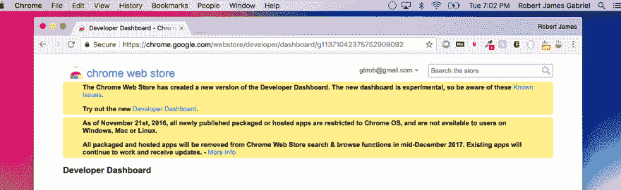

# 我的谷歌 Chrome 开发者仪表板愿望清单

> 原文：<https://dev.to/robertjgabriel/my-google-chrome-developer-dashboard-wishlist-3lp1>

# 我的谷歌 Chrome 开发者仪表板愿望清单

[T2】](https://res.cloudinary.com/practicaldev/image/fetch/s--O9RaFIe0--/c_limit%2Cf_auto%2Cfl_progressive%2Cq_auto%2Cw_880/https://cdn-images-1.medium.com/max/1600/1%2AFCLJwNB7IiVnwTqr4YGxjQ.png)

随着新的谷歌 Chrome 开发者仪表板的发布，其功能逐渐消失。我想我会写下我最大的愿望。

当有人购买我的应用程序时，会发送电子邮件。

这似乎是一个巨大的疏忽。我甚至想要一个布景。当有人
购买我的某个应用程序(付费)时，我会收到电子邮件或推送通知。而不是目前的设置，我必须通过谷歌支付检查。

**实时分析**

这又是一个巨大的疏忽。随着谷歌分析成为网络追踪的第一名，你会认为它也会在这里。状态和用户数量更新需要 24 小时，即使这样也很糟糕。将是很好的有它
每小时更新或每 3 个小时。甚至像每个国家或设备的用户数量的细分。

**高清支持截图**

看这有多模糊。

看看这里，他们在压缩图像方面做得很糟糕。如果有任何事情，他们应该允许或转换图像到 webp。这里的想法不就是
展示你的应用吗？苹果和 Mozilla 用很好的方式展示了像
这样的东西。

**安全检查**

Mozilla 检查你的代码是否有过时的脚本，以及你的代码是否容易受到 xss 攻击。希望 Chrome 也能这样做

**双周支付**

能够每两周而不是每月领一次工资。简单如。

**应用的试用模式**

这将改变游戏规则！！！！能够允许人们下载付费的 Chrome 扩展，并在要求他们付费之前给他们 7 天的试用期。这将极大地增加对话。看起来很容易。

**更好的审核流程**

这链接到上述安全检查功能。我个人希望
审核流程能够提供更多反馈，并对
应用的质量进行正确检查。通过一些 chrome 扩展，它们可以极大地影响网站
的页面速度。看起来这可能会发生，我希望如此。鉴于谷歌正专注于 PWAs，看到他们将此作为 T4 chrome 扩展的标准将会令人惊讶。

#### 杂项

*   从商品概览页面中删除旧商品或停产商品的功能。
*   关于重要事件的电子邮件和产品内通知，例如当用户在 Chrome 网络商店中留下对你的扩展的评论时。
*   恢复到旧版本。
*   重新设计的网站/商店。
*   更少的垃圾物品和可怕的克隆。
*   应用程序的试用模式。所以你可以在付费前试用一个应用一周。
*   推荐分析。
*   PWA 支持
*   版本审查

新的 Chrome 开发者仪表盘

你的愿望清单是什么？在
**[推特](https://twitter.com/RobertJGabriel)** 或者
** [Github](https://github.com/RobertJGabriel) 上让我知道。

如果你愿意支持我，因为我刚刚开始全职从事开源工作。你可以在这里看到更多关于我。我的
捐赠页面[这里](https://www.robertgabriel.ninja/donate)。