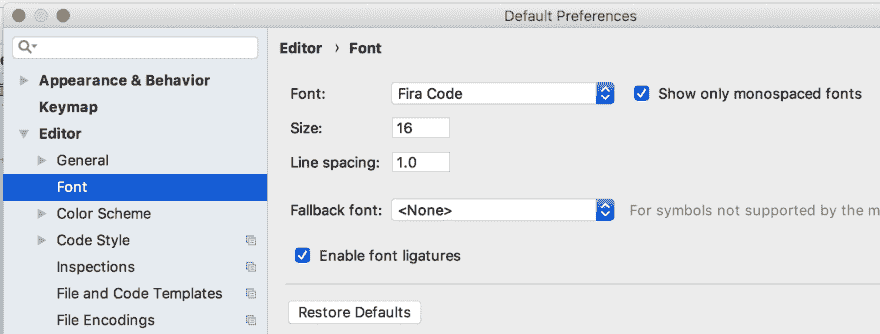
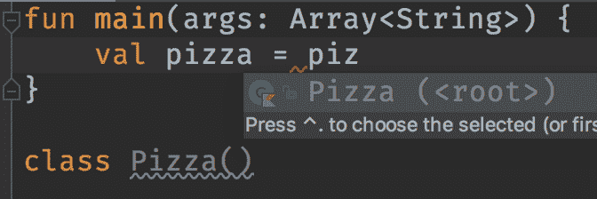

# 我的 IntelliJ 想法设置

> 原文：<https://dev.to/chrisvasqm/my-intellij-idea-setup-gbg>

*Photo by [Dominik Scythe](https://unsplash.com/@drscythe) on [Unsplash](https://unsplash.com)*

不要拘束，这是提高工作效率的关键。无论是在你最喜欢的编辑器中使用你最喜欢的[扩展](https://dev.to/chrisvasqm/must-have-extensions-for-vs-code-according-to-me-dho)，还是为你的椅子和桌子选择合适的*高度*，我们都有自己的个人偏好。

今天，我想分享一些我每次安装 IntelliJ IDEA 时做的小改变。

> 注意:以下任何配置都可以在任何基于 IntelliJ 的 ide 上使用，比如:Riders、Webstorm、Android Studio、PHPStorm 等。

## 改变默认字体

Fira 代码很快成为我的最爱，因为它不仅读起来很好，而且支持*字体连字*，这使得某些符号在你编码时可以组合或改变它们的呈现方式。

为了如此:

1.  在`File`菜单中或者在 Windows 或 MacOS 上分别按`CTRL + ALT + S` / `Command + ,`打开`Settings`窗口。
2.  在左侧面板上，选择`Editor`类别并点击`Font`。

现在，对我们来说幸运的是，每个 JetBrain 的 IDE 都默认安装了 Fira 代码，所以除了从字体的下拉菜单中选择它，我们不必做任何其他事情。

> *注意:如果您喜欢字体连字的外观，请确保也检查该窗口上的`Enable font ligatures`。*

以下是我的设置:

[T2】](https://res.cloudinary.com/practicaldev/image/fetch/s--sU-k1q5c--/c_limit%2Cf_auto%2Cfl_progressive%2Cq_auto%2Cw_880/https://thepracticaldev.s3.amazonaws.com/i/aqrwneyik27zmvdwp4wh.png)

要了解更多信息，请查看他们的 GitHub 知识库:

##  [汤斯基](https://github.com/tonsky) / [菲拉科德](https://github.com/tonsky/FiraCode)

### 带编程连字的自由等宽字体

<article class="markdown-body entry-content container-lg" itemprop="text">

## Fira 代码:带有编程连字的自由等宽字体

[T2】](https://github.com/tonsky/FiraCode./extras/logo.svg)

读入西班牙语 | [简体中文](https://github.com/tonsky/FiraCode./README_CN.md)

### 问题

程序员使用许多符号，通常用几个字符编码。对于人脑来说，像`->`、`<=`或`:=`这样的序列是单一的逻辑符号，即使它们在屏幕上显示两三个字符。你的眼睛花费了非零的能量来扫描、解析和连接多个字符成为一个逻辑字符。理想情况下，所有编程语言都应该为操作符设计完整的 Unicode 符号，但现在还不是这样。

### 解决办法

Fira Code 是一种免费的等宽字体，包含常见编程多字符组合的连字。这只是一个字体呈现特性:底层代码保持 ASCII 兼容。这有助于更快地阅读和理解代码。对于一些常见的序列，如`..`或`//`，连字允许我们纠正间距。

### 下载和安装

[T2】](https://github.com/tonsky/FiraCode/releases/download/6.2/Fira_Code_v6.2.zip)

然后:

*   [如何安装](https://github.com/tonsky/FiraCode/wiki)
*   [故障排除](https://github.com/tonsky/FiraCode/wiki#troubleshooting)
*   [新闻&更新](https://twitter.com/FiraCode)

…</article>

[View on GitHub](https://github.com/tonsky/FiraCode)

## 去除区分大小写

默认行为是，为了让编辑器的自动完成功能为类名弹出，我们需要以大写字母开始写它的名称，这对我来说有点麻烦，我发现没有这个 IDE 仍然可以很好地预测我想要键入的内容。

要做到这一点，我们必须:

1.  在`File`菜单中或者在 Windows 或 MacOS 上分别按`CTRL + ALT + S` / `Command + ,`打开`Settings`窗口。
2.  在左侧面板上，选择`Editor`类别，展开`General`菜单并选择`Code Completion`选项。
3.  从`Case sensitive completion`下拉菜单中选择`None`选项。

示例:

我创建了一个`Pizza`类，当我创建它的一个新实例时，自动完成弹出:

[T2】](https://res.cloudinary.com/practicaldev/image/fetch/s--pW8Xz-q4--/c_limit%2Cf_auto%2Cfl_progressive%2Cq_auto%2Cw_880/https://thepracticaldev.s3.amazonaws.com/i/whwlnylajff8vhu1zwmp.png)

现在，您可以亲自尝试一下，看看它是否适合您:)

## 有用的插件

如今，ide 自带了许多有用的特性，但是这些插件可以是你美味冰淇淋上的樱桃:

### [。忽略](https://plugins.jetbrains.com/plugin/7495--ignore)

*由[雅克布](https://plugins.jetbrains.com/author/f2b75a1e-da67-470d-83c9-1b23a889b64e)到*

我用这个自动找到没有被 Git 跟踪的文件，并添加到我的. gitignore 中，它甚至可以检测你的项目是否没有. gitignore 文件，并为你创建。

### [降价支持](https://plugins.jetbrains.com/plugin/7793-markdown-support)

*由[瓦伦丁·方达拉托夫](https://plugins.jetbrains.com/author/4f781b7c-2f50-433a-be13-3ce148c29009)，[安娜·库塔巴](https://plugins.jetbrains.com/author/2e4cc1fe-1bbf-4549-88f8-99cbdc61a397)，[德米特里·克拉西尔斯基科夫](https://plugins.jetbrains.com/author/Dmitry%20Krasilschikov)*

这个增加了对*的支持。md* 文件(如 README，CONTRIBUTING)是 Git 存储库中常用的文件，带有一个预览器作为侧面板，让您在编写 Markdown 时可以看到所有内容的样子。

## 就这么多了

我也喜欢到处摆弄一些键盘快捷键，但我尽量不要对其进行太多的定制，以减少从一台计算机切换到另一台计算机时来自我或其他人的任何挫折感。