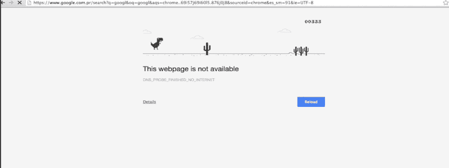

# 我作为软件开发人员的旅程

> 原文：<https://dev.to/achiengcindy/my-journey-so-far-as-a-software-developer-32b4>

这是一个关于韧性、决心和激情的故事。

这要追溯到 2011 年 8 月，当时我被录取学习应用计算机科学。老实说，我不知道这是怎么回事。我一直认为自己是一名数学家，因为数字是有意义的，但却错过了学习统计学的机会。

当时我有一台迷你笔记本电脑，是用我的 HELB 基金(高等教育贷款委员会)买的。我仍然清楚地记得当我最喜欢的讲师哎呀！不知道他是否会感激我提到他的名字，但肯定会说，“把那个玩具给你的小妹妹”，并继续谈论常见的 java 编译器。(先生，你塑造了我的技能)

“什么是编译器？”，我可以问自己，但保持沉默，以掩盖我的无知。这门课看起来还不错。我觉得自己很愚蠢，我的理智告诉我要放弃。你不够有创造力，你不像其他人那样得到它。我希望我问了。

长话短说，我设法毕业了，但冒名顶替综合症仍然困扰着我。在我看来，编程是为某一类人设计的，与这个世界格格不入。

直到我加入安德拉训练营，我的维度才改变。这是全女性训练营，在那个房间里有 40 个聪明的女人，包括我自己。我受到了启发。解决现实生活问题的实用性和相关软件激励我继续下去。我看到了通过编写代码解决问题的未来，这并不容易，但我知道我比以往任何时候都更想成为程序员，所以我辞去了 It 技术人员的工作，开始了成为世界级开发人员的可怕旅程，正如安德森喜欢说的那样。

我没能坚持到训练营结束，但是有些事情改变了。我表现得很激烈，我愿意付出时间和努力，没有什么能阻止我。我重生了，并抛弃了那些误解。[阿城辛迪博客](https://achiengcindy.com/)的诞生是为了记录我的旅程，并激励任何想编码但不知道从哪里开始的人。

我申请了与  和 [ALC 3.0](https://andela.com/alcwithgoogle/) 合作的谷歌非洲挑战赛奖学金，并幸运地被中级移动网络课程录取。奖学金的第一阶段是为期 3 个月的挑战课程，只有 500 名学者根据许多因素被选中获得纳米学位，这些因素包括参与度、按时完成任务、帮助同龄人等。

Andela Learning community 汇集了非洲各地的所有学习者，与每一个提议进行互动，提供情感支持和合作(这是优秀程序员所做的)。

向包括 jakearchibald 在内的一些最优秀的开发人员学习是一段有趣的旅程。在 3 个月的挑战课程中获得的知识是不可估量的。你曾经想象过拥有离线的第一个网络应用吗？向这个说再见:

[T2】](https://res.cloudinary.com/practicaldev/image/fetch/s--MmIhI9Ct--/c_limit%2Cf_auto%2Cfl_progressive%2Cq_auto%2Cw_880/https://i.imgur.com/JGRhuL0.jpg)

如果你像我一样喜欢这个游戏，好的一面是你仍然可以在你想玩的时候玩。多亏了 web Technologies [服务工作者](https://achiengcindy.com/2018/05/11/understanding-the-service-worker-lifecycle/)，Catch API，Indexed db 和 fetch API。

高潮是 7DaysofCodeChallenge 创建了一个可以在线和离线工作的[货币转换器应用程序](https://achiengcindy.github.io/currency_converter/main.html)。

今天(2018 年 7 月 11 日)，我再次幸运地成为为数不多的 500 名在 Udacity 获得纳米学位的学者之一，我无法保持沉默。感谢所有支持我的人。麦克卡布和我所有的奖学金获得者，安德拉，乌达城和谷歌非洲

Asanteni sana!

#### 更多关于 ALC

1.  [ALC](https://medium.com/@chimdi2000/andela-and-googles-android-learning-community-alc-the-case-for-investing-in-communities-of-35cda2b276b5)