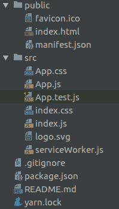
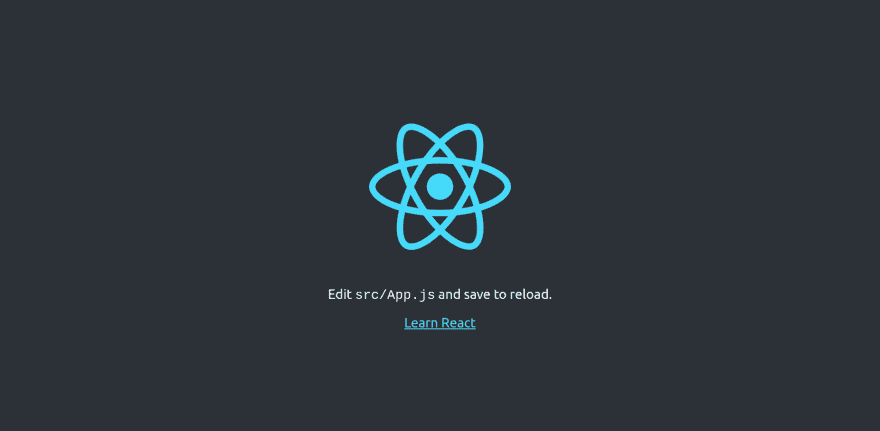
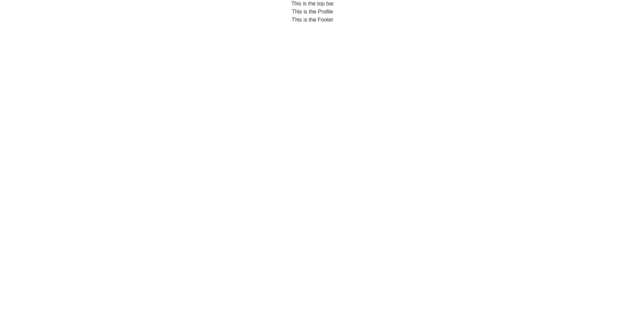
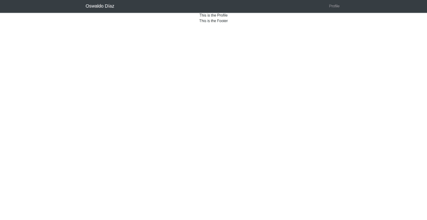
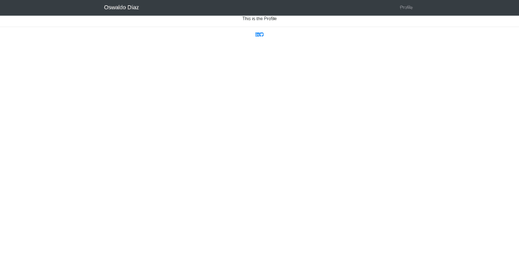
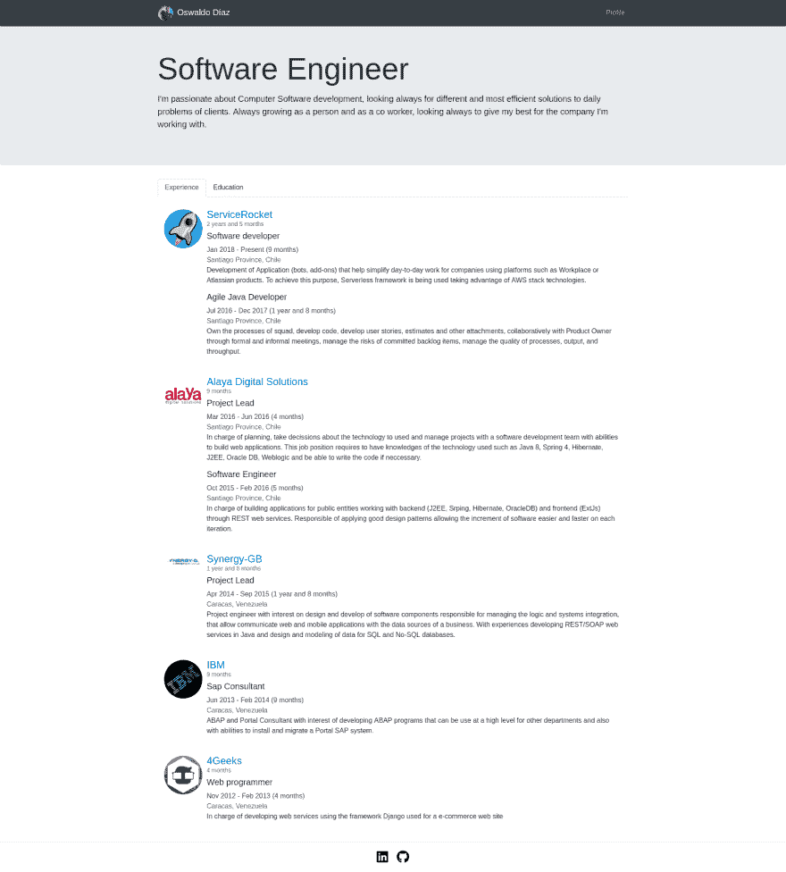
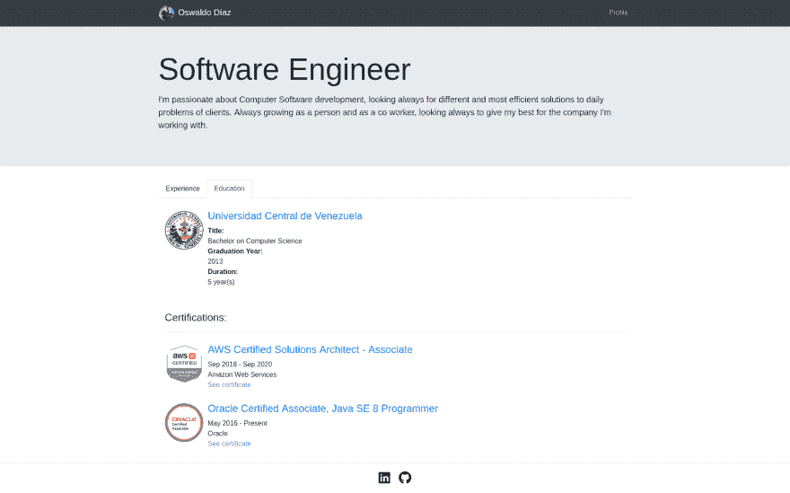

# 我的 React 个人页面

> 原文：<https://dev.to/oswaldodiaz/my-personal-page-with-react-4jkn>

我玩 React 已经有一段时间了，到目前为止，我的体验相当令人满意，所以我决定创建自己的个人页面，现在我想向您展示如何做到这一点。

整个 app 都在 [github](https://github.com/oswaldodiaz/mypage) 上。

## 先决条件

首先让我们假设您已经为 [React](https://reactjs.org/tutorial/tutorial.html#setup-for-the-tutorial) 设置好了所有的环境:

*   确保您安装了最新版本的 [Node.js](https://nodejs.org/en/) 。
*   按照 Create React App 的[安装说明创建一个新项目。](https://reactjs.org/docs/create-a-new-react-app.html#create-react-app)

我使用[纱线](https://yarnpkg.com/en/)代替 npm，但是没有必要，如果你宁愿在命令`yarn add`中使用 npm 替换`npm install`。

```
yarn add -g create-react-app 
```

## 创建新的 React 应用

要创建一个新的 React 应用程序，你只需要运行`create-react-app`，然后输入你的应用程序名称。

```
create-react-app my-page
cd my-page 
```

现在创建了一个基本项目，其结构如下:
[](https://res.cloudinary.com/practicaldev/image/fetch/s--KoN808l3--/c_limit%2Cf_auto%2Cfl_progressive%2Cq_auto%2Cw_880/https://thepracticaldev.s3.amazonaws.com/i/l945bl5k131wyvxwjr3s.png)

让我们运行我们的应用程序，看看我们到目前为止有什么。

```
yarn start 
```

您的浏览器将在`http://localhost:3000`打开，您将看到 React 徽标四处旋转。

[T2】](https://res.cloudinary.com/practicaldev/image/fetch/s--hUX8xoOk--/c_limit%2Cf_auto%2Cfl_progressive%2Cq_auto%2Cw_880/https://thepracticaldev.s3.amazonaws.com/i/3pmogi9ycby0904wxo4n.png)

## 依赖关系

我们将使用一组依赖关系来轻松呈现我们的组件:

*   Bootstrap :一个用于 HTML、CSS 和 JS 开发的开源工具包。

```
yarn add bootstrap --save
yarn add jquery --save
yarn add popper.js --save
yarn add reactstrap --save 
```

*   对于你网站上的矢量图标和社会标志，这是网络上最流行的图标集和工具包。

```
yarn add @fortawesome/react-fontawesome --save
yarn add @fortawesome/fontawesome-svg-core --save
yarn add @fortawesome/free-brands-svg-icons --save 
```

*   [时刻](https://momentjs.com/docs/):用 JavaScript 解析、验证、操作和显示日期和时间。

```
yarn add moment --save 
```

让我们也在`index.js`
中导入引导程序

```
import 'bootstrap/dist/css/bootstrap.min.css'; 
```

## 运行 App

保持应用程序运行，这样你就可以实时看到你的变化。

```
yarn start 
```

## 组件

React 的神奇之处在于将页面的片段作为组件来处理，每个组件都独立工作，这样就可以轻松地对代码进行 T2 替换、重定位或重构，而不需要增加整个应用程序。对于这个项目，我们将有 3 个主要组件:**顶栏**，**配置文件**和**页脚**，其中每个组件都有一个特定的主题渲染，它们中的每一个都可以在其他组件中划分。

让我们将名为*组件*的文件夹添加到我们的 src 中，并创建我们的 3 个组件:

```
mkdir src/components
touch src/components/TopBar.js
touch src/components/Profile.js
touch src/components/Footer.js 
```

下面是组件`TopBar.js`的代码。

```
import React from 'react';

class TopBar extends React.Component {
  render() {
    return <div>This is the top bar</div>;
  }
}

export default TopBar; 
```

首先，我们创建一个名为 TopBar 的组件，它从 React Component 扩展而来，这个类有一个名为 render()的独特方法，它需要返回一个 HTML 标签，在本例中是一个简单的`<div>This is the top bar</div>`。最后，我们需要导出这个类，这样我们就可以在其他组件中使用它。为`Profile.js`和`Footer.js`复制相同的代码。

现在，让我们修改`App.js`,以便它呈现我们的新组件:

```
import React, { Component } from 'react';
import './App.css';
import TopBar from './components/TopBar';
import Profile from './components/Profile';
import Footer from './components/Footer';

class App extends Component {
  render() {
    return (
      <div className="App">
        <TopBar />
        <Profile />
        <Footer />
      </div>
    );
  }
}

export default App; 
```

现在我们可以看到以下内容:

[T2】](https://res.cloudinary.com/practicaldev/image/fetch/s--wW1c0fA1--/c_limit%2Cf_auto%2Cfl_progressive%2Cq_auto%2Cw_880/https://thepracticaldev.s3.amazonaws.com/i/a3rcgu9ng5ihmd5xbs01.png)

### 顶栏

顶栏将由一个带有用户名的[导航栏](https://reactstrap.github.io/components/navbar/)和一个到**个人资料**的链接组成。让我们替换`TopBar.js`上的代码。

```
import React from 'react';
import {Container, Collapse, Navbar, NavbarToggler, NavbarBrand, Nav, NavItem, NavLink } from 'reactstrap';

class TopBar extends React.Component {
  constructor(props) {
    super(props);

    this.toggle = this.toggle.bind(this);
    this.state = {
      isOpen: false
    };
  }

  toggle() {
    this.setState({
      isOpen: !this.state.isOpen
    });
  }

  render() {
    return (
      <Navbar color="dark" dark expand="md">
        <Container>
          <NavbarBrand href="/">
            <span>Oswaldo Díaz</span>
          </NavbarBrand>
          <NavbarToggler onClick={this.toggle}/>
          <Collapse isOpen={this.state.isOpen} navbar>
            <Nav className="ml-auto" navbar>
              <NavItem>
                <NavLink href="/profile/">Profile</NavLink>
              </NavItem>
            </Nav>
          </Collapse>
        </Container>
      </Navbar>
    );
  }
}

export default TopBar; 
```

现在我们的设计有了一个合适的顶栏。

[T2】](https://res.cloudinary.com/practicaldev/image/fetch/s--uYPVaFzz--/c_limit%2Cf_auto%2Cfl_progressive%2Cq_auto%2Cw_880/https://thepracticaldev.s3.amazonaws.com/i/1mvxilmn8no4fnqsbk1v.png)

### 页脚

对于页脚，我们将使用 [FontAwesome](https://fontawesome.com/how-to-use/on-the-web/using-with/react) 来呈现 [Github](https://github.com/) 和 [Linkedin](https://linkedin.com/) 图标，并链接到每个个人资料。现在让我们替换我们的`Footer.js`内容。

```
import React from 'react';
import {Container} from 'reactstrap';
import { FontAwesomeIcon } from '@fortawesome/react-fontawesome';
import { faLinkedin, faGithub } from '@fortawesome/free-brands-svg-icons'

class Footer extends React.Component {
  render() {
    return (
      <footer>
        <hr/>
        <Container>
          <a href="https://www.linkedin.com/in/oswaldo-d%C3%ADaz-397b036b/"><FontAwesomeIcon icon={faLinkedin} /></a>
          <a href="https://github.com/oswaldodiaz"><FontAwesomeIcon icon={faGithub}  /></a>
        </Container>
      </footer>
    )
  }
}

export default Footer; 
```

有了上面的代码，2 个图标将会出现在最后，链接到我们的 linkedin 和 github 个人资料。

[T2】](https://res.cloudinary.com/practicaldev/image/fetch/s--YXTiJXco--/c_limit%2Cf_auto%2Cfl_progressive%2Cq_auto%2Cw_880/https://thepracticaldev.s3.amazonaws.com/i/ix4m3469qhuqo8iivfcz.png)

### 简介

对于个人资料，让我们将内容分为两部分，首先是对您的概述，然后是包含更多详细信息的[选项卡](https://reactstrap.github.io/components/tabs/)。第二部分将呈现新组件`Experience.js`和`Education.js`。

在我们继续之前，让我们创建一个 JSON 文件，我们可以在其中存储所有的或专业的经验，然后我们将使用适当的组件来呈现这些信息:

```
touch src/profile.json 
```

并将以下内容添加到`profile.json`。

```
{  "title":  "Software Engineer",  "summary":  "I'm passionate about Computer Software development, looking always for different and most efficient solutions to daily problems of clients. Always growing as a person and as a co worker, looking always to give my best for the company I'm working with.",  "studies":  [  {  "institute":  "Universidad Central de Venezuela",  "logo":  "https://media.licdn.com/dms/image/C560BAQEqH4pTb_C3Vg/company-logo_400_400/0?e=1547078400&v=beta&t=w7dqsi-UJEkF4ChiuDRTSUPQ0H_hZiJ6NwWvix_b1Uc",  "url":  "http://www.ciens.ucv.ve/",  "title":  "Bachelor on Computer Science",  "durationInYears":  "5",  "graduationYear":  2013  }  ],  "certifications":  [  {  "logo":  "https://www.certmetrics.com/api/ob/image/amazon/c/1",  "url":  "https://aws.amazon.com/certification/certified-solutions-architect-associate/",  "title":  "AWS Certified Solutions Architect - Associate",  "issuer":  "Amazon Web Services",  "issueDate":  "2018-09-01",  "expiryDate":  "2020-09-01",  "verificationLink":  "https://www.certmetrics.com/amazon/public/badge.aspx?i=1&t=c&d=2018-09-13&ci=AWS00487431"  },  {  "logo":  "https://acclaim-production-app.s3.amazonaws.cimg/86629924-6c10-442c-8742-05ff5e45e922/Oracle-Certification-badge_OC-Associate.png",  "url":  "https://education.oracle.com/es/oracle-certified-associate-java-se-8-programmer/trackp_333",  "title":  "Oracle Certified Associate, Java SE 8 Programmer",  "issuer":  "Oracle",  "issueDate":  "2016-05-01",  "verificationLink":  "https://www.youracclaim.com/badges/aa466aec-ddbc-4e67-8038-aa8466a4aef9/linked_in_profile"  }  ],  "experiences":  [  {  "companyName":  "ServiceRocket",  "logo":  "https://media.licdn.com/dms/image/C560BAQE0UGAq3qc4PA/company-logo_200_200/0?e=1547078400&v=beta&t=wPEtCDSDDI8HHn779fD3yG5tr95YQC6pe71f81HU7oQ",  "url":  "https://www.servicerocket.com/",  "roles":  [  {  "title":  "Software developer",  "description":  "Development of Application (bots, add-ons) that help simplify day-to-day work for companies using platforms such as Workplace or Atlassian products. To achieve this purpose, Serverless framework is being used taking advantage of AWS stack technologies.",  "startDate":  "2018-01-01",  "currentJob":  true,  "location":  "Santiago Province, Chile"  },  {  "title":  "Agile Java Developer",  "description":  "Own the processes of squad, develop code, develop user stories, estimates and other attachments, collaboratively with Product Owner through formal and informal meetings, manage the risks of committed backlog items, manage the quality of processes, output, and throughput.",  "startDate":  "2016-07-01",  "endDate":  "2018-01-01",  "location":  "Santiago Province, Chile"  }  ]  },  {  "companyName":  "Alaya Digital Solutions",  "logo":  "https://media.licdn.com/dms/image/C4D0BAQEOGmtbMe-jiA/company-logo_400_400/0?e=1547078400&v=beta&t=O-BNIwr7tSojDadQq7WHlBT349-M2WEl7tgY4IJxLzU",  "url":  "http://www.alaya.cl/",  "roles":  [  {  "title":  "Project Lead",  "description":  "In charge of planning, take decissions about the technology to used and manage projects with a software development team with abilities to build web applications. This job position requires to have knowledges of the technology used such as Java 8, Spring 4, Hibernate, J2EE, Oracle DB, Weblogic and be able to write the code if neccessary.",  "startDate":  "2016-03-01",  "endDate":  "2016-07-01",  "location":  "Santiago Province, Chile"  },  {  "title":  "Software Engineer",  "description":  "In charge of building applications for public entities working with backend (J2EE, Srping, Hibernate, OracleDB) and frontend (ExtJs) through REST web services. Responsible of applying good design patterns allowing the increment of software easier and faster on each iteration.",  "startDate":  "2015-10-01",  "endDate":  "2016-03-01",  "location":  "Santiago Province, Chile"  }  ]  },  {  "companyName":  "Synergy-GB",  "logo":  "https://media.licdn.com/dms/image/C4E0BAQG8mmQH36m-Xg/company-logo_400_400/0?e=1547078400&v=beta&t=ijgqvtMLx6iNypHtW_7WySNju7rTP7Tvo3ujAchGvck",  "url":  "http://www.alaya.cl/",  "roles":  [  {  "title":  "Project Lead",  "description":  "Project engineer with interest on design and develop of software components responsible for managing the logic and systems integration, that allow communicate web and mobile applications with the data sources of a business. With experiences developing REST/SOAP web services in Java and design and modeling of data for SQL and No-SQL databases.",  "startDate":  "2014-04-01",  "endDate":  "2015-10-01",  "location":  "Caracas, Venezuela"  }  ]  },  {  "companyName":  "IBM",  "logo":  "https://media.licdn.com/dms/image/C560BAQEZL5_LD7kuhg/company-logo_400_400/0?e=1547078400&v=beta&t=kD5vayFgrDcbzzpbNYhpfPPF0kr-pQWAnuHdl0j7mRU",  "url":  "https://www.ibm.com/ve-es/",  "roles":  [  {  "title":  "Sap Consultant",  "description":  "ABAP and Portal Consultant with interest of developing ABAP programs that can be use at a high level for other departments and also with abilities to install and migrate a Portal SAP system.",  "startDate":  "2013-06-01",  "endDate":  "2014-03-01",  "location":  "Caracas, Venezuela"  }  ]  },  {  "companyName":  "4Geeks",  "logo":  "https://media.licdn.com/dms/image/C4D0BAQERvzTMXtxd7g/company-logo_400_400/0?e=1547078400&v=beta&t=I_dafILp03Xn8WaI9-9IBHah7Z5wPpW55D8WY1kgR6c",  "url":  "https://www.4geeksacademy.co",  "roles":  [  {  "title":  "Web programmer",  "description":  "In charge of developing web services using the framework Django used for a e-commerce web site",  "startDate":  "2012-11-01",  "endDate":  "2013-03-01",  "location":  "Caracas, Venezuela"  }  ]  }  ]  } 
```

文件`profile.json`有一般信息(**标题**和**摘要**)和章节**学习**、**认证**和**经验**，我们将在后面使用组件渲染。

让我们创建两个新组件:

*   `Experience.js`:渲染工作经验。
*   给予教育(研究和认证)。

```
touch src/components/Experience.js
touch src/components/Education.js 
```

首先，对于`Experience.js`组件，让我们使用[媒体](https://reactstrap.github.io/components/media/)来呈现我们的工作体验。

```
import React from "react";
import { Container, Row, Col } from "reactstrap";
import profile from "../profile";
import moment from "moment";
import { Media } from "reactstrap";

function getDuration(duration) {
  const years = parseInt(duration / 12);
  const months = (duration > 12)? duration % 12 : duration
  return (years > 0? years + " year" + (years > 1? "s": "") + " and " : "") + (months > 0? months + " month" + (months > 1? "s": "") : "");
};

class Experience extends React.Component {
  render() {
    return <Container>
      <Row>
        <Col>
          {profile.experiences.map(function (experience, i) {
            moment.locale('en');

            const totalDuration = experience.roles.reduce(function (cnt, role) {
              const startDate = moment(role.startDate);
              const timeEnd = moment(role.currentJob ? new Date() : new Date(role.endDate));
              const duration = moment.duration(timeEnd.diff(startDate));
              return Number(cnt) + Number(duration.asMonths().toPrecision(1));
            }, 0);

            return (
              <div key={i}>
                <Media>
                  <Media left top href={experience.url}>
                    <Media object src={experience.logo} alt={experience.companyName}/>
                  </Media>
                  <Media body>
                    <Media heading>
                      <a href={experience.url}>{experience.companyName}</a>
                      <span className="jobTotalDuration">{getDuration(totalDuration)}</span>
                    </Media> 
                    {experience.roles.map(function (role, i) {
                      const startDate = moment(role.startDate);
                      const timeEnd = moment(role.currentJob ? new Date() : new Date(role.endDate));
                      const duration = Number(moment.duration(timeEnd.diff(startDate)).asMonths().toPrecision(1));

                      return <div key={i}>
                        <h5>{role.title}</h5>
                        <span
                          className="jobDuration">{startDate.format('MMM YYYY')} - {role.currentJob ? 'Present' : timeEnd.format('MMM YYYY')} ({getDuration(duration)})</span>
                        <span className="jobLocation">{role.location}</span>
                        <p className="jobDescription">{role.description}</p>
                      </div>
                    })}
                  </Media>
                </Media>
              </div>
            );
          })}
        </Col>
      </Row>
    </Container>
  }
}

export default Experience; 
```

我们正在导入上面创建的 JSON，通过:`import profile from "../profile";`。

在这个组件中，我们定义了一个**函数**，它被用来清理代码并从组件中抽象出逻辑。

我们添加的另一个东西是 **map** 来迭代一个经验集合和每个经验(以及一个角色集合)。

现在，让我们来研究一下`Education.js`。我们也会使用媒体。

```
import React from 'react';
import {Container, Row, Col, Media} from 'reactstrap';
import moment from 'moment';
import profile from '../profile.json';

class Education extends React.Component {
  render() {
    return <Container>
      <Row>
        <Col>
          {profile.studies.map(function (study, i) {
            return <Media key={i}>
              <Media left top href={study.url}>
                <Media object src={study.logo} alt={study.institute}/>
              </Media>
              <Media body>
                <Media heading>
                  <a href={study.url}>{study.institute}</a>
                </Media>
                {
                  [
                    {
                      "key": "Title",
                      "value": study.title
                    },
                    {
                      "key": "Graduation Year",
                      "value": study.graduationYear
                    },
                    {
                      "key": "Duration",
                      "value": study.durationInYears + " year(s)"
                    }
                  ].map(function (object, i) {
                    return <div>
                      <Row>
                        <Col className="formLabel">{object.key}:</Col>
                      </Row>
                      <Row>
                        <Col>{object.value}</Col>
                      </Row>
                    </div>
                  })
                }
              </Media>
            </Media>
          })}
        </Col>
      </Row>
      <br/>
      <br/>
      <Row>
        <Col>
          <h4>Certifications:</h4>
          <hr/>
          {profile.certifications.map(function (certification, i) {
            const verification = certification.verificationLink ?
              <Row>
                <Col>
                  <a className="certificateLink" href={certification.verificationLink}>See certificate</a>
                </Col>
              </Row> : "";
            return <Media key={i}>
              <Media left top href={certification.url}>
                <Media object src={certification.logo} alt={certification.title}/>
              </Media>
              <Media body>
                <Media heading>
                  <a href={certification.url}>{certification.title}</a>
                </Media>
                <Row>
                  <Col>{moment(certification.issueDate).format('MMM YYYY')} - {(certification.expiryDate) ? moment(certification.expiryDate).format('MMM YYYY') : 'Present'}</Col>
                </Row>
                <Row>
                  <Col>{certification.issuer}</Col>
                </Row>
                {verification}
              </Media>
            </Media>
          })}
        </Col>
      </Row>
    </Container>
  }
}

export default Education; 
```

现在我们已经定义了两个部分，让我们修改`Profile.js`。

```
import React from 'react';
import {Jumbotron, Container, TabContent, TabPane, Nav, NavItem, NavLink } from "reactstrap";
import classnames from 'classnames';
import Experience from "./Experience";
import Education from './Education'
import profile from '../profile.json'

class Profile extends React.Component {
  constructor(props) {
    super(props);

    this.toggle = this.toggle.bind(this);
    this.state = {
      activeTab: '1'
    };
  }

  toggle(tab) {
    if (this.state.activeTab !== tab) {
      this.setState({
        activeTab: tab
      });
    }
  }

  render() {
    return <div>
      <Jumbotron>
        <Container>
          <h1 className="display-3">{profile.title}</h1>
          <p className="lead">{profile.summary}</p>
        </Container>
      </Jumbotron> 
      <Container>
        <Nav tabs>
          <NavItem>
            <NavLink className={classnames({ active: this.state.activeTab === '1' })}
                     onClick={() => { this.toggle('1'); }}>
              Experience
            </NavLink>
          </NavItem>
          <NavItem>
            <NavLink className={classnames({ active: this.state.activeTab === '2' })}
                     onClick={() => { this.toggle('2'); }}>
              Education
            </NavLink>
          </NavItem>
        </Nav>
        <TabContent activeTab={this.state.activeTab}>
          <TabPane tabId="1">
            <Experience/>
          </TabPane>
          <TabPane tabId="2">
            <Education/>
          </TabPane>
        </TabContent>
      </Container>
    </div>;
  }
}

export default Profile; 
```

首先，我们使用[大屏幕](https://reactstrap.github.io/components/jumbotron/)显示**摘要**和[标签](https://reactstrap.github.io/components/tabs/)显示**体验**和**教育**。

### 添加个人资料图片

查找您的个人资料图片，并将其保存在名为`profilePic.jpg`(可能是另一个名称)的`src`文件夹下。

让我们修改`TopBar.js`来添加一个轮廓图片:

```
...
import profilePic from '../profilePic.jpg';

class TopBar extends React.Component {
  ...

  render() {
    return (
      <Navbar color="dark" dark expand="md">
        <Container>
          <NavbarBrand href="/">
            
            ... 
```

### 添加样式

最后，让我们通过修改`App.css`来添加一些样式。

```
.profile-pic {
  height: 4vmin;
  margin-right: 10px;
  border-radius: 50px;
}

a {
  color: #343a40;
}

a:hover {
  color: #173798;
  text-decoration: none;
}

div.media {
  margin-top: 30px;
  margin-bottom: 10px;
}

div.media .media-heading .jobTotalDuration {
  color: #666;
  font-size: 14px;
  display: block;
}

div.media img {
  height: 10vmin;
  margin-right: 10px;
  border-radius: 50px;
}

div.media .jobDuration {
  color: #444;
  display: block;
}

div.media .jobLocation {
  color: #666;
}

.formLabel {
  font-weight: bold;
}

.certificateLink {
  color: cornflowerblue;
}

footer {
  margin-top: 20px;
  margin-bottom: 10px;
  border-top: #444444;
  text-align: center;
}

footer a {
  color: black;
  font-size: 30px;
  margin-right: 10px;
  margin-left: 10px;
} 
```

### 最终结果

**经历**
[](https://res.cloudinary.com/practicaldev/image/fetch/s--6ilRit38--/c_limit%2Cf_auto%2Cfl_progressive%2Cq_auto%2Cw_880/https://thepracticaldev.s3.amazonaws.com/i/x73ts8ag33m4wl9crhfa.png)

**教育**
[](https://res.cloudinary.com/practicaldev/image/fetch/s--NGoQTgkV--/c_limit%2Cf_auto%2Cfl_progressive%2Cq_auto%2Cw_880/https://thepracticaldev.s3.amazonaws.com/i/avr1x9r6y4s1h911f3b0.png)

这是我目前在 AWS 中的页面，作为一个 S3 静态网站，位于 URL[http://oswaldodiaz . info](http://oswaldodiaz.info)下。

让我知道，如果你觉得这个教程有用，如果有些东西不够清楚，或者如果你有反应的经验，你会做什么不同；)