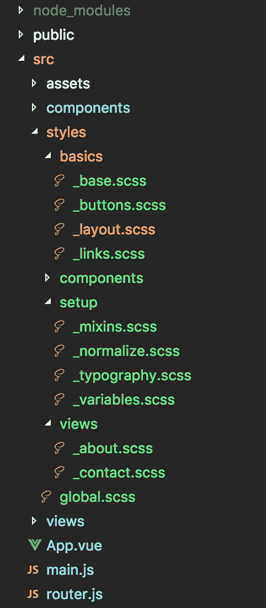

# Vue CLI 3 项目中的我的 SCSS 设置

> 原文：<https://dev.to/lynnewritescode/my-scss-setup-within-a-vue-cli-3-project-4jan>

直到 Vue.js 的出现，我才意识到我已经失去了一些对开发的热情。我仍在学习，但它让我再次对编码产生了兴趣。我断断续续地玩了一会儿，现在我正致力于用 Vue 从头开始建立我自己的网站。

最难理解的事情之一是项目结构。这是很多教程都没有涉及到的东西。最终我把它拼凑起来，并遇到了我的下一个问题。SCSS。

我找不到很多关于人们通常如何使用全局样式以及每个组件中的样式的信息。我知道我想怎么做，但不知道如何实际实现它。如果你也有类似的情况，我希望这篇文章能有所帮助。

下面是我如何从头开始创建一个 Vue CLI 3 应用程序...

## 创建应用程序

假设您安装了 Vue CLI 3，在终端中运行以下命令，在浏览器中启动 Vue 项目管理器。

```
vue ui 
```

Enter fullscreen mode Exit fullscreen mode

如果你还没有安装，这里有你需要的[文档](https://cli.vuejs.org/guide/installation.html)。

要创建应用程序，只需在 Vue 项目管理器中点击屏幕顶部的**创建**按钮。这将带您完成通常必须在终端中完成的各种步骤，并允许您将设置保存为预置。得心应手！

对于我的项目，我倾向于选择以下选项:

*   包装经理:纱线
*   预设:手动(用于第一个项目)
*   功能:通天塔，路由器，CSS 预处理器，棉绒/格式化程序
*   历史模式:开
*   预处理器:SCSS/萨斯
*   linter/Formatter:ESLint+appearlier(保存时 Lint)

然后点击**创建项目**，它将创建您的应用程序。您现在应该有了一个基本的 Vue.js 项目。你可以在 Vue 项目管理器的 tasks 选项卡中点击 **serve** 来本地启动你的站点。

## 设置我们的风格

首先，在 src 文件夹中创建一个名为 **styles** 的文件夹。这是我们将为应用程序存储所有 SCSS 的地方。在这个文件夹中，创建一个将用于你的全局样式的文件，例如 **global.scss**

在 Vue 项目管理器中，进入**插件**选项卡，点击**添加插件**按钮。我们想安装一个名为**的插件 vue-CLI-plugin-style-resources-loader**。

安装完成后，它会在项目的根目录下添加一个名为 **vue.config.js** 的文件

转到 **vue.config.js** 并添加以下代码，用您为全局样式命名的 scss 文件替换样式表名称/路径。

```
const path = require("path");

module.exports = {
  pluginOptions: {
    "style-resources-loader": {
      preProcessor: "scss",
      patterns: [path.resolve(__dirname, "./src/styles/global.scss")]
    }
  }
}; 
```

Enter fullscreen mode Exit fullscreen mode

现在，global.scss 中的所有样式将在整个项目中和组件中可用。通常我的 SCSS 文件结构看起来像这样:

[T2】](https://res.cloudinary.com/practicaldev/image/fetch/s--cnZWrzMn--/c_limit%2Cf_auto%2Cfl_progressive%2Cq_auto%2Cw_880/http://lynnefinnigan.com/static/img/styles.png)

我在 _base.scss 中有基本的富文本样式，变量、排版等都作为部分存储在各自的文件夹中。然后将它们导入到全局样式表中，如下所示:

```
@import "setup/normalize.scss";
@import "setup/typography.scss";
@import "setup/variables.scss";
@import "setup/mixins.scss";

@import "basics/base.scss";
@import "basics/layout.scss";
@import "basics/links.scss";
@import "basics/buttons.scss"; 
```

Enter fullscreen mode Exit fullscreen mode

我在 styles 目录中还有一个文件夹，用于存放组件。我在 Vue 中创建的每个组件都有自己的 scss 部分。Vue.js 的一个有用的特性是，你可以在 Vue 组件文件中添加样式，这些样式可以是**范围的**，这样它们只有在页面上呈现特定组件时才会呈现。

现在我们已经设置好了，向组件添加样式就很容易了。这是它在我的组件中的样子 **Example.vue**

```
<template>
  <div>
    <h1>I am a component!</h1>
  </div>
</template>

<script>
export default {
  name: Example
}
</script>

<style lang="scss" scoped>
@import "../styles/components/example.scss";
</style> 
```

Enter fullscreen mode Exit fullscreen mode

在 **_example.scss** 文件中，你可以访问所有的变量/排版/混合以及你在全局样式中添加的任何东西。你也可以像这样把它写在样式标签里，用 **$c-title** 作为标题颜色的全局变量名:

```
<style lang="scss" scoped>
h1 {
  color: $c-title;
}
</style> 
```

Enter fullscreen mode Exit fullscreen mode

然而，我更喜欢把所有的样式放在一个地方(样式文件夹和子文件夹)，文件名和组件本身一样。这样更容易找到，也更容易和其他人一起工作。

这是一篇很长的文章，所以如果你已经读到这里，感谢你的阅读！我希望这在某种程度上有所帮助。尽情享受你的 Vue 项目，创造出令人惊叹的东西！