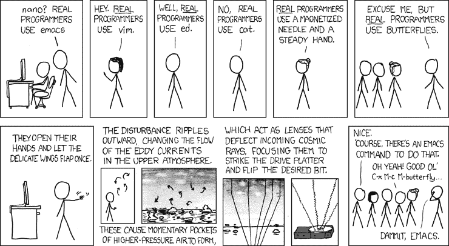

# 我的解决方案是最好的！

> 原文：<https://dev.to/jhotterbeekx/my-solution-is-the-best-1pjk>

几天前，我看了一个主题演讲人关于建筑的演讲。这是一次有趣的谈话，他有一个很好的概念，这个想法肯定很有意义。我真的不喜欢演讲者，这是可能发生的，但这通常不会从内容中删除任何信用。只是这一次，至少对我来说是这样。

## 发生了什么？

演讲的大部分都很好，有很多很好的例子，他真的很懂自己的东西。但是对我来说，他完全错误的地方是他谈论其他解决方案和技术的方式。称它们为蹩脚的平台，告诉人们如果他们还在使用这个平台，他们可能应该退出，称某些做法为潮人所用，称使用了多年的方法为“大错误”。现在你可能明白我的意思了，在演讲中有很多这样的例子。因此，虽然内容很好，但他对待其他技术的方式实际上让我完全失去了对它的尊重。虽然这个例子有点极端，但它让我思考，为什么我们很多人认为自己的解决方案是最好的，而对其他解决方案说三道四？

[T2】](https://res.cloudinary.com/practicaldev/image/fetch/s--FbJ6nC69--/c_limit%2Cf_auto%2Cfl_progressive%2Cq_auto%2Cw_880/https://thepracticaldev.s3.amazonaws.com/i/6jigb61eh36zz5w6jnbq.png)

## 是什么原因导致了这种行为？

我们在工作中可以使用的技术上有很大的选择余地，我们大多数人可能会意识到认为我们选择的技术是最好的那种感觉。这种感觉是完全自然的，是人性的一部分，它反映了我们对主题或选择的热情。虽然在你选择了某项技术后，你可能会对它感到有些不安全，但是一旦你熟悉了它，这种感觉通常会被激情取代。如果你与他人交谈并关注自己，你会注意到你会非常热情地为自己的选择辩护。所以你从怀疑到认为这是你见过的最好的，看起来有点奇怪，对吗？别担心，你绝对没有任何问题，你只是人类。

## 放开自己

谁没有参与过关于 Windows 比 Linux 好，IOS 比 Android 好，React 比 Angular 好的讨论？我们都这样做了，我们仍然这样做，而且可能会做很长一段时间。虽然我并不是说要放弃这些讨论，但是试着把自己放开一点。试着站在别人的立场上，看看这对他们有什么好处，试着接受我们并不知道所有的事情，其他的解决方案可能一样好，甚至更好。我们似乎很容易在没有实际工作的情况下就对一些事情做出判断，我认为这都来自于我们热情的人性。但是试着意识到这一点，也许下一次在做出判断之前先尝试一些事情或者听听别人的意见。我发现这个想法很有帮助。“如果有很多人在使用它，它在某些方面肯定是好的”。

## 没有最佳方案

当谈到这个主题时，一个容易出现的问题是，每种语言、框架或其他技术解决方案都有针对不同情况的用途。我不认为那是真的。对于一种情况，没有“最佳”的解决方案，顶多有一些好的解决方案。我们在软件工程中的可能性太大了，解决方案被广泛使用，这使得只有一个真正的最佳解决方案的情况几乎消失了。我甚至认为，你对不同的技术了解得越多，你就越会发现它们在本质上比你想象的要相似得多。

[T2】](https://res.cloudinary.com/practicaldev/image/fetch/s--r85dmwub--/c_limit%2Cf_auto%2Cfl_progressive%2Cq_auto%2Cw_880/https://thepracticaldev.s3.amazonaws.com/i/7pm7j5q5110u14u0501v.jpg)

## 我们能改变什么？

现在回头看看这个演示，他本可以做些什么不同的事情呢？事实上很简单，他可以什么都不说。他们没有给演示增加任何价值。如果他的目标是让事情变得有趣，就试着加上一个笑话，或者至少说一些不会损害他人利益的话。以这种方式想象演示实际上点燃了他正在演示的实际主题的热情和灵感，我认为这将是他想要达到的目标。

当你审视我们的日常工作时，你可以试着意识到这一点，因为意识是提升自己的关键。就像我之前说的，不要对技术和解决方案进行评判，而是试着从一个更符合逻辑或理性的角度来看待它。你会注意到，如果你更能接受他人的选择，并能够承认自己对该主题缺乏了解，其他人也会敞开心扉，而你实际上会从中学到更多。

我想以一种积极的方式结束这篇文章，因此我想请你试着尊重他人，你不需要贬低他人来增加你自己想法的价值。你的观点，你的想法，你的意见值得分享，并且足够强大，可以独立存在！

[T2】](https://res.cloudinary.com/practicaldev/image/fetch/s--nMv6MFgu--/c_limit%2Cf_auto%2Cfl_progressive%2Cq_auto%2Cw_880/https://thepracticaldev.s3.amazonaws.com/i/tgajmko680kjws3buipw.jpg)