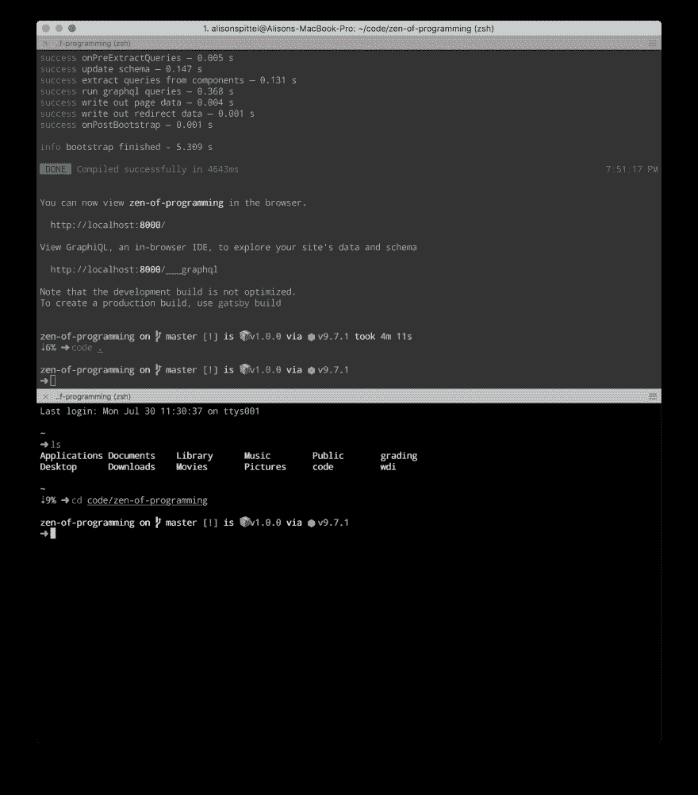
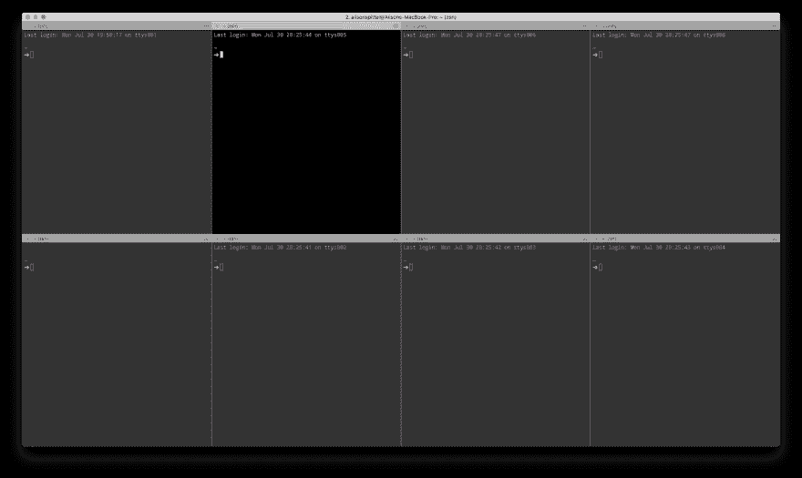
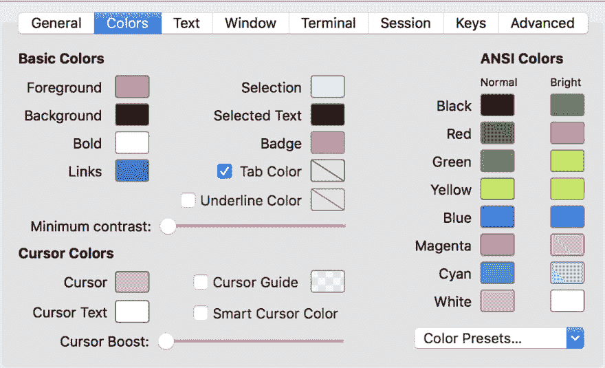
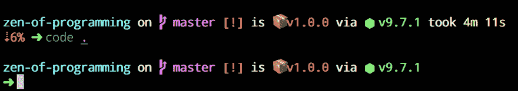
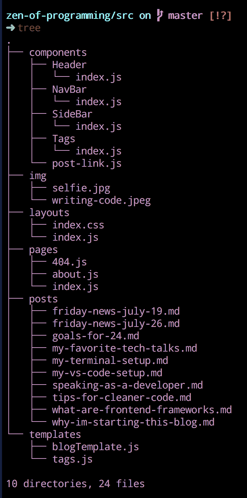

# 我的终端设置:iTerm2 + Zsh🔥

> 原文：<https://dev.to/aspittel/my-terminal-setup-iterm2--zsh--30lm>

作为我在文本编辑器设置上的[帖子](https://zen-of-programming.com/vs-code-setup/)的后续，我想写一下我的开发设置的另一个关键部分——我的终端。与我相对较新的文本编辑器设置不同，我的终端配置已经跟随我很多年了——跨越多个任务，甚至更多的计算机。当我得到一台新电脑时，这是我第一件要做的事情

# 终端

我的终端仿真器使用 iTerm2。它有一些非常酷的功能，比如搜索、自动完成和粘贴历史。也就是说，让它成为我的必备功能的是分割窗格。

[T2】](https://res.cloudinary.com/practicaldev/image/fetch/s--8c1FQHfU--/c_limit%2Cf_auto%2Cfl_progressive%2Cq_auto%2Cw_880/https://thepracticaldev.s3.amazonaws.com/i/dh7xqfrny7k1commgy74.png)

当我做 web 开发工作时，我通常为我的服务器会话打开窗格，并在必要时运行其他命令。当一次运行许多进程时，正如我以前的工作所要求的那样，我很容易一次打开 10 个窗格

[T2】](https://res.cloudinary.com/practicaldev/image/fetch/s--0FjzczX2--/c_limit%2Cf_auto%2Cfl_progressive%2Cq_auto%2Cw_880/https://thepracticaldev.s3.amazonaws.com/i/d1rtcxzv0h9w7qqt64km.png)

您可以使用快捷键`cmd + d`创建水平方向的新窗格，使用快捷键`cmd + shift + d`创建垂直方向的新窗格。

[T2】](https://res.cloudinary.com/practicaldev/image/fetch/s--5aXqzKYY--/c_limit%2Cf_auto%2Cfl_progressive%2Cq_auto%2Cw_880/https://thepracticaldev.s3.amazonaws.com/i/bkykts3bdwswr3w1evzo.png)

我确实对我使用的调色板做了一些调整——我认为最大的调整是我的默认字体是粉色(最前面的颜色)。

除此之外，大部分的“魔力”都来自于我的壳，Zsh！

# 外壳

对于我的 shell，命令行使用的编程语言，我使用 Zsh 而不是 Bash。

使用 Zsh 有一些优点和缺点，我发现的最大缺点是安装某些软件有些困难。起初，这是一个很大的学习曲线，但是随着时间的推移，我已经习惯了常见的绊脚石，并没有太多的问题。考虑到这一点，我只会向有经验的 shell 用户推荐 Zsh！

也就是说，对我来说，利远大于弊。与 Bash 相比，Zsh 中的 tab 补全要好得多。它甚至有针对 Git 的制表符补全功能！

哦，我的 Zsh 是一个管理你的 Zsh 配置的框架，必须下载。当我提到 Zsh 时，许多功能实际上是我的 Zsh 的一部分。

[T2】](https://res.cloudinary.com/practicaldev/image/fetch/s--ZRf-X3r1--/c_limit%2Cf_auto%2Cfl_progressive%2Cq_auto%2Cw_880/tab-completion.png)

## My .zshrc

Zsh 主要使用一个`.zshrc`文件来保存您的定制，而不是一个`.bash_profile`。默认情况下，该文件中有一堆解释不同设置的注释。下面我将介绍一下我的一些设置。

Zsh 有很棒的主题，可以改变提示的外观。

[T2】](https://res.cloudinary.com/practicaldev/image/fetch/s--AGgjraka--/c_limit%2Cf_auto%2Cfl_progressive%2Cq_auto%2Cw_880/https://thepracticaldev.s3.amazonaws.com/i/98sol1utzimvfj1az64n.png)

我用[飞船](https://github.com/denysdovhan/spaceship-prompt)显示一堆优秀的信息。例如，在我的博客的目录中，这是一个节点应用程序，我的 git 分支、git 状态、包版本和当前节点版本显示。此外，它还显示了运行前一个命令所花费的时间，以及计算机电池的百分比(如果电池电量低的话)!这在不同的目录中略有不同，但是能够如此方便地访问这些信息真的很好，尤其是与在 Bash 环境中创建类似的东西有多么困难相比。

我总是打开和关闭 Zsh 内置的自动纠正功能。现在我把它打开了，但它有时确实让我很烦。

```
ENABLE_CORRECTION="true" 
```

Enter fullscreen mode Exit fullscreen mode

另一个优秀的 Zsh 特性是插件。这些使得 Zsh 对不同的语言有更好的自动完成功能，或者给 shell 增加额外的特性。我特别推荐`git`插件——它为 git 提供了制表符补全功能！我也很喜欢`zsh-syntax-highlighting`。它用绿色突出显示有效的命令，用红色突出显示无效的命令，所以你甚至不用测试命令就能知道它是否有效！

```
plugins=(git node bundler osx rake ruby python javascript bash zsh-syntax-highlighting) 
```

Enter fullscreen mode Exit fullscreen mode

在那之后，我还有无聊的 PATH 和 git 配置，所以我要把它省去。

最后，我们来看看我的别名和自定义函数。我的罪恶快感功能并不是伟大的实践，它被命名为“acp”。“acp”添加、提交和推送我的代码，它看起来是这样的:

```
function acp() {
  git add .
  git commit -m "$1"
  git push
} 
```

Enter fullscreen mode Exit fullscreen mode

我用得太多了，但是当我在做个人项目的时候，它真的加快了速度。

我有两个自定义别名设置:

```
alias groups="python ~/wdi/groupr/groupr.py"
alias zen="gatsby build && surge public/ zen-of-programming.com" 
```

Enter fullscreen mode Exit fullscreen mode

第一个是为课堂活动和项目创建随机的学生小组。Zen 部署我的个人网站。是的，我只有两个自定义别名；然而，这仅仅是因为太多的内置于哦我的 Zsh！

有些内置的我特别依赖的是“……”这是“cd”的别名../.."。您可以继续添加句点，并继续在目录中向后移动。你也可以省略“cd”，只需输入文件名就可以从一个目录切换到另一个目录——“blog”相当于“cd blog”git 还内置了其他别名，几乎可以做任何你能想到的事情。我也很喜欢`please=sudo`，虽然我个人并不使用它！

我电脑上的另一个额外工具是`tree`(你可以用`brew install tree`在 Mac 上安装它)。这以一种非常好的方式列出了目录中的文件夹和文件。

[T2】](https://res.cloudinary.com/practicaldev/image/fetch/s--Bq07GotL--/c_limit%2Cf_auto%2Cfl_progressive%2Cq_auto%2Cw_880/https://thepracticaldev.s3.amazonaws.com/i/6abo3ky9qn96hs96yh73.png)

### 不要见外！

如果你喜欢这篇文章并想阅读更多，我有一个[每周简讯](https://mailchi.mp/b4216331e284/zen-of-programming)，里面有我本周最喜欢的链接和我的最新文章。还有，[发推特](https://twitter.com/aspittel)给我一张你终端设置的图片！