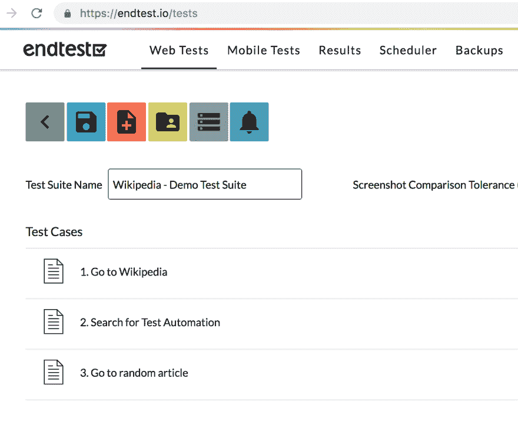
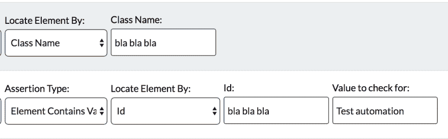
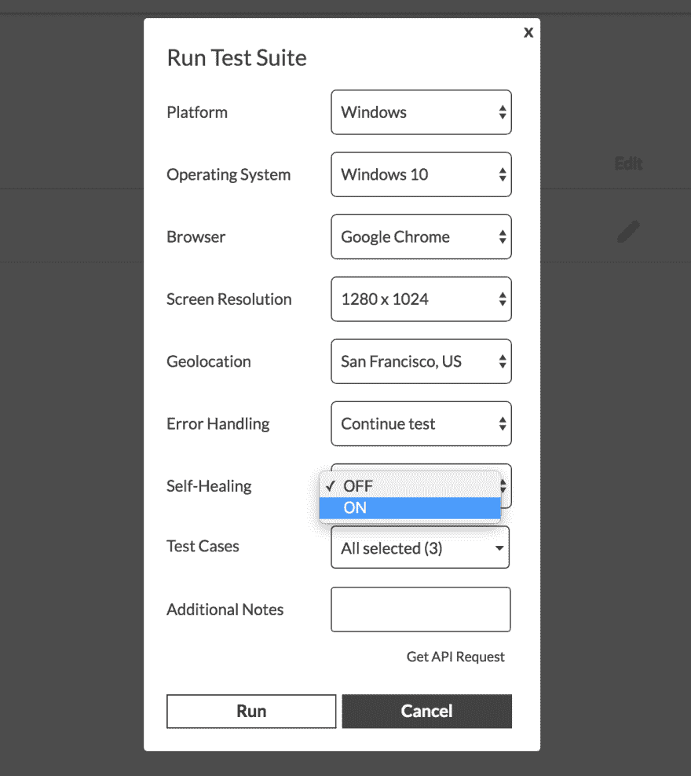
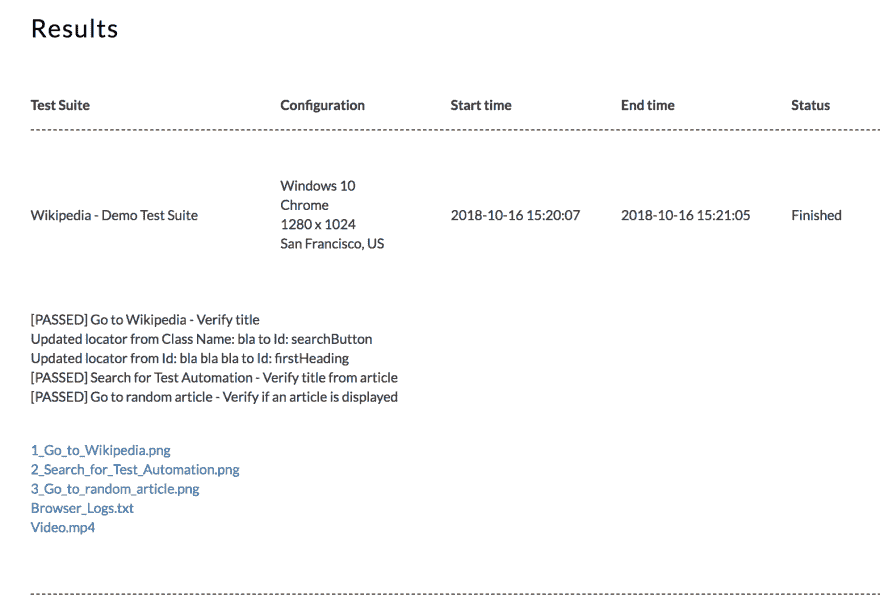

# 我的测试由人工智能维护

> 原文：<https://dev.to/razgandeanu/my-tests-are-being-maintained-by-artificial-intelligence-5805>

关于测试，最令人沮丧的事情之一是，你必须让它们与相应的 UI 保持同步。

嘿，克劳斯，那些测试又被打破了。
***什么？***
*嗯，UI 做了很多改动，测试也失败了。*
***哎呀，我讨厌保养。***

[T2】](https://i.giphy.com/media/l4FGKcOu4bKzoHF6w/source.gif)

当估计实现自动化测试的工作量时，我们大多数人都倾向于忘记包括维护的成本。

如果没有人注意保持步骤的更新，一套测试将在几周内变得过时。

UI 中的大多数变化往往出现在大发布之前，这使得您的测试毫无用处。

[T2】](https://i.giphy.com/media/xTiTnJ3BooiDs8dL7W/giphy.gif)

理想情况下，应该为测试人员提供一个模型和足够的时间来更新步骤。但这从未发生过。

几个月前，我开始着手寻找这个恼人问题的解决方案。

很明显，我无法阻止用户界面的改变。它必须改变，必须为新的特性和功能腾出空间。

我确实试图通过要求我们的团队提供模型来改进我们的开发过程，但是这被证明是非常耗时的，并且可能会导致我们交付时间的延迟。

很快，显而易见，最佳解决方案是简化维护流程。

*人工智能呢？*
***那它呢？***
*可以用来保养。*
***不知如何艾。***
*为什么不直接用 Endtest？*

事实证明，有这个 [Endtest](https://endtest.io) 平台可以让你使用机器学习来进行自动化测试。

我有这个维基百科测试套件，其中包含 3 个测试用例:

因为不允许我从维基百科网站更改 UI，所以我只会破坏我的步骤中的定位器。

[T2】](https://res.cloudinary.com/practicaldev/image/fetch/s--GsktBJGR--/c_limit%2Cf_auto%2Cfl_progressive%2Cq_auto%2Cw_880/https://i.imgur.com/pz4exct.png)

之后，我所要做的就是用自我修复选项运行测试:

每次你运行一个测试，人工智能就会对你的应用程序了解得越来越多。因此，它学会了如何以不同的方式识别你的元素和你的业务流程。

如果事情发生了变化，测试的步骤不再与你的应用程序的用户界面相匹配，人工智能就会找到新的方法，就像用户一样。

瞧！测试被 AI 修复:
