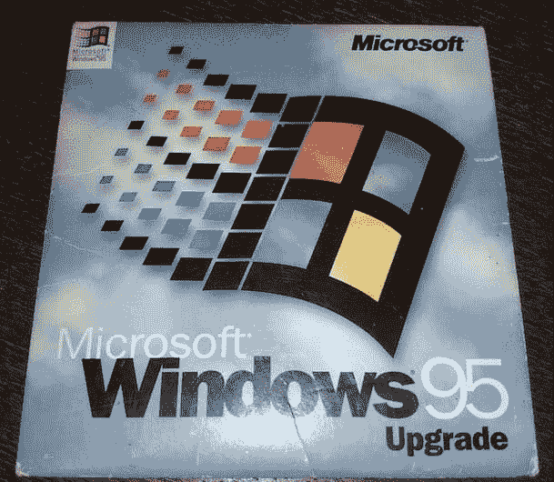

# 我的 Windows 95 故事

> 原文：<https://dev.to/bradymholt/my-windows-95-story-522n>

今天我在清理我的一个抽屉时，发现了这块旧宝石。

[T2】](https://res.cloudinary.com/practicaldev/image/fetch/s--r67azjYZ--/c_limit%2Cf_auto%2Cfl_progressive%2Cq_auto%2Cw_880/https://www.geekytidbits.com/media/windows-95.jpg)

那天是 1995 年 8 月 24 日星期四。我期待这一天已经好几个月了。微软的小册子、美国在线聊天室里的极客热以及与朋友的聊天让我迫不及待地想要得到一份 Windows 95。

因为我 15 岁了，不会开车，所以我妈妈在早上 8 点左右把我送到了 CompUSA，这样我就可以排队参加 9 点的商店开业。线已经缠绕在建筑物上了。在排队的时候，我和一些人聊了聊除了 Windows 95 之外的其他东西，我们给出了自己的想法。一些人持怀疑态度，担心微软正在向苹果的方向发展，在苹果那里，设置是抽象的，你的控制权更少。其他人对世界上最新的操作系统只有兴奋。我的意见介于这两个极端之间。

当我终于走进商店，拿起我的 Windows 95 升级版盒子，我走向收银台，准备支付 109.95 美元(含税)的价格。我一直在修剪草坪，为这次重要的采购攒钱。那对我来说是一大笔钱，但我没有多想。

我妈妈在 9:30 左右回来接我，当我们到家时，我把 CD 放进我的 Unisys 386 电脑，开始安装过程。它花了似乎永远，但一旦它安装和启动，我欣喜若狂。界面干净、清新，感觉比 Windows 3.1 高级多了。

没过多久，我就发现并观看了安装光盘上的两个音乐视频:[伊迪·布里克尔-美好时光](https://www.youtube.com/watch?v=iqL1BLzn3qc)和[威泽-巴迪·霍利](https://www.youtube.com/watch?v=ApN2eLI4d-4)。