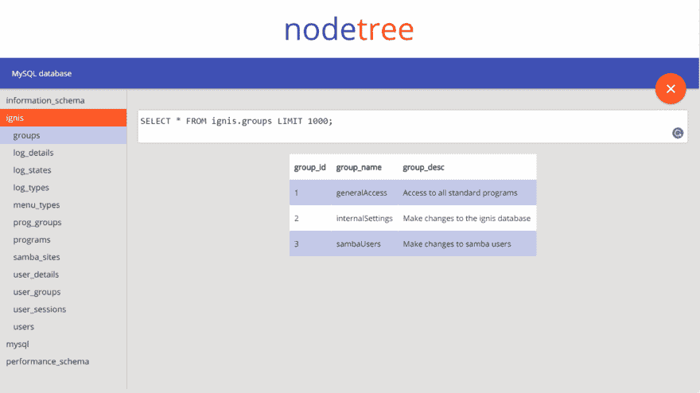
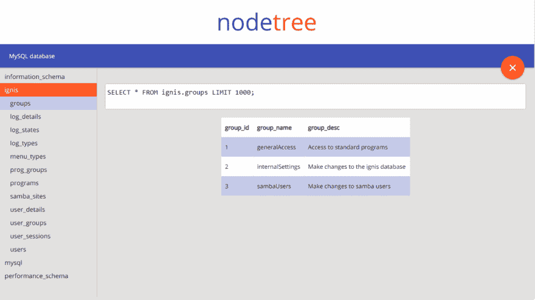

# NodeJS 中的 MySQL 编辑器~第五部分

> 原文：<https://dev.to/link2twenty/mysql-editor-in-nodejs--part-five-4026>

# MySQL 编辑器中的 NodeJS

这是 MySQL 编辑器迷你系列的最后一周，该项目尚未完成，但它现在是功能性的和开源的。如果有人想看看这个项目，并可能提交一个问题，甚至拉请求，请这样做。

这个星期，我已经使查询框工作，而不是像以前一样只是为了展示，我还使它可以编辑字段。

如果你想跟随我的旅程，这是我的[帖子索引](https://dev.to/link2twenty/adventures-of-a-hobbyist--index-4oj7)。

## [ignis-pwa](https://github.com/ignis-pwa)/[node tree](https://github.com/ignis-pwa/nodetree)

### 一个用 NodeJS 写的 MySQL 浏览器

<article class="markdown-body entry-content container-lg" itemprop="text">

# 节点树

一个用 NodeJS 写的 MySQL 浏览器

在 [dev.to](https://dev.to/link2twenty/mysql-editor-in-nodejs--part-one-42j0) 上阅读该项目

试玩一下[演示](http://nodetree-mysql.herokuapp.com/)密码是`demopassword`

</article>

[View on GitHub](https://github.com/ignis-pwa/nodetree)

## 查询框

上周我做了一个函数，我可以把一个查询传递给它，然后这个函数会从服务器获取数据并处理它。这个星期我做了另一个函数，读取查询框的内容，并把它传递给原来的函数。目前，你可以通过按 CTRL + Enter 来完成这个操作，当然，这对于移动用户来说是不可行的，所以这是一个需要解决的问题。

[T2】](https://res.cloudinary.com/practicaldev/image/fetch/s--0fNRDBV5--/c_limit%2Cf_auto%2Cfl_progressive%2Cq_66%2Cw_880/https://thepracticaldev.s3.amazonaws.com/i/1vt5c70re7njvfxkw7c9.gif)

## 编辑字段

为了编辑字段，我回到了生成表格的代码。现在，如果查询给出的数据应该是可编辑的，则添加一个事件侦听器，侦听焦点和模糊，当被触发时，一个函数会检查内容是否已更改，如果是，则向用户请求确认。

[T2】](https://res.cloudinary.com/practicaldev/image/fetch/s--ROZVLaKh--/c_limit%2Cf_auto%2Cfl_progressive%2Cq_66%2Cw_880/https://thepracticaldev.s3.amazonaws.com/i/jgip1rjrwlwydnwkkqq5.gif)

## 接下来呢

正如我在文章顶部所说的，我不打算继续记录这个过程，我将继续寻找 bug，并尝试添加更多的改进，但我认为我已经从这个项目中学到了我所能学到的一切。

### Bug 列表和待办事项

*   数据库页面对移动设备不友好
*   需要一名服务人员
*   如果能增加 PWA 支持就更好了
*   移动用户不能执行自定义查询
*   应该有一个选项，要求在登录用户名

如果你能看到更多的 bug 或者你认为有用的特性，请在 GitHub 页面上留下评论或者提出问题。谢谢你。

## 注销

我很快会回来写一个业余爱好者的冒险，我想回来的第一篇文章会是过去 5 篇文章的总结和我一路上学到的东西。感谢您的阅读。

因为你知道我是谁