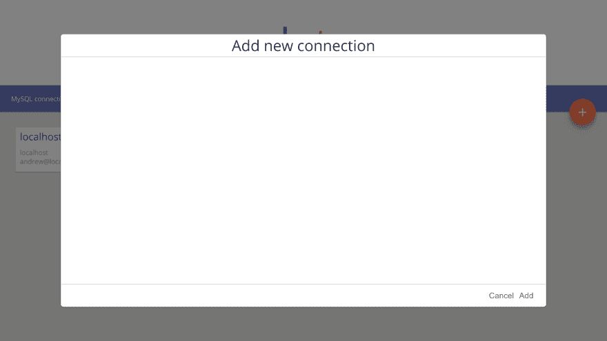
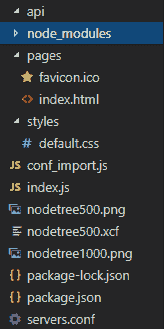

# node.js 第一部分中的 mysql 编辑器

> 原文：<https://dev.to/link2twenty/mysql-editor-in-nodejs--part-one-42j0>

# MySQL 编辑器中的 NodeJS

这是我的业余爱好者系列[冒险的一个短暂休息，我正在学习 node，将我学到的一些东西付诸实践。](https://dev.to/link2twenty/adventures-of-a-hobbyist--index-4oj7)

我不确定这个迷你系列会持续多久，但目标是制作一个 web 界面，让您可以连接到 MySQL 数据库进行查看，如果有时间的话，还可以编辑表格。

一旦我有了一个工作原型，我会把它放在 GitHub 上，我们会看看是否有人有任何拉请求或问题要报告。

## 进展至此

到目前为止，我已经放入了连接屏幕的基本框架，这是基于 MySQL workbench 的松散模型，但是做了一些材质上的改动。

主屏幕:

[T2】](https://res.cloudinary.com/practicaldev/image/fetch/s--TKL1WFkZ--/c_limit%2Cf_auto%2Cfl_progressive%2Cq_auto%2Cw_880/https://thepracticaldev.s3.amazonaws.com/i/3qxra0bfvz6w4yhbgdy4.png)

对话概念:

[T2】](https://res.cloudinary.com/practicaldev/image/fetch/s--TsoWJGn2--/c_limit%2Cf_auto%2Cfl_progressive%2Cq_auto%2Cw_880/https://thepracticaldev.s3.amazonaws.com/i/mzczuhskuunzdpvk0njk.png)

我使用一个 JSON 文件来存储服务器细节，而不是密码，当然，为了做到这一点，我使用了我之前写的`confHelper`，这里是我看的[帖子](https://dev.to/link2twenty/adventures-of-a-hobbyist--part-five-532c)。这次我也用`expressjs`来路由。

## 代码

到目前为止，我还没有真正对代码进行评论，我担心它会很快失控。如果你有任何注释代码的建议，我洗耳恭听。

为了让你了解我的超级简单的结构，这里有一张图片。

[T2】](https://res.cloudinary.com/practicaldev/image/fetch/s--HgVXj9DB--/c_limit%2Cf_auto%2Cfl_progressive%2Cq_auto%2Cw_880/https://thepracticaldev.s3.amazonaws.com/i/hsejjisnyhwe3a4b3ifp.png)

和我的项目一样，如果我做错了什么，请告诉我😀

**服务器:**

```
const express = require('express');
const app = express();
var path = require('path');
const ConfHelper = require('./conf_import');
const ch = new ConfHelper('servers');

app.get('/', function(req, res) {
  res.sendFile(path.join(__dirname + '/pages/index.html'));
});

app.get('/styles/default.css', function(req, res) {
  res.sendFile(path.join(__dirname + '/styles/default.css'));
});

app.get('/favicon.ico', function(req, res) {
  res.sendFile(path.join(__dirname + '/pages/favicon.ico'));
});

app.get('/api/servers', function(req, res) {
  res.json(ch.config.get().servers);
});

app.listen(80); 
```

Enter fullscreen mode Exit fullscreen mode

**首页:**

```
<head>
  nodetree
  <link rel="shortcut icon" type="image/x-icon" href="favicon.ico" />
  <link rel="stylesheet" href="/styles/default.css">
  <meta name="viewport" content="width=device-width, initial-scale=1.0">
</head>

<body>
  <header><span class="blue">node</span><span class="orange">tree</span></header>
  <nav>MySQL connections</nav>
  <div class="fab shadow shadow-hover"> + </div>
  <div class="box-container"></div>
  <div hidden class="modal">
    <div class="backdrop"></div>
    <div class="content shadow">
      <div class="header">Add new connection</div>
      <div class="central"></div>
      <div class="footer"><button class="modal-close">Cancel</button><button>Add</button></div>
    </div>
  </div>
</body>

<script>
  const boxTemplate = (name, host, user) => {
    // Main node
    let node = document.createElement('div');
    node.classList.add('boxes');
    node.classList.add('shadow');
    node.classList.add('shadow-hover');
    // Div containing name
    let nameNode = document.createElement('div');
    nameNode.classList.add('name');
    nameNode.appendChild(document.createTextNode(name));
    node.appendChild(nameNode);
    // Span containing host
    let hostNode = document.createElement('span');
    hostNode.appendChild(document.createTextNode(host));
    node.appendChild(hostNode);
    // Add break
    let breakNode = document.createElement('br');
    node.appendChild(breakNode);
    // Span contain user
    let userNode = document.createElement('span');
    userNode.appendChild(document.createTextNode(`${user}@${host}`));
    node.appendChild(userNode);

    node.addEventListener('click', event => {
      console.log(event.target.querySelector('.name').innerText);
    })

    return node
  };

  const closeModal = () => {
    let modal = document.querySelector('.modal');
    modal.hasAttribute('hidden') || modal.setAttribute('hidden','');
  }

  const fab = document.querySelector('.fab');
  fab.addEventListener('click', event => {
    let modal = document.querySelector('.modal');
    modal.hasAttribute('hidden') && modal.removeAttribute('hidden');
  })

  const modalClose = document.querySelector('.modal-close');
  modalClose.addEventListener('click', closeModal)

  const modalBack = document.querySelector('.modal .backdrop');
  modalBack.addEventListener('click', closeModal)

  let oReq = new XMLHttpRequest();
  oReq.addEventListener("load", _setBoxes);
  oReq.open("GET", "/api/servers");
  oReq.send()

  function _setBoxes() {
    const boxContainer = document.querySelector('.box-container');
    const res = JSON.parse(this.response);
    let servers = Object.keys(res);

    for (let server of servers) {
      boxContainer.appendChild(boxTemplate(server, res[server].host, res[server].user));
    }
  }
</script> 
```

Enter fullscreen mode Exit fullscreen mode

**款式:**

```
@import url('https://fonts.googleapis.com/css?family=Open+Sans');

    :root {
      --header-font-size: 12.5vh;
      --header-height: 25vh;
      --nav-height: 60px;
      --fab-size: var(--nav-height);
      --box-flex: flex-start;
      --modal-size: 80;
      --modal-radius: 6px;
    }

    @media only screen and (min-device-width : 768px) and (max-device-width : 1024px) {
      :root {
        --header-font-size: 60px;
        --header-height: 15vh;
        --nav-height: 60px;
        --box-flex: flex-start;
        --modal-size: 80;
        --modal-radius: 6px;
      }
    }

    @media only screen and (max-device-width : 768px) {
      :root {
        --header-font-size: 60px;
        --header-height: 15vh;
        --nav-height: 50px;
        --box-flex: space-around;
        --modal-size: 100;
        --modal-radius: 0px;
      }
    }

    body {
      background: #e2e1e0;
      font-family: 'Open Sans';
      margin: 0;
    }

    header {
      height: var(--header-height);
      width: 100vw;
      background: white;
      text-align: center;
      line-height: var(--header-height);
      font-size: var(--header-font-size);
    }

    .blue {
      color: #303F9F;
    }

    .orange {
      color: #FF5722;
    }

    nav {
      padding: 0px 25px;
      background: #3F51B5;
      height: var(--nav-height);
      line-height: var(--nav-height);
      box-shadow: 0 1px 3px rgba(0, 0, 0, 0.12), 0 1px 2px rgba(0, 0, 0, 0.24);
      color: #fff;
    }

    nav button.add {
      border-radius: 12px;
      background: rgba(0, 0, 0, 0);
      height: 24px;
      width: 24px;
      box-sizing: border-box;
      color: #fff;
      border: #fff solid 1px;
    }

    .fab {
      position: relative;
      cursor: pointer;
      text-align: center;
      background-color: #FF5722;
      color: white;
      /* calculated from --fab-size */
      top: calc((var(--fab-size) / 2) * -1);
      width: var(--fab-size);
      height: var(--fab-size);
      margin-bottom: calc(var(--fab-size) * -1);
      margin-left: calc(100vw - var(--fab-size) - 25px);
      border-radius: calc(var(--fab-size) / 2);
      font-size: calc((var(--fab-size) / 8) * 5);
      line-height: var(--fab-size);
    }

    .shadow {
      box-shadow: 0 1px 3px rgba(0, 0, 0, 0.12), 0 1px 2px rgba(0, 0, 0, 0.24);
      transition: box-shadow 0.3s cubic-bezier(.25, .8, .25, 1);
    }

    .shadow-hover:hover {
      box-shadow: 0 10px 20px rgba(0, 0, 0, 0.19), 0 6px 6px rgba(0, 0, 0, 0.23);
    }

    .box-container {
      display: flex;
      justify-content: var(--box-flex);
      flex-wrap: wrap;
      padding: 25px;
    }

    .boxes {
      cursor: pointer;
      min-width: 225px;
      height: 90px;
      border-radius: 2px;
      background: #fff;
      color: #757575;
      padding: 0 0 10px 10px;
      margin: 10px;
    }

    .boxes .name {
      padding: 5px 0 10px 0;
      font-size: 1.5em;
      color: #212121;
      pointer-events: none;
    }

    .boxes span {
      pointer-events: none;
    }

    .modal {
      position: fixed;
      top: 0;
      left: 0;
      width: 100vw;
      height: 100vh;
    }

    .modal .backdrop {
      position: fixed;
      top: 0;
      left: 0;
      width: 100vw;
      height: 100vh;
      background: rgba(46,46,46,0.6);
    }

    .modal .content {
      position: fixed;
      top: calc((100vh - (var(--modal-size) * 1vh))/2);
      left: calc((100vw - (var(--modal-size) * 1vw))/2);
      width: calc((var(--modal-size) * 1vw));
      height: calc((var(--modal-size) * 1vh));
      border-radius: var(--modal-radius);
      background: #fff;
      color: #757575;
    }

    .modal .content .header {
      height: 50px;
      line-height: 50px;
      color: #212121;
      border-bottom: 1px solid #BDBDBD;
      font-size: 34px;
      text-align: center;
    }

    .modal .content .central {
      height: calc((var(--modal-size) * 1vh) - 102px);
      color: #C5CAE9;
    }

    .modal .content .footer {
      height: 50px;
      line-height: 50px;
      color: #303F9F;
      border-top: 1px solid #BDBDBD;
      padding: 0 23px;
      text-align: right;
    }

    .modal .content .footer button {
      cursor: pointer;
      color: #303F9F;
      border: none;
      background: none;
      height: 50px;
      font-size: 18px;
    } 
```

Enter fullscreen mode Exit fullscreen mode

## 结束

这就是我今天所做的，我有一个很长的任务清单，你可能已经注意到了，这个版本甚至还没有与任何 MySQL 的东西进行交互。这是一次长途旅行，谢谢你陪我一起来。

再次感谢🦄🦄🦄