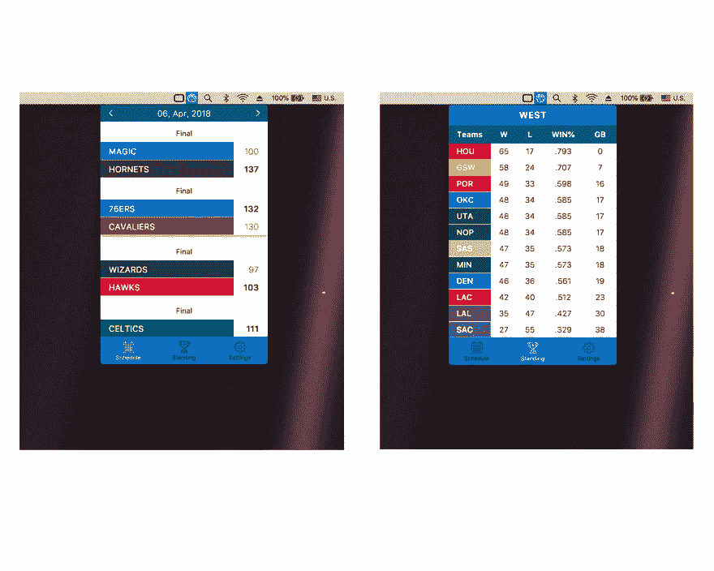
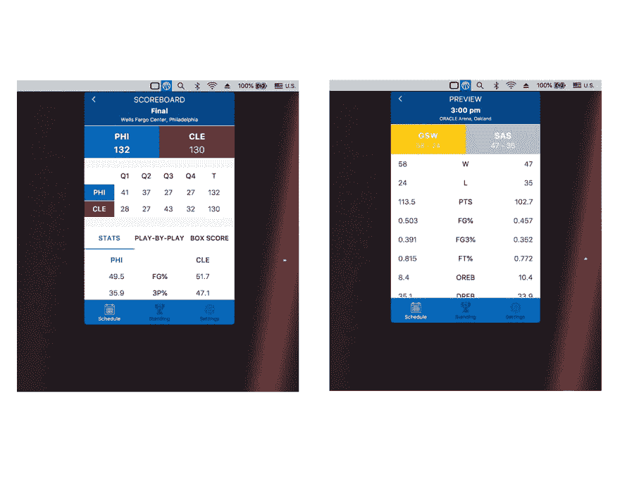

# NBA 酒吧-🏀🖥️在你的菜单栏中查看 NBA。

> 原文：<https://dev.to/xxhomey19/nba-bar-----check-nba-in-your-menubar-1dp3>

18-19 NBA 赛季就要开始了，所以我最近用`Next.js`和`react-virtualized`重写了一下，然后运行起来更快更流畅！希望你喜欢:)

它可以在 MacOS 和 Windows 上运行。请随意下载和使用它，如果它不幸有错误，请为我打开一个问题，谢谢；)

## 屏幕截图

 

## 回购:【https://github.com/xxhomey19/nba-bar】T2