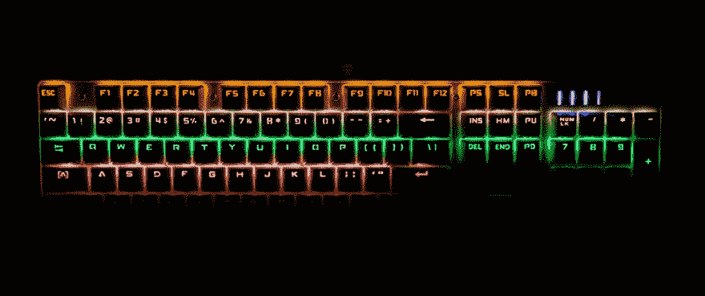

# Netsuite SuiteScript 2.0 客户端加载黑客工具

> 原文：<https://dev.to/smith288/netsuite-suitescript-20-client-side-onload-hackery-2hpn>

[T2】](https://res.cloudinary.com/practicaldev/image/fetch/s--PHOO03yb--/c_limit%2Cf_auto%2Cfl_progressive%2Cq_66%2Cw_880/https://thepracticaldev.s3.amazonaws.com/i/m5sag5dg3ync1ww8wk8a.gif)

当我的公司从 Suitescript 1.0 迁移到 2.0 时(因为，为什么不呢？)我们需要做的一件事是，当某个事件发生时，从另一个浏览器标签中监听浏览器的消息监听器。

为了做到这一点，我需要脚本来监听加载。Netsuite 没有提供让我们在页面加载时轻松加载客户端脚本的功能。我们必须创建一个 UserEvent 脚本，它将在加载时调用一个函数，然后将 INLINEHTML 自定义字段类型分配给具有所需函数的表单。

仔细讨论

```
/**
 * @NApiVersion 2.x
 * @NScriptType UserEventScript
 */

define(['N/runtime'],
    function (runtime) {

        return {
            beforeLoad: beforeLoad
        };

        function beforeLoad(context) {

            if (runtime.executionContext.toUpperCase() == 'USERINTERFACE') {
                var inline = context.form.addField({
                    id: 'custpage_attachmessage',
                    label: 'not shown',
                    type: 'INLINEHTML',
                });
                inline.defaultValue = "<script>jQuery(function($){ require(['/SuiteScripts/clientSuiteScript.js'], function(mod){ mod.pageInit();});});</script>";
            }
        }
    }); 
```

那么客户端套件脚本将大致如下所示:

```
/**
 * @NApiVersion 2.x
 * @NScriptType ClientScript
 */

define(['N/currentRecord'],

    function (currentRecord) {

        function pageInit() {
            window.addEventListener("message", browser_ReceiveMessage, false);
            console.log('Added Listener...');

        }

        return {
            pageInit: pageInit
        }

        function browser_ReceiveMessage(event) {

            var curRec = currentRecord.get();
            console.log('Current Record ID', curRec.id)
        }
    }

); 
```

然后在加载时，控制台将输出当前记录的 id。

尽情享受吧！