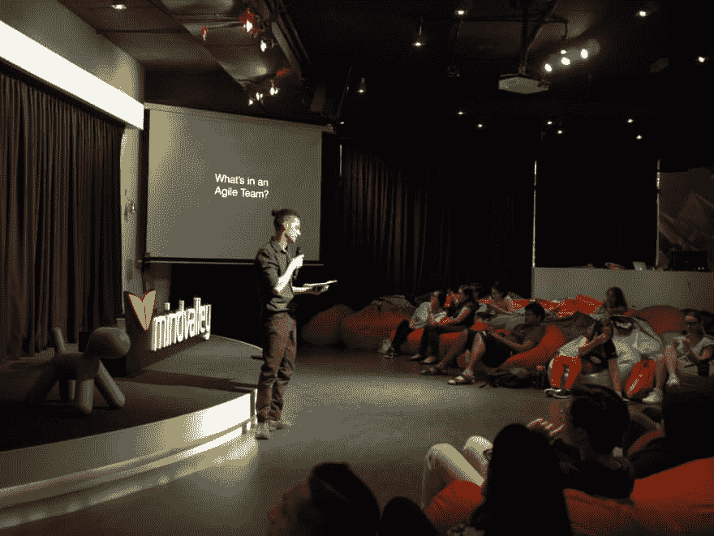
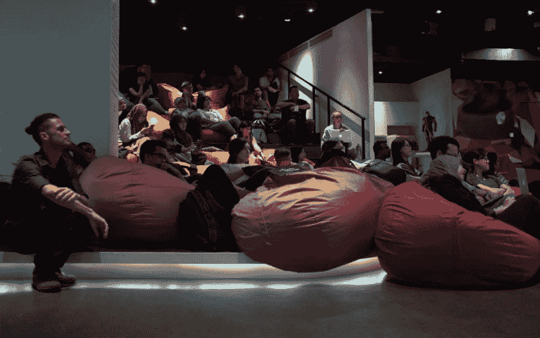
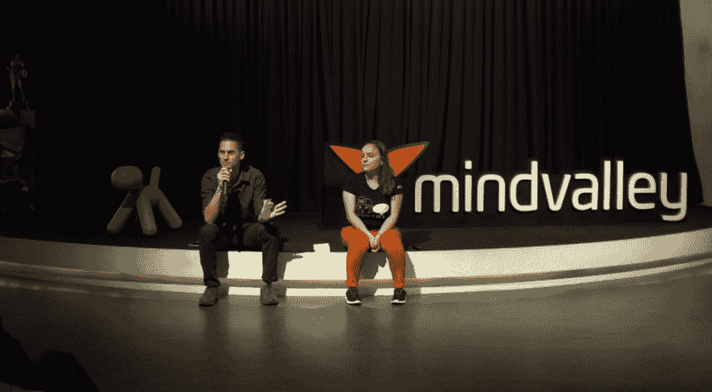
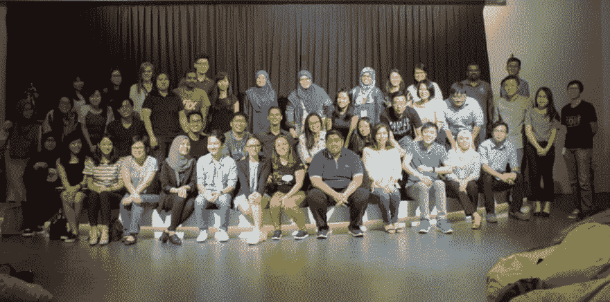

# 网络和我作为敏捷论者的第一次敏捷演讲

> 原文：<https://dev.to/agilistandre/networking-and-my-first-agile-talk-as-an-agilist-dbc>

2017 年 8 月 23 日，我在 Mindvalley 美丽的 Awesomeness 做了我的第一次敏捷演讲，由一个不可思议的组织组织，名为【t 2 女性编码】，吉隆坡 (WWC)。这次活动还包括我的敏捷同事[安德里亚·维萨诺乌](https://www.linkedin.com/in/andreeavisanoiu/)的演讲，他展示了一个关于敏捷框架的比较。

我的演讲是关于[敏捷团队](http://agilistandre.com/what-makes-an-agile-team-agile-and-a-waterfall-team-not/)的，它很受欢迎，尽管由于缺乏实践，在演讲中总的来说有一些失误。我一手拿着笔记，一手拿着麦克风，差一只手就拿不住遥控器了。我很高兴地说，从那以后我已经好多了。

<figure> 

<figcaption>我的第一次敏捷交谈</figcaption>

</figure>

<figure> 

<figcaption>与 WWC 观众一起聆听安德里亚</figcaption>

</figure>

<figure> 

<figcaption>问&答</figcaption>

</figure>

<figure> 

<figcaption>出席人数众多，与敏捷和 WWCers 的会面充满乐趣</figcaption>

</figure>

## 我的敏捷谈吐是怎么发生的？认识编码女性

在我演讲的前几周，我幸运地偶然发现了另一个由 WWC 组织的敏捷演讲。敏捷专家金伯利·布朗是主讲人，她分享了帮助组织在工作场所保持敏捷的经验。

在这次活动中，我遇到了 Daphne Choong，她是 WWC 的组织者之一，也是敏捷路线的领导者。达芙妮和她的 WWCers 伙伴在吉隆坡组织了许多活动:2017 年共举办了 17 场活动！他们在业余时间组织这些活动，并且这些活动可以免费参加，他们的愿景是“[创造]一个女性在技术领导者、高管、创始人、风投、董事会成员和软件工程师中占有相应比例的世界。”但是，正如他们的愿景促进平等一样，他们的活动也是如此:男女都受欢迎。

由于我们都对敏捷话题充满热情，Daphne 接着提到，如果我感兴趣，她会组织另一场敏捷活动，届时我将是演讲人。我不可能拒绝的！我非常乐意支持这个鼓舞人心的组织，同时借此机会获得一些舞台时间。

所以，找一个在你的区域附近编写章节[的女性，看看她们接下来的活动。你会学到很多很酷的东西，并有很多机会与该领域的其他专业人士交流。](https://www.womenwhocode.com/networks)

帖子[联网和我作为敏捷专家的第一次敏捷演讲](http://agilistandre.com/networking-first-agile-talk-agilist/)首先出现在[敏捷专家安德烈](http://agilistandre.com)上。