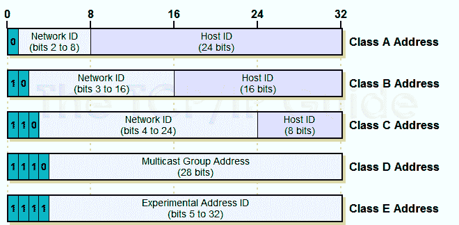
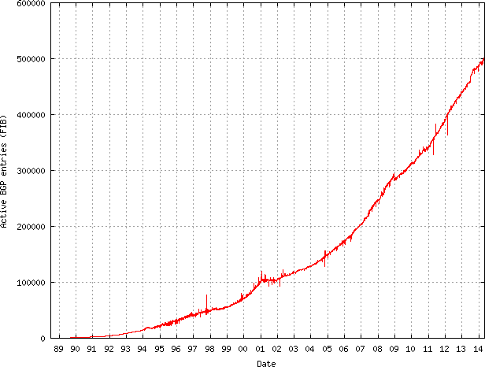
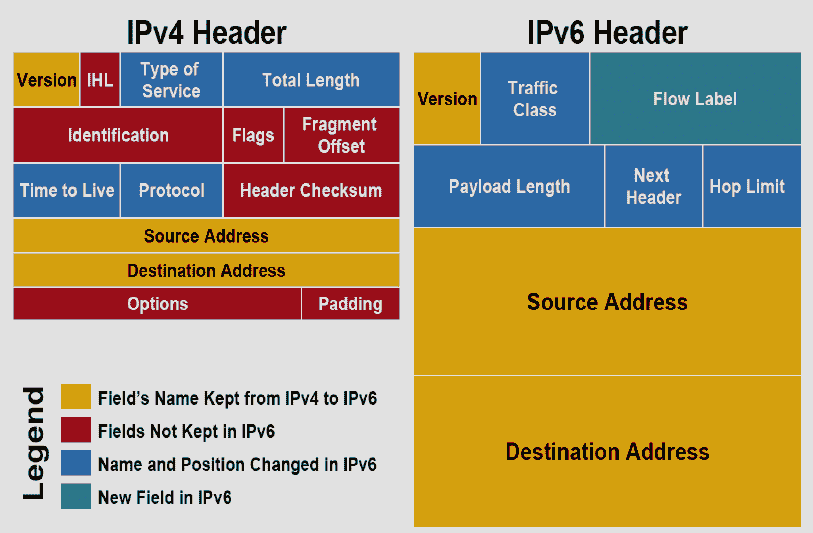
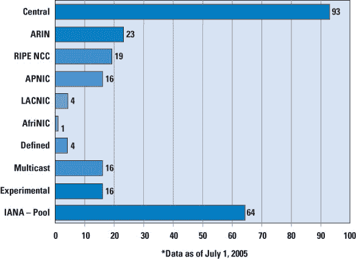

# 网络基础:命名、寻址和转发

> 原文：<https://dev.to/swyx/networking-essentials-naming-addressing-and-forwarding-13kk>

*这是我参加[免费的 Udacity 计算机网络基础课程](https://www.udacity.com/course/computer-networking--ud436)的一系列课堂笔记中的第四篇。*

## 什么是 IP 寻址？

“互联网协议”v4 地址是一个 32 位的数字，以“点分四边形”表示，例如`130.207.7.36`。4 个数字中的每一个代表 8 位，总共 32 位。二进制数的 8 位从 0 到 255(记住 2 ^ 8 = 256)。

因此，2^32 的 IPv4 地址总数约为 40 亿。虽然[我们已经用完了](https://dev.to/swyx/networking-essentials-architecture-and-principles-2g5e)个地址，但出于我们的目的，我们将学习如何处理所有这些地址。如果我们要单独存储和查找每个地址，这将是昂贵和低效的。

所以我们把 IP 地址分组。

## 1994 年以前的有类寻址

在 1994 年之前，我们使用“有类”寻址，将 IP 地址分为“路由前缀”(表示 A、B 或 C 类)、“网络 ID”部分和“主机 ID”部分:

[T2】](https://res.cloudinary.com/practicaldev/image/fetch/s--GoPH9oSD--/c_limit%2Cf_auto%2Cfl_progressive%2Cq_auto%2Cw_880/https://knowledgeofthings.com/wp-content/uploads/2017/10/ipclassful.png)

早在 1992 年，路由表中只有大约 5000 个路由前缀，但在 1994 年，这种趋势加速发展，显然这是不可持续的，我们开始用完 C 类地址，同时仍然为未使用的 A 类和 B 类保留整个 IPv4 地址空间。
[T3】](https://res.cloudinary.com/practicaldev/image/fetch/s--CEGPxaAr--/c_limit%2Cf_auto%2Cfl_progressive%2Cq_auto%2Cw_880/http://media.packetlife.net/media/blog/attachments/702/plot.png)

## 无类域间路由(CIDR)

有类策略未能预见到对 C 类地址的巨大需求，其不灵活性导致我们采用了新的寻址协议 CIDR。在 IPv4 中，我们没有固定的 32 位“网络 ID”和“主机 ID”部分，而是有一个带“掩码”的 IP 地址，表示网络 ID 的长度。

所以`65.14.248.0/22`翻译成这样的二进制:

```
--------65--- ---14--- ---248-- ----0--
01000001 00001110 11111000 0000000
^^^^^^^^ ^^^^^^^^ ^^^^^^

^ first 22 bits are network ID 
```

Enter fullscreen mode Exit fullscreen mode

因此“掩码”是一个可变长度的地址前缀，与使用的 IP 地址范围无关(而“有类寻址”基本上是固定地址前缀长度的)。这使得 rir 可以根据网络的规模更灵活地进行分配。

然而，有可能具有连续或重叠的地址前缀，例如既有`65.14.248.0/22`又有`65.14.248.0/24`。在这种情况下，`65.14.248.0/24`将是`65.14.248.0/22`的子集(更具体)。如果在路由表中发现这样的重叠，解决方案是根据最长的掩码(也称为地址前缀)长度进行转发。这种更具体地址的“屏蔽”允许上游路由器(例如`65.14.248.0/8`)聚集(而不是宣布)更具体的前缀。

从 1994 年到 21 世纪初，CIDR 非常成功地将路由表的增长速度降低到了线性水平。但是从 2000 年开始，出现了一种新的做法，使得上游提供商很难将 IP 前缀聚合在一起。

## 多宿主 vs IP 前缀聚合

多宿主是指一个 AS(通常带有一个`/24`掩码)想要通过两个上游 ISP 到达。

让我们以两个 ISP 为例，ISP1 和 ISP2。如果 ISP1 拥有`12.0.0.0/8`并将`12.20.249.0/24`分配给我们的 AS，我们的 AS“多宿主”并将`12.20.249.0/24`通告给 ISP2。现在，ISP1 和 ISP2 都想将此前缀通告给互联网的其余部分。虽然 ISP1 可能想将这个前缀聚合到`12.0.0.0/8`中，但是它不能，因为 ISP2 仍然在通告`12.20.249.0/24`，并且作为一个更长的前缀，所有的流量都将流向 ISP2。ISP1 被迫*而不是*将 AS 前缀聚合到它已经拥有的前缀中。

因此，虽然 CIDR 聚合暂时解决了路由表大小的增长，但多宿主再次引发了爆炸，因为聚合变得不那么有用了。

## 用最长前缀匹配算法进行地址查找

因此，CIDR 要求 LPM 在路由表中高效地查找正确的前缀，而 LPM 需要搜索所有前缀长度和给定长度的所有前缀的空间。另一个限制是速度——OC48 需要 160 *纳秒*的查找，或者最多 4 次内存访问。

二进制尝试的速度效率很低，而直接尝试或精确匹配策略的空间效率很低。我们通过使用“多位”或“多进制”尝试进行折衷。一个 k 元 Trie 的深度为`W/K`，度为`2^K`，步距为`K`位。二元尝试是多元尝试的特例，其中`k=1`，即深度为`W`，度为`2`，步距为`1`位。因此，我们可以通过移动`k`来控制内存访问，以解决我们想要的深度。

还存在进一步的优化，如[推叶](https://ieeexplore.ieee.org/iel7/7106213/7110105/07110131.pdf)、[露勒奥](https://en.wikipedia.org/wiki/Lule%C3%A5_algorithm)和[帕特里夏尝试](http://www.mathcs.emory.edu/~cheung/Courses/323/Syllabus/Text/trie02.html)。也存在尝试的替代方案，例如[内容可寻址存储器](https://en.wikipedia.org/wiki/Content-addressable_memory)查找，这基本上是完全匹配的。

## IP v4 耗尽的解决方案:网络地址转换

**NAT 允许多个网络重用同一个私有 IP 地址空间。**私有 IP 地址在 1996 年被保留( [RFC 1918](https://tools.ietf.org/html/rfc1918) ，在这里你可以看到类似`192.168.0.0`和`172.16.0.0`这样熟悉的地址的来源。NAT 允许网络重复使用部分互联网地址空间，获取私有 IP 地址并转换成一个全球可见的 IP 地址。NAT 维护一个表，将它的公共地址和端口映射到它重写的私有地址和端口。

这在小型/家庭办公网络和 VPN 中很流行。然而，[互联网架构](https://dev.to/swyx/networking-essentials-architecture-and-principles-2g5e)的端到端原则却被打破了。

## 解决 IPv4 枯竭的方案:IPv6 (128 位地址)

另一个解决方案是 IPv6。IPv6 不仅增加了更多的地址位，还清除了报头中的大量粘性物质。以下是必填字段的比较:

[T2】](https://res.cloudinary.com/practicaldev/image/fetch/s--IKeUqY2i--/c_limit%2Cf_auto%2Cfl_progressive%2Cq_auto%2Cw_880/https://www.researchgate.net/profile/Muzhir_Al-Ani/publication/269810379/figure/fig1/AS:295073662160901%401447362451826/Comparison-of-IPv4-and-IPv6-headers-structures-15.png)

IPv6 的优势:

*   当然是更多的地址
*   更简单的页眉
*   更简单的多宿主
*   内置带有[IPSec/扩展报头](http://www.ipv6now.com.au/primers/IPv6PacketSecurity.php) - ( [当然有些警告](https://www.internetsociety.org/blog/2015/01/ipv6-security-myth-2-ipv6-has-security-designed-in/))的安全性

然而，到目前为止，我们只看到 IPv6 的采用非常缓慢，因为 IPv6 很难增量部署。一切都运行在 IPv4 上，在狭窄的腰部以上和以下都有巨大的网络效应。采纳者面临着严重的不兼容问题。到目前为止，增量部署涉及[双堆叠 IPv4 和 IPv6](https://www.juniper.net/documentation/en_US/junos/topics/concept/ipv6-dual-stack-understanding.html) 或[转换/隧道](http://www.ciscopress.com/articles/article.asp?p=2104947)(有点类似，但有一个单独的层，仅用于 [6 到 4 隧道](https://en.wikipedia.org/wiki/6to4))。

## 先不说:IP 地址分配是如何工作的

IP 地址按层级分配给 ISP:

*   在顶部，全球[互联网号码分配机构(IANA)](https://www.iana.org/) 分配给:
*   五个区域性互联网注册中心之一:AfriNIC、APNic、ARIN、LACNIC 或 RIPE。进而分配给:
*   个人助理，比如你的大学网络

这一直持续到 2011 年，那时 [IANA 给出了最后一个“/8”区块](https://www.nro.net/ipv4-free-pool-depleted/)。有趣的是，注册管理机构之间的分配并不均衡:

[T2】](https://res.cloudinary.com/practicaldev/image/fetch/s--UaiFafLi--/c_limit%2Cf_auto%2Cfl_progressive%2Cq_auto%2Cw_880/https://www.cisco.com/c/dam/en_us/about/ac123/ac1img/ipj/ipj_8-3/83_ipv4_figure_01_lg.jpg)

这也是一个不错的 CIDR 备忘单，显示了有类到无类的转换，以及每个地址范围内的分配和其中的例外:[https://oav.net/mirrors/cidr.html](https://oav.net/mirrors/cidr.html)。

## 我们系列的下一个

希望这是对 IP 寻址工作和我们今天面临的 IPv4 问题的一个很好的高层次概述。我正在计划更多的初级读本，希望您能就以下方面提供反馈和问题:

*   [架构和原理](https://dev.to/swyx/networking-essentials-architecture-and-principles-2g5e)
*   [切换](https://dev.to/swyx/networking-essentials-switching-3eba)
*   [路由](https://dev.to/swyx/networking-essentials-routing-5gb7/)
*   [命名/寻址/转发](https://dev.to/swyx/networking-essentials-naming-addressing-and-forwarding-13kk)
*   [DNS](https://dev.to/swyx/networking-essentials-dns-1dl7)
*   [拥塞控制和流式传输](https://dev.to/swyx/networking-essentials-congestion-control-26n2)
*   [速率限制和流量整形](https://dev.to/swyx/networking-essentials-rate-limiting-and-traffic-shaping-43ii)
*   [内容分发](https://dev.to/swyx/networking-essentials-content-distribution-jag)
*   [软件定义网络](https://dev.to/swyx/networking-essentials-software-defined-networking-35n9)
*   [交通工程](https://dev.to/swyx/networking-essentials-traffic-engineering-13c4)
*   [网络安全](https://dev.to/swyx/networking-essentials-network-security-1fcp)