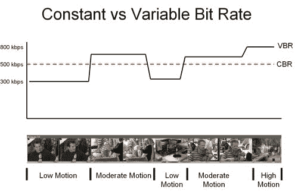
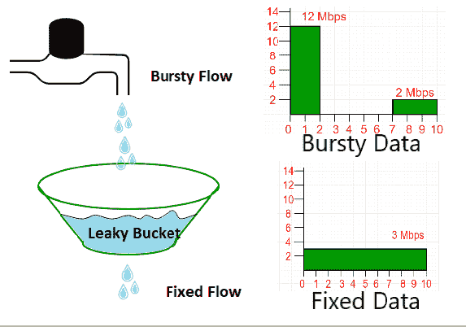
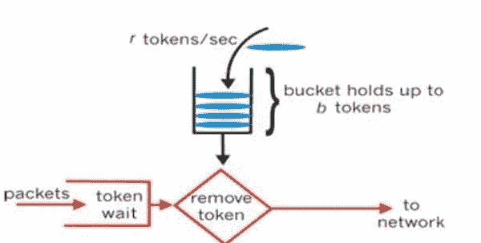
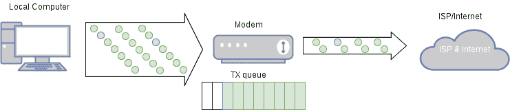

# 网络基础:速率限制和流量整形

> 原文：<https://dev.to/swyx/networking-essentials-rate-limiting-and-traffic-shaping-43ii>

*这是我参加[免费的 Udacity 计算机网络基础课程](https://www.udacity.com/course/computer-networking--ud436)的系列课堂笔记中的第七篇。*

既然我们已经探索了 [TCP 拥塞控制](https://dev.to/swyx/networking-essentials-congestion-control-26n2)是如何工作的，我们可能认为我们理解了互联网流量是如何形成的。但是拥塞控制是非常低级的——我们仍然对互联网流量进行高级别的限制，以解决资源或业务限制。我们称之为速率限制和流量整形。

## 流量分类方式

并非所有流量都是平等的。就流量需求而言，传输数据通常是突发性的。传输音频通常是连续的，因为您正在向下传输一组相当恒定的数据。由于压缩，传输视频可能是连续的或突发的。

对流量进行分类的高级方法归结为:

*   **恒定比特率(CBR)** :流量以固定的间隔到达，数据包大小大致相同，这就导致了恒定的比特率(如音频)。我们根据峰值负载来调整 CBR 流量。
*   **可变比特率(VBR)** :所有可变(如视频和数据)。我们根据峰值和平均负载来调整 VBR 流量。

[T2】](https://res.cloudinary.com/practicaldev/image/fetch/s--tKVh1yNw--/c_limit%2Cf_auto%2Cfl_progressive%2Cq_auto%2Cw_880/https://www.securitycameraking.com/securityinfo/wp-content/uploads/2015/08/Bit-Rates-e1438874598220.jpg)

## 流量整形方法

我们将讨论三个问题:

*   漏桶
*   (r，t)成形
*   令牌桶

**漏桶流量整形**

[T2】](https://res.cloudinary.com/practicaldev/image/fetch/s---FNsXl5E--/c_limit%2Cf_auto%2Cfl_progressive%2Cq_auto%2Cw_880/https://cdncontribute.geeksforgeeks.org/wp-content/uploads/leakyTap-1.png)

漏桶将突发流转变为常规流。两个相关参数是**铲斗尺寸**和**排水速率**。排水管或“泄漏”充当系统的“调节器”。您希望将**排放速率**设置为流入流量的**平均**速率，并根据您预期的**最大**突发大小设置**桶大小**。桶的溢出被丢弃或被置于较低的优先级。

漏桶是在 1986 年开发的，你可以[在这里](https://en.wikipedia.org/wiki/Leaky_bucket)进一步阅读。

**(R，T)流量整形**

这个变体最好地处理了**恒定流**。它的工作原理如下:

1.  将流量分成`T`比特的帧
2.  在任何`T`位帧中注入多达`R`位

如果发送方想要发送多于`R`位，它必须等到下一个`T`位帧。遵循这一规则的流称为“(R，T)平滑交通形状”。

因此，最大数据包大小是`R * T`，它通常不是很大，行为范围仅限于固定速率流(CBR，如上)。可变流(VBR)必须请求等于峰值速率的数据速率(`R*T`)，这是非常浪费的。

如果一个流超过 R，T 速率，超出的包被分配一个较低的优先级，或者被丢弃。优先级由发送方(首选，因为它最了解自己的优先级)或网络(这被称为[监管](https://en.wikipedia.org/wiki/Traffic_policing_(communications)))分配。

**令牌桶流量整形**

在一个代币桶中，**代币**以`R`的速率到达，桶可以拿`B`个代币。这两个参数决定了令牌桶调节器。

突发流有两个参数`Lpeak`和`Lavg`来描述它。它流入调节器的方式类似于它流入漏桶调节器的方式。

这里的区别在于，只要有令牌，监管者就可以发送令牌桶中的流量。所以令牌桶的工作方式有点像漏桶的反面。如果大小为`b`的数据包出现:

*   如果桶已满**，则发送数据包并移除`b`令牌。**
***   如果桶**是空的**，包必须*等待*直到`b`令牌滴入桶中。*   如果它是部分满的，它也会等待，直到桶中的令牌数超过`b`。**

 **[T2】](https://res.cloudinary.com/practicaldev/image/fetch/s--MF38Atq3--/c_limit%2Cf_auto%2Cfl_progressive%2Cq_auto%2Cw_880/https://gateoverflow.in/%3Fqa%3Dblob%26qa_blobid%3D14382465908978628560)

令牌桶通过限制**可变/突发流**而不是像漏桶一样总是平滑它。它们没有丢弃或优先级策略，而漏桶有。因为它们可能最终“垄断”网络，所以需要通过将令牌桶和漏桶组合成一个**复合整形器**来监管令牌桶。

**一个有趣的技术:功率提升**

康卡斯特在 2006 年首次实现了 Power Boost，它允许用户在短时间内以更高的速率发送信息。这对那些不会给网络带来持续负载的用户来说是一种空闲容量的优势。可以“封顶”，也可以“不封顶”。提升的量可以通过超过用户已经预订的速率的额外速度来测量，并且可以通过令牌桶来调节。由第二令牌桶对提升量实施上限。

如果入站流量超过路由器容量并且缓冲器开始填满，功率提升会对延迟产生影响，因此在功率提升之前实施流量整形器可能有助于改善这一问题。[本 SIGCOMM11 论文更多内容](https://conferences.sigcomm.org/sigcomm/2011/papers/sigcomm/p134.pdf)。

该计划于 2013 年结束。

一个有趣的问题:缓冲膨胀

大型缓冲器实际上是家用路由器、主机、交换机和接入点中的一个问题，尤其是在与功率提升相结合时。一段时间的高流入(可能与其他用户混合数据)超过缓冲区的排出速率，可能会导致数据在缓冲区中停滞，从而引入不必要的延迟，这对语音和视频等时间敏感型应用程序来说可能是一个问题。

[T2】](https://res.cloudinary.com/practicaldev/image/fetch/s--cZXhaUjm--/c_limit%2Cf_auto%2Cfl_progressive%2Cq_auto%2Cw_880/https://wiki.untangle.cimg/b/b3/Bufferbloat_diagram_2.png)

试图到处减少缓冲区大小是不切实际的，因此解决缓冲区膨胀的方法是使用流量整形方法，就像我们在上面学到的方法，以确保缓冲区永远不会填满。

## 网络测量

您如何“看到”网络上正在发送的流量？

*   **被动**:收集已经在网络上的数据包和流量统计数据，例如数据包跟踪
*   **活动**:注入额外流量测量各种特性，如`ping`和`traceroute`

测量流量对于通过流量向用户收费非常重要。在实践中，公司根据第 95 百分位率(每 5 分钟测量一次)收费，以考虑到一些突发性，也称为[承诺信息率](https://en.wikipedia.org/wiki/Committed_information_rate)。

测量流量也有助于安全:检测受损主机、僵尸网络和 DDoS 攻击。

## 被动测量

**SNMP**

大多数网络都有内置的简单网络管理协议(T1 ),它提供了一个可以分析的数据的 T2 管理信息库(T3)。通过定期从设备轮询 MIB 以获取它发送的字节和数据包计数，它可以确定它发送数据的速率。但是因为数据太粗糙，你不能做比这更复杂的查询。

**数据包监控**

这涉及到使用像`tcpdump`、`ethereal`和`wireshark`这样的工具，或者安装在网络中服务器旁边的硬件设备来检查通过你机器的数据包报头和内容。这提供了许多细节，包括时间和目的地信息，然而，这些细节也是高开销的，有时需要专用的监控卡。

**流量监控**

监控器(可能运行在路由器本身上)记录每个流的统计数据。流量的定义如下:

*   公共源和目标 IP
*   公共源端口和目的端口
*   公共协议类型
*   普通 [TOS 字节](https://en.wikipedia.org/wiki/Type_of_service)
*   公共接口

该流还可以具有其他信息，如:

*   下一跳 IP 地址
*   源/目标 AS 或前缀

基于这些标识符以及基于时间接近度将分组分组为流是常见的。

为了减少监控开销，也可以通过仅在每 10 或 100 个包中的 1 个上创建流来进行**采样**(可能是随机采样)。

## 我们系列的下一个

希望这是对网络如何塑造、监管、测量和限制通过它们的流量的一个很好的高层次概述。我正在计划更多的初级读本，希望您能就以下方面提供反馈和问题:

*   [架构和原理](https://dev.to/swyx/networking-essentials-architecture-and-principles-2g5e)
*   [切换](https://dev.to/swyx/networking-essentials-switching-3eba)
*   [路由](https://dev.to/swyx/networking-essentials-routing-5gb7/)
*   [命名/寻址/转发](https://dev.to/swyx/networking-essentials-naming-addressing-and-forwarding-13kk)
*   [DNS](https://dev.to/swyx/networking-essentials-dns-1dl7)
*   [拥塞控制和流式传输](https://dev.to/swyx/networking-essentials-congestion-control-26n2)
*   [速率限制和流量整形](https://dev.to/swyx/networking-essentials-rate-limiting-and-traffic-shaping-43ii)
*   [内容分发](https://dev.to/swyx/networking-essentials-content-distribution-jag)
*   [软件定义网络](https://dev.to/swyx/networking-essentials-software-defined-networking-35n9)
*   [交通工程](https://dev.to/swyx/networking-essentials-traffic-engineering-13c4)
*   [网络安全](https://dev.to/swyx/networking-essentials-network-security-1fcp)**