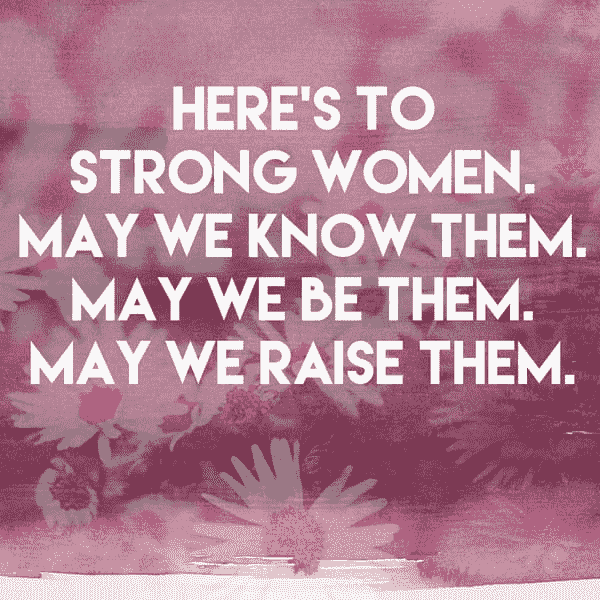
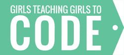
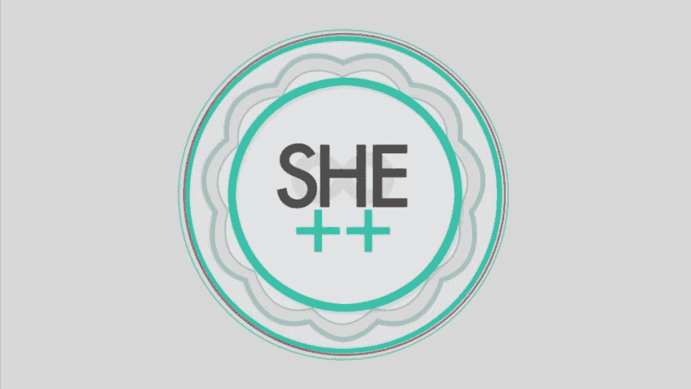
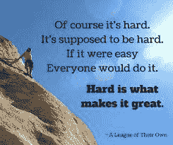

# 然而，利齐编码

> 原文：<https://dev.to/lizziepika/nevertheless-lizzie-siegle-coded--2gld>

[T2】](https://res.cloudinary.com/practicaldev/image/fetch/s--pWEK4z3T--/c_limit%2Cf_auto%2Cfl_progressive%2Cq_auto%2Cw_880/http://www3.pictures.livingly.com/mp/c9Ofo4SPZpvl.jpg)

## 我是如何进入编码的

2014 年 3 月的一天，我的 AP 微积分老师给我的一些同学讲了一个为期一天的全女生编码营。我勉强通过了他的课，所以我没有参与那次谈话(他可能认为我不感兴趣)，但我还是参加了，跳过了我的周末工作和一场田径比赛。我爱上了创造性编码和使用代码解决问题的想法。有关于密码学、拼图游戏、麻省理工学院 AppInventor、HTML 和 CSS、Scratch 等的研讨会。老实说，我不记得那天我学到了什么(我只知道我参加了 HTML 和 CSS 研讨会)，但我只知道我离开那天感觉很受鼓舞，好像我可以去编码了。作为一个从来不认为自己是 STEM 的人，看到这样一个多元化的大学生群体放弃一天的时间来指导和教授当地的高中女生，这是一种授权。这些导师打破了我对计算机程序员的所有刻板印象。
[T3】](https://res.cloudinary.com/practicaldev/image/fetch/s--qVuGHYHO--/c_limit%2Cf_auto%2Cfl_progressive%2Cq_auto%2Cw_880/http://web.stanford.edu/group/gtgimg/gtgtc_logo.png)

那次事件激发了我两年后组织的 She++代码日，以及在代码日一年后我帮助组织的 Spectra Hackathon。
[T3】](https://res.cloudinary.com/practicaldev/image/fetch/s--ZwEOdVDd--/c_limit%2Cf_auto%2Cfl_progressive%2Cq_auto%2Cw_880/https://i.vimeocdn.com/video/435519601.jpg%3Fmw%3D1000%26mh%3D563)

## 我最近克服了...

我的毕业论文遇到了一些麻烦，但现在它已经走到了一起！我以前从未使用过 Django，在移植我的代码时遇到了麻烦，但这只是花费了时间和一些新 API 的实现，让我的生活变得更容易。
[T3】](https://res.cloudinary.com/practicaldev/image/fetch/s--bfAFyQRt--/c_limit%2Cf_auto%2Cfl_progressive%2Cq_auto%2Cw_880/https://upload.wikimedia.org/wikipedia/commons/thumb/7/75/Django_logo.svg/1200px-Django_logo.svg.png)

## 我想吹嘘那些激励我的女人...

我很幸运在我的生活中有一些了不起的女人，她们不断地教导、激励、指导和赞助我。我经常谈论他们，因为我非常感谢[朋美·伊穆拉](https://twitter.com/girlie_mac)和[贝尔·道格拉斯](https://twitter.com/beardigsit)，他们忍受了我近两年的许多问题和生活更新，以及令人惊叹的 Twilio 开发人员网络女性[尼基塔](https://twitter.com/okSnickers)、[玛格丽特](https://twitter.com/dead_lugosi)、[珍](https://twitter.com/jennifermarie)、[凯利](https://twitter.com/kelleyrobinson)、[梅根](https://twitter.com/MeganSpeir)和[凯特](https://twitter.com/SatchKat)。

科技很奇怪，因为实习生被当作全职员工对待，我认为人们有时会忘记大学生仍然在思考很多问题，即使我们表现得不像。能够给比你领先几步的女性发信息并向她们倾诉是一种授权、鼓舞和培养。当冒名顶替综合症发作或我质疑自己时，我只会问:“某某人会怎么做？”然后我的信心迅速增长。

最近在我生日那天，我收到了两条消息，提到了一些我经常吹嘘的女性，因为她们经常鼓舞我，激励我。当他们说“我想成为我从来不知道的榜样或女人”时，这很奇怪，因为他们对我来说是惊人的榜样:我希望有一天我能为别人做同样的事情，就像这些人为我做的一样。

在我八年级的时候，罗杰·费德勒的一则广告告诉我，“一个受激励的人生激励着其他人。”
[T3】](https://res.cloudinary.com/practicaldev/image/fetch/s--xUhTmKh0--/c_limit%2Cf_auto%2Cfl_progressive%2Cq_auto%2Cw_880/http://www.abc.net.au/news/image/9305752-3x2-940x627.jpg)

当我意识到我就要毕业时，我试着少说些风凉话，但当我看到这些女人所做的一切时，我很难不这么做。

## 我对支持女性和非二进制代码的盟友的建议是....

对不舒服的感觉感到舒服。“当然很难。应该很难。如果不是很难，大家都会去做。困难才是伟大的原因。”

[T2】](https://res.cloudinary.com/practicaldev/image/fetch/s--99121G06--/c_limit%2Cf_auto%2Cfl_progressive%2Cq_auto%2Cw_880/https://encrypted-tbn0.gstatic.com/images%3Fq%3Dtbn:ANd9GcQm31T9uiVvfXGvhaG0wgvgxh7XCFVmOI7GnsNzHEZTi4V9_P5T)