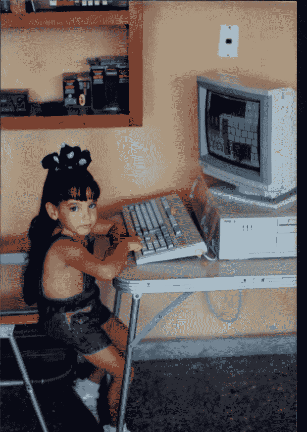

# 然而，莫尼卡编码，现在仍然如此

> 原文：<https://dev.to/monikmayo91/nevertheless-mnica-coded-and-still-does--2bd9>

## 我开始编码是因为...

自从我有记忆以来，我喜欢电脑。我家的第一台笔记本电脑安装了 Windows 3.8，屏幕是黑白的。但这对我来说无关紧要，能够使用它让我着迷。即使不知道如何阅读，我也学会了如何打开我喜欢的程序。在我成长的过程中，我父亲经常从他的工作中借用计算机，有一次他给我做了一个小程序，给我一些简单的方程式来学习数学。当我高中毕业时，很明显我想学习计算机科学，并开始在理工学院学习。当我从那里毕业时，我进入了计算机科学大学，对此我很自豪，因为这五年我学到了我所能学到的一切。我在一家软件公司做了三年多的开发人员，从一开始，我就必须面对新技术，进行大量的学习，并接受专业培训。自从我第一次看到如何自己编写程序，我就爱上了它。

## 我想吹嘘一下...

最近，我想用 python 写一个情人节脚本给我的男朋友一个惊喜，因为我对 pyhton 一无所知，所以在很短的时间内我就学会了基本的技巧。

## 我对支持女性和非二进制代码的盟友的建议是....

到达某个地方的第一步是决定你不会停留在你现在的地方