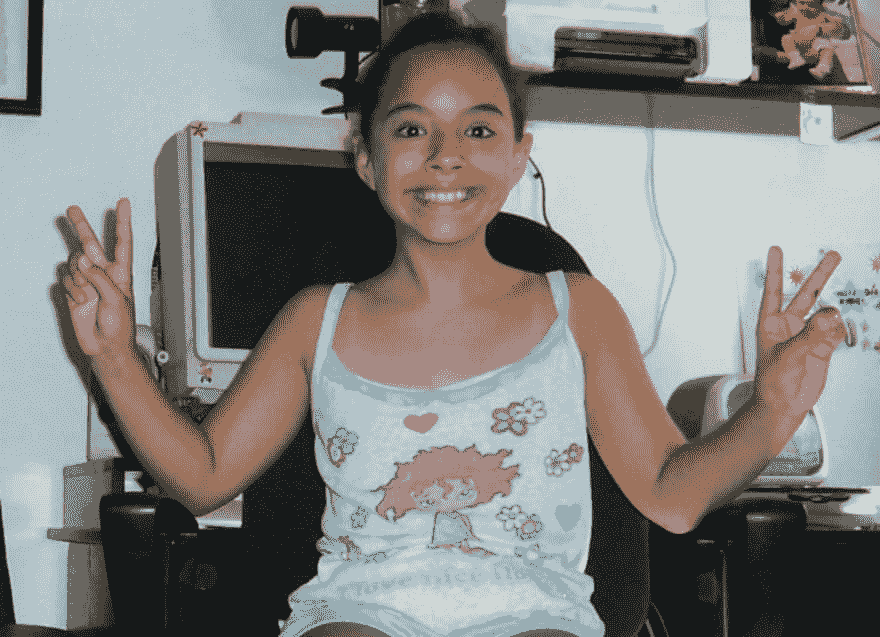

# 尽管如此，宝拉编码

> 原文：<https://dev.to/terceranexus6/nevertheless-paula-coded--15b1>

## 我开始/继续编码是因为...

自从我是一个蹒跚学步的孩子，我就一直使用电脑。我对科学感兴趣是因为我爸爸给我看了宇宙剧集，我喜欢力学。虽然，我是上了中学才知道计算机工程的，是偶然在网上发现的。我仍然记得我变得如此兴奋，并开始寻找越来越多的相关信息，自学 python 编程，在攻读学士学位时非常努力地学习，以获得允许我学习计算机工程的分数。从那时起，作为一名计算机工程专业的大四学生，我一直在编写代码和学习新的语言，因为这让我感到兴奋，就像当年我发现我可以编写程序和硬件一样。

[T2】](https://res.cloudinary.com/practicaldev/image/fetch/s--3wFShPEI--/c_limit%2Cf_auto%2Cfl_progressive%2Cq_auto%2Cw_880/https://thepracticaldev.s3.amazonaws.com/i/6mvxnsscq7zexjrq9fi6.jpg)

## 我最近克服了...

一些新专业的高年级科目。当我第一次被邀请选择计算机科学专业时，我选择了硬件和电子，我真的很喜欢它，但我想获得更广阔的视野，所以今年我也选择了不同专业(信息系统)的一些科目，其中包括一些对我来说新的东西，如云计算、应用程序开发和系统安全。我一下子就通过了，我对探索新的领域感到非常兴奋。

## 我想吹嘘一下...

干扰组织和黑客组织。Interferencias 是我在 2016 年成立的一个数字权利意识协会，在我的国家引起了广泛关注，目前有 500 多名成员。我感到高兴的是，许多人对数字权利感兴趣，并希望保护我们的隐私。HACKIIT 是我大学里的一个黑客组织，我被指派为一群热衷于网络和取证黑客的学生的导师。这让我可以继续研究、学习和分享计算机科学中我最喜欢的东西:安全性。

[T2】](https://res.cloudinary.com/practicaldev/image/fetch/s--w2DKadwH--/c_limit%2Cf_auto%2Cfl_progressive%2Cq_auto%2Cw_880/https://thepracticaldev.s3.amazonaws.com/i/ceh9ezsll03l5njc93s7.jpg)

## 我给盟友的建议是支持女性主义者的守则....

我们不是“女程序员”，我们是**程序员**。工程师。平等对待我们，并做出相应的反应。我的同学和朋友，在 Interferencias 和 HACKIIT 的家伙，他们都相信我的话和我的代码，因为我已经证明它是值得信赖的，这给了我翅膀，以改善每个人和每天舒适地平等。如果你身边有人妥协了这种平等，请不要管住你的嘴！

[T2】](https://res.cloudinary.com/practicaldev/image/fetch/s--OG1pZlR1--/c_limit%2Cf_auto%2Cfl_progressive%2Cq_auto%2Cw_880/https://thepracticaldev.s3.amazonaws.com/i/uezstg86ekho8o1ybunj.jpg)