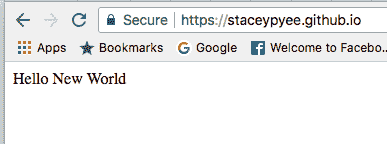
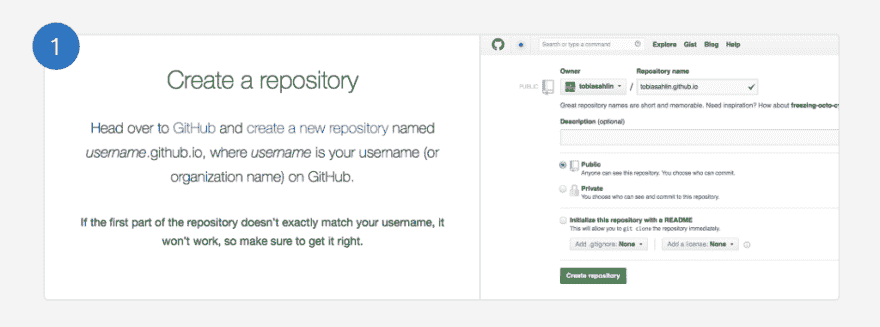
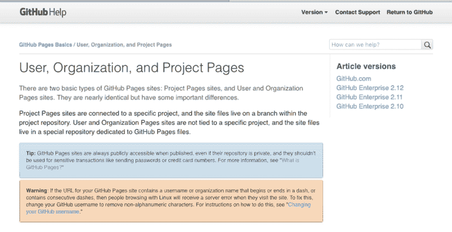
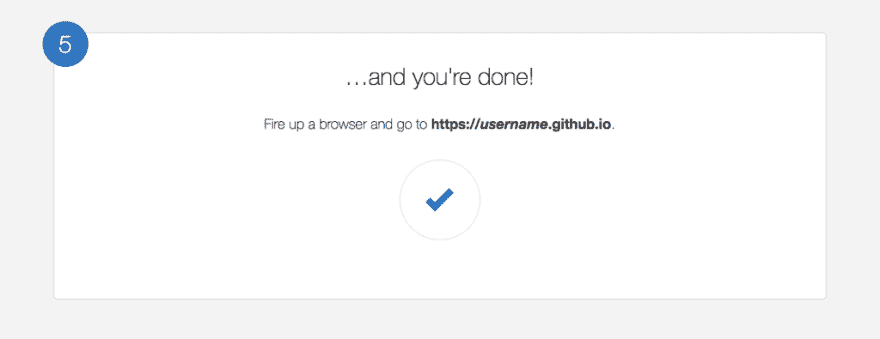
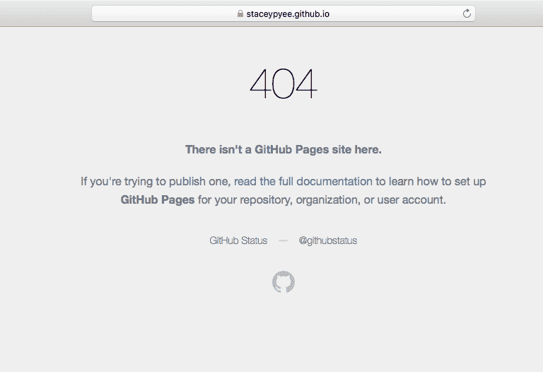
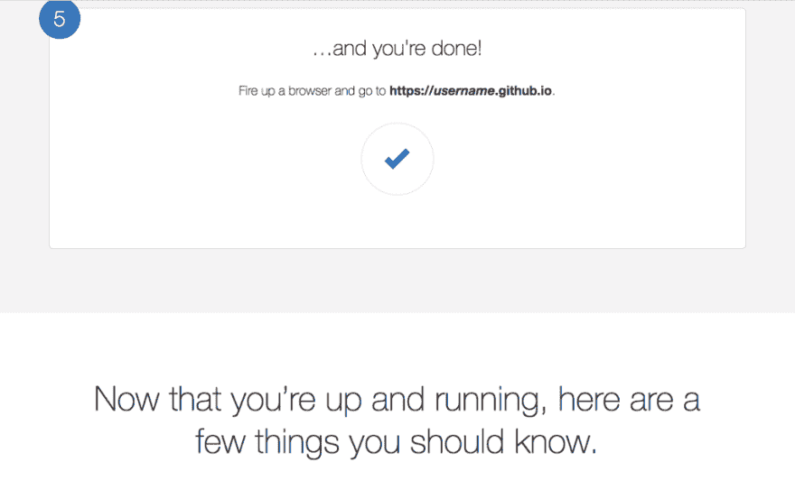
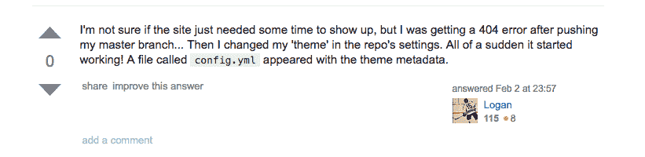
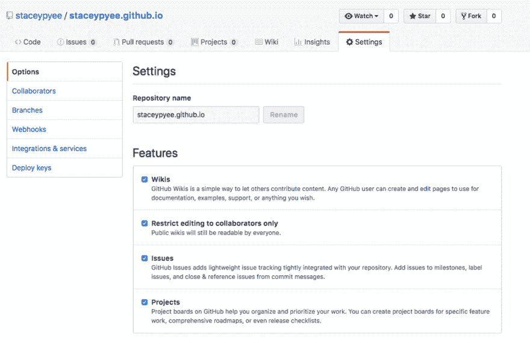
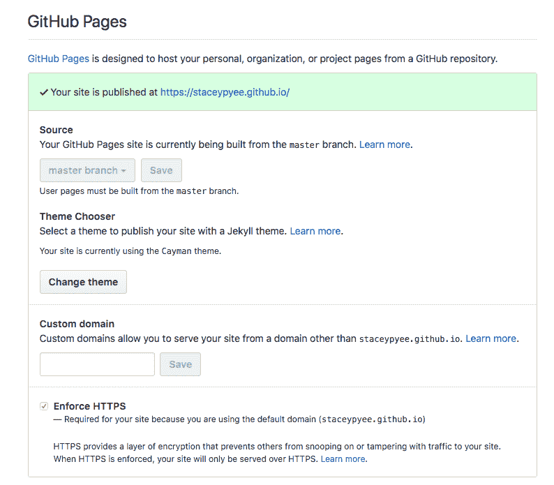
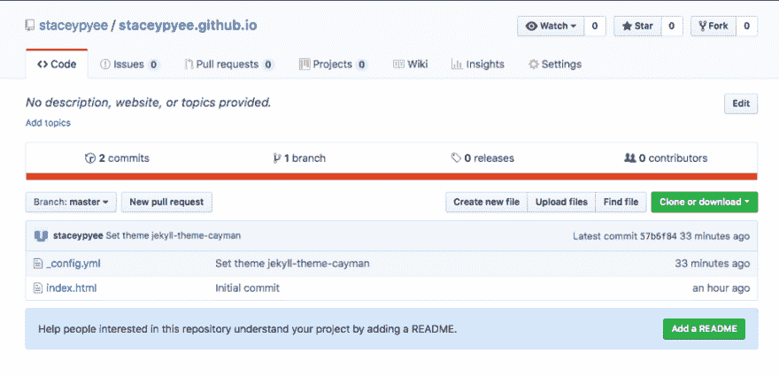

# GitHub 页面的新尝试！

> 原文：<https://dev.to/staceypyee/new-attempt-on-github-pages--6go>

生活就是冒险和探索！

JENG JENG~

[T2】](https://res.cloudinary.com/practicaldev/image/fetch/s--fOInFpft--/c_limit%2Cf_auto%2Cfl_progressive%2Cq_auto%2Cw_880/https://cdn-images-1.medium.com/max/387/1%2AYKUkn4pXb2NmVAFHS5mtQw.png)

### 我做了什么？

像往常一样，注册一个帐户，并验证您的电子邮件。

接下来，一步一步地遵循这个步骤

github pages

#### ***第一步:按照指定的命名格式创建一个存储库。***

<figure> 

<figcaption>来自 Github 页面的步骤 1。</figcaption>

</figure>

<figure> 

<figcaption>警告:请务必用破折号更改您的用户名或组织名！</figcaption>

</figure>

如果您需要更改名称，请访问[https://help . github . com/articles/changing-your-github-username/](https://help.github.com/articles/changing-your-github-username/)

#### ***步骤 2 — 4:按照***中的步骤 2—4 进行。

***克隆你的存储库，用你熟悉的 Git 客户端创建并推送你的初始页面内容。我用了 GitX。*T3】**

### **好吧！第五步！屏住呼吸！**

<figure> 

<figcaption>注意:将路径改为您设置的用户名。对于我来说，[https://syaceypeye . github . io](https://syaceypyee.github.io)</figcaption>

</figure>

### 3…2…1! Tada!

[T2】](https://res.cloudinary.com/practicaldev/image/fetch/s--E7IernCT--/c_limit%2Cf_auto%2Cfl_progressive%2Cq_auto%2Cw_880/https://cdn-images-1.medium.com/max/768/1%2AxUVT5xRA4nNXvC0IzaAIhQ.png)

ORZ…

[orz](http://knowyourmeme.com/memes/orz)

### 哦不！！哪里出了问题？！！

<figure> 

<figcaption>没有更多的线索</figcaption>

</figure>

我在网上搜索了一下，发现

[我的新 Github 页面没有显示](https://stackoverflow.com/questions/20895543/my-new-github-page-isnt-showing-up)

基本上可以忽略评论，直到最后一条！

[T2】](https://res.cloudinary.com/practicaldev/image/fetch/s--mc2aETat--/c_limit%2Cf_auto%2Cfl_progressive%2Cq_auto%2Cw_880/https://cdn-images-1.medium.com/max/821/1%2AmZ4rId8nxhqtSJ-spH60rw.png)

**_config.yml 是关键！**

### 一步克服！

所以我回到我的回购和去设置

[T2】](https://res.cloudinary.com/practicaldev/image/fetch/s--H1YJrXtR--/c_limit%2Cf_auto%2Cfl_progressive%2Cq_auto%2Cw_880/https://cdn-images-1.medium.com/max/1024/1%2ANCx6wcGum8AL1aft6r7x2w.png)

**继续向下滚动，直到到达“GitHub Pages”会话，选择一个主题！**

[T2】](https://res.cloudinary.com/practicaldev/image/fetch/s--suC1j-j9--/c_limit%2Cf_auto%2Cfl_progressive%2Cq_auto%2Cw_880/https://cdn-images-1.medium.com/max/794/1%2A-mSGGXNVIS9KrfU1IGnNTw.png)

如今，现在

### 3…2…1…

[T2】](https://res.cloudinary.com/practicaldev/image/fetch/s--fOInFpft--/c_limit%2Cf_auto%2Cfl_progressive%2Cq_auto%2Cw_880/https://cdn-images-1.medium.com/max/387/1%2AYKUkn4pXb2NmVAFHS5mtQw.png)

你最终会在你的 repo 里面找到… _config.yml！

<figure> 

<figcaption>这里是我们的朋友！</figcaption>

</figure>

我曾经把 Blogger.com 作为我学习 HTML 的试验场。

这次尝试的目的是为我建立一个地方来记下我的学习进度。是啊，我们需要记录和分享~

***不要埋葬你过去的经历。*T3】**

让我们看看我们能做些什么。请分享您的见解，更好的选择或分享渠道，如果你有任何。:)

探索愉快！

资源:Github，堆栈溢出