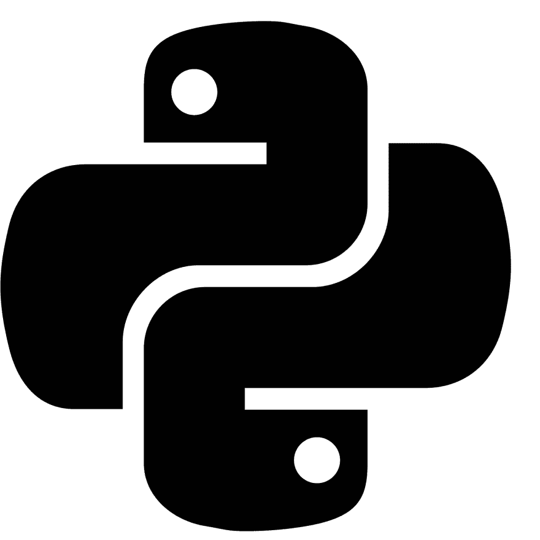

# 学习 Python 的新平台和备忘单

> 原文：<https://dev.to/trekhleb/new-playground-and-cheatsheet-for-learning-python-1k8p>

我正在学习 Python，我决定创建一个存储库，在那里我可以放置 Python 脚本示例和标准的 Python 语法、结构和语句示例，以便能够快速概括如何使用该语言的这个或那个特性。

下面是我得到的消息。

[T2】](https://res.cloudinary.com/practicaldev/image/fetch/s--RsD82-n_--/c_limit%2Cf_auto%2Cfl_progressive%2Cq_auto%2Cw_880/https://thepracticaldev.s3.amazonaws.com/i/nk24kmc3h8037c2k8a74.png)

这是一个由[主题](https://github.com/trekhleb/learn-python#table-of-contents)分割的[Python 脚本](https://github.com/trekhleb/learn-python)的集合，包含
代码示例以及解释、不同的用例以及进一步阅读的链接。

这是一个**游乐场**,因为你可以改变或添加代码来看看它是如何工作的，并且[使用断言来测试它](https://github.com/trekhleb/learn-python#testing-the-code)。它还允许你 [lint 你写的代码](https://github.com/trekhleb/learn-python#linting-the-code)，检查它是否符合 Python 代码风格指南。总的来说，它可能会使你的学习过程更具互动性，而且它可能会帮助你从一开始就保持相当高的代码质量。

这是一张**备忘单**，因为一旦你想重述[标准 Python 语句和结构](https://github.com/trekhleb/learn-python#table-of-contents)的语法，你可能会回到这些代码示例。还因为代码中充满了断言，所以您不用启动它们就能马上看到预期的函数/语句输出。

## 如何使用回购

存储库中的每个 Python 脚本具有以下结构:

```
"""Lists  <--- Name of the topic here

# @see: https://www.learnpython.org/en/Lists  <-- Link to further readings goes here

Here might go more detailed explanation of the current topic (i.e. general info about Lists).
"""

def test_list_type():
    """Explanation of sub-topic goes here.

    Each file contains test functions that illustrate sub-topics (i.e. lists type, lists methods).
    """

    # Here is an example of how to build a list.  <-- Comments here explain the action
    squares = [1, 4, 9, 16, 25]

    # Lists can be indexed and sliced. 
    # Indexing returns the item.
    assert squares[0] == 1  # <-- Assertions here illustrate the result.
    # Slicing returns a new list.
    assert squares[-3:] == [9, 16, 25]  # <-- Assertions here illustrate the result. 
```

Enter fullscreen mode Exit fullscreen mode

因此，通常情况下，您可能需要执行以下操作:

*   [找到你想要学习或回顾的话题](https://github.com/trekhleb/learn-python#table-of-contents)。
*   阅读每个脚本的 docstring 中链接的注释和/或文档(如上例所示)。
*   查看代码示例和断言，了解使用示例和预期输出。
*   更改代码或添加新的断言，看看事情是如何工作的。
*   [运行测试](https://github.com/trekhleb/learn-python#testing-the-code)和 [lint 代码](https://github.com/trekhleb/learn-python#linting-the-code)看看它是否工作和被正确编写。

## 目录

1.  **入门**
    *   [Python 是什么](https://github.com/trekhleb/learn-python/blob/master/src/getting_started/what_is_python.md)
    *   [Python 语法](https://github.com/trekhleb/learn-python/blob/master/src/getting_started/python_syntax.md)
    *   [变量](https://github.com/trekhleb/learn-python/blob/master/src/getting_started/test_variables.py)
2.  **操作员**
    *   [算术运算符](https://github.com/trekhleb/learn-python/blob/master/src/operators/test_arithmetic.py) ( `+`、`-`、`*`、`/`、`//`、`%`、`**`)
    *   [按位运算符](https://github.com/trekhleb/learn-python/blob/master/src/operators/test_bitwise.py) ( `&`、`|`、`^`、`>>`、`<<`、`~`)
    *   [赋值操作符](https://github.com/trekhleb/learn-python/blob/master/src/operators/test_assigment.py) ( `=`、`+=`、`-=`、`/=`、`//=`等。)
    *   [比较运算符](https://github.com/trekhleb/learn-python/blob/master/src/operators/test_comparison.py) ( `==`、`!=`、`>`、`<`、`>=`、`<=`)
    *   [逻辑运算符](https://github.com/trekhleb/learn-python/blob/master/src/operators/test_logical.py) ( `and`、`or`、`not`)
    *   [身份符](https://github.com/trekhleb/learn-python/blob/master/src/operators/test_identity.py) ( `is`，`is not`)
    *   [会员操作人员](https://github.com/trekhleb/learn-python/blob/master/src/operators/test_membership.py) ( `in`，`not in`)
3.  **数据类型**
    *   [数字](https://github.com/trekhleb/learn-python/blob/master/src/data_types/test_numbers.py)(包括布尔值)
    *   [字符串](https://github.com/trekhleb/learn-python/blob/master/src/data_types/test_strings.py)及其方法
    *   [列表](https://github.com/trekhleb/learn-python/blob/master/src/data_types/test_lists.py)及其方法(包括列表理解)
    *   [元组](https://github.com/trekhleb/learn-python/blob/master/src/data_types/test_tuples.py)
    *   [集合](https://github.com/trekhleb/learn-python/blob/master/src/data_types/test_sets.py)及其方法
    *   [字典](https://github.com/trekhleb/learn-python/blob/master/src/data_types/test_dictionaries.py)
    *   [铸造类型](https://github.com/trekhleb/learn-python/blob/master/src/data_types/test_type_casting.py)
4.  **控制流程**
    *   [`if`声明](https://github.com/trekhleb/learn-python/blob/master/src/control_flow/test_if.py)
    *   [`for`语句](https://github.com/trekhleb/learn-python/blob/master/src/control_flow/test_for.py)(和`range()`功能)
    *   [`while`声明](https://github.com/trekhleb/learn-python/blob/master/src/control_flow/test_while.py)
    *   [`try`报表](https://github.com/trekhleb/learn-python/blob/master/src/control_flow/test_try.py)
    *   [`break`声明](https://github.com/trekhleb/learn-python/blob/master/src/control_flow/test_break.py)
    *   [`continue`声明](https://github.com/trekhleb/learn-python/blob/master/src/control_flow/test_break.py)
5.  **功能**
    *   [功能定义](https://github.com/trekhleb/learn-python/blob/master/src/functions/test_function_definition.py) ( `def`和`return`语句)
    *   [默认参数值](https://github.com/trekhleb/learn-python/blob/master/src/functions/test_function_default_arguments.py)
    *   [关键字参数](https://github.com/trekhleb/learn-python/blob/master/src/functions/test_function_keyword_arguments.py)
    *   [任意参数列表](https://github.com/trekhleb/learn-python/blob/master/src/functions/test_function_arbitrary_arguments.py)
    *   [拆包参数列表](https://github.com/trekhleb/learn-python/blob/master/src/functions/test_function_unpacking_arguments.py) ( `*`和`**`语句)
    *   [λ表达式](https://github.com/trekhleb/learn-python/blob/master/src/functions/test_lambda_expressions.py) ( `lambda`语句)
    *   [文档字符串](https://github.com/trekhleb/learn-python/blob/master/src/functions/test_function_documentation_string.py)
    *   [功能注释](https://github.com/trekhleb/learn-python/blob/master/src/functions/test_function_annotations.py)
6.  **类**
    *   [类定义](https://github.com/trekhleb/learn-python/blob/master/src/classes/test_class_definition.py) ( `class`语句)
    *   [类对象](https://github.com/trekhleb/learn-python/blob/master/src/classes/test_class_objects.py)
    *   [实例对象](https://github.com/trekhleb/learn-python/blob/master/src/classes/test_instance_objects.py)
    *   [方法对象](https://github.com/trekhleb/learn-python/blob/master/src/classes/test_method_objects.py)
    *   [类和实例变量](https://github.com/trekhleb/learn-python/blob/master/src/classes/test_class_and_instance_variables.py)
    *   [继承](https://github.com/trekhleb/learn-python/blob/master/src/classes/test_inheritance.py)
    *   [多重继承](https://github.com/trekhleb/learn-python/blob/master/src/classes/test_multiple_inheritance.py)
7.  **模块**
    *   [模块](https://github.com/trekhleb/learn-python/blob/master/src/modules/test_modules.py) ( `import`语句)
    *   [套餐](https://github.com/trekhleb/learn-python/blob/master/src/modules/test_packages.py)
8.  **错误和异常**
    *   [处理异常](https://github.com/trekhleb/learn-python/blob/master/src/exceptions/test_handle_exceptions.py) ( `try`语句)
    *   [提出异常](https://github.com/trekhleb/learn-python/blob/master/src/exceptions/test_raise_exceptions.py) ( `raise`语句)
9.  **文件**
    *   [读写](https://github.com/trekhleb/learn-python/blob/master/src/files/test_file_reading.py) ( `with`声明)
    *   [文件对象的方法](https://github.com/trekhleb/learn-python/blob/master/src/files/test_file_methdos.py)
10.  **新增内容**
    *   [`pass`声明](https://github.com/trekhleb/learn-python/blob/master/src/additions/test_pass.py)
    *   [发电机](https://github.com/trekhleb/learn-python/blob/master/src/additions/test_generators.py) ( `yield`语句)
11.  **标准图书馆简介**
    *   [连载](https://github.com/trekhleb/learn-python/blob/master/src/standard_libraries/test_json.py) ( `json`库)
    *   [文件通配符](https://github.com/trekhleb/learn-python/blob/master/src/standard_libraries/test_glob.py) ( `glob`库)
    *   [字符串模式匹配](https://github.com/trekhleb/learn-python/blob/master/src/standard_libraries/test_re.py) ( `re`库)
    *   [数学](https://github.com/trekhleb/learn-python/blob/master/src/standard_libraries/test_math.py) ( `math`、`random`、`statistics`图书馆)
    *   [日期和时间](https://github.com/trekhleb/learn-python/blob/master/src/standard_libraries/test_datetime.py) ( `datetime`库)
    *   [数据压缩](https://github.com/trekhleb/learn-python/blob/master/src/standard_libraries/test_zlib.py) ( `zlib`库)

> 我希望这个库对您有所帮助！