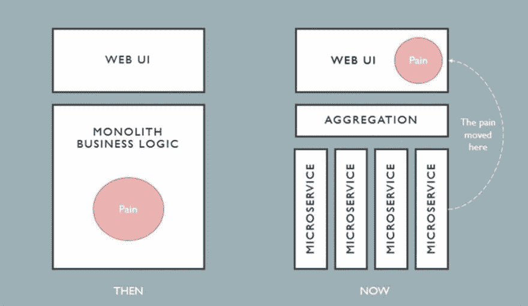
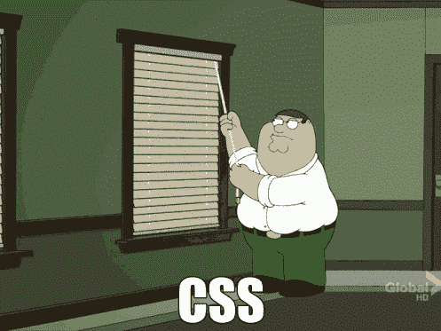

# web 开发中职位分离的下一阶段

> 原文：<https://dev.to/vlasterx/next-phase-of-separation-of-job-titles-in-web-development-3aff>

我从来不喜欢做后端编程。

对我来说，这是达到目的的手段，一些更有逻辑的人喜欢解决的事情，以帮助我们的应用程序做他们应该做的。“痛苦”就存在于此:)前端和后端开发的分离非常明显——前端更有创造性，而后端更有逻辑性。

[T2】](https://res.cloudinary.com/practicaldev/image/fetch/s--yAGyfF-_--/c_limit%2Cf_auto%2Cfl_progressive%2Cq_auto%2Cw_880/https://thepracticaldev.s3.amazonaws.com/i/uhogo2eds46pct0xv1rv.png)

如今人们谈论前端时遇到的问题来自上图中的这个概念——大多数 web 应用程序逻辑与后端分离，并被转移到前端单页面应用程序和框架，如 React、Vue 或 Angular。今天，一些后端开发人员转移到了前端，而其他人则留下来创建微服务。

理解以下内容很重要——虽然“痛苦”(从我的角度来看)转移到了前端，但并不是所有的前端都是这样。创意前端仍然存在，它对于现代网络应用程序仍然至关重要，我们需要明确区分这两种前端职业:

1)“创意”前端专注于设计、模板和大部分 CSS 脚本，JavaScript 用于动画和视觉交互。2018 年合适的名字。会是“前端设计师”。

2)“逻辑”前端，位于创意前端和后端之间。路由、状态管理和大多数应用程序逻辑现在都通过 JavaScript 解决了。这个职业合适的名字应该是“JavaScript 开发人员/工程师”

我相信，来自这两个群体中任何一方的专业人士都不喜欢做另一方的工作。只要想想那些 JS 开发人员，当他们需要用高级 CSS 做任何事情时，他们都很痛苦。

[T2】](https://res.cloudinary.com/practicaldev/image/fetch/s--vWU9YHOO--/c_limit%2Cf_auto%2Cfl_progressive%2Cq_66%2Cw_880/https://thepracticaldev.s3.amazonaws.com/i/vg20e2d8j0yi3xfqjzf5.gif)

2018 年。这种区别将变得更加明显。

这种分离可能会让一些人感到震惊，但作为一名网页设计师，我经历了所有这些。我已经看到网页设计被分为 UX，用户界面和前端，这只是下一个阶段。

你同意还是不同意？