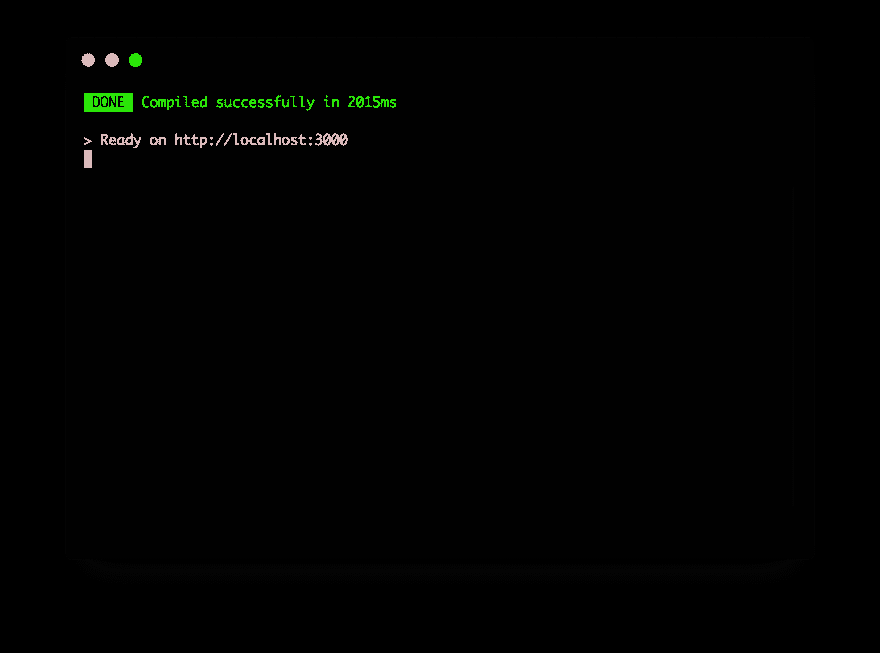

# Next.js +样式化组件真正简单的指南▲ +💅

> 原文：<https://dev.to/aprietof/nextjs--styled-components-the-really-simple-guide----101c>

我最近开始使用 [Next.js](https://nextjs.org/) ，老实说，我不得不说，这是一个很棒的工具，你可以从盒子里得到很多东西，虽然有些东西我不太同意，但总体来说，它使创建静态和服务器渲染的应用程序变得非常简单。

接下来捆绑了 [styled-jsx](https://github.com/zeit/styled-jsx) ，这是一个完整的、有作用域的、组件友好的 CSS 支持 jsx(呈现在服务器或客户端上)，虽然这很棒，但我宁愿使用样式化的组件，这只是我的偏好。

本指南介绍了如何使用不同于 [styled-jsx](https://github.com/zeit/styled-jsx) 的样式解决方案，它也支持通用样式。这意味着我们可以在 HTML 中为第一次呈现提供所需的样式，然后在客户端加载其余的样式。

Next.js 有一个已经带有样式化组件的[示例 repo](https://github.com/zeit/next.js/tree/canary/examples/with-styled-components) ,但是你需要克隆它，然后试着理解在幕后发生了什么，我决定制作这个快速而又非常简单的指南，演示如何让样式化组件与 next.js 一起工作。

我们开始吧！

## 1。创建项目目录并安装 next 和 react 依赖项

```
mkdir my-next-app && cd my-next-app && yarn add next react react-dom 
```

> Next.js 只支持 [React 16](https://reactjs.org/blog/2017/09/26/react-v16.0.html) 。
> 由于 React 16 的工作方式和我们使用它的方式，我们不得不放弃 React 15 支持。
> 
> *   [Next.org](https://nextjs.org/)

## 2。将脚本添加到您的`package.json`

```
{
  "scripts": {
    "dev": "next",
    "build": "next build",
    "start": "next start"
  },
  "dependencies": {
    "next": "^...",
    "react": "^...",
    "react-dom": "^..."
  }
} 
```

之后，文件系统是主要的 API。每一个`.js`文件都变成了自动处理和渲染的路径。

## 3。创建一个/pages 目录和你的第一页。

从您的项目根目录:

```
mkdir pages && touch pages/index.js 
```

填充`./pages/index.js`:

```
export default () => (
   <div>
       <h1>My First Next.js Page</h1>
   </div>
) 
```

然后只需运行`yarn dev`并转到`http://localhost:3000`。

[T2】](https://res.cloudinary.com/practicaldev/image/fetch/s--J6Po-7h9--/c_limit%2Cf_auto%2Cfl_progressive%2Cq_auto%2Cw_880/https://www.adrianprieto.com/wp-content/uploads/2018/06/run.png)

到目前为止，我们得到:

*   自动传输和捆绑(使用 webpack 和 babel)
*   热代码重载
*   `./pages`的服务器渲染和索引

## 4。添加样式组件

```
yarn add styled-components 
```

现在让我们来编辑`./pages/index.js`:

```
import styled from 'styled-components';

export default () => (
  <div>
    My First Next.js Page
  </div>
);

const Title = styled.h1`
  color: red;
`; 
```

如果你重新加载页面，你会得到一个错误，这是因为我们还没有设置正确的配置，不要担心，我们正在做下一步。

## 5。添加 babel 插件和自定义`.bablerc`文件

首先，让我们将样式化组件 babel 插件作为开发依赖项进行安装:

```
yarn add -D babel-plugin-styled-components 
```

然后在项目的根目录下创建一个`.babelrc`文件。

```
touch .babelrc 
```

*   添加一个通天塔/预设
*   添加一个样式组件插件，将`ssr`标志设置为`true`，将`displayName`设置为`true`，将`preprocess`设置为 false。

最终的`.babelrc`文件应该是这样的:

```
{
  "presets": [
    "next/babel"
  ],
  "plugins": [
    [
      "styled-components",
      {
        "ssr": true,
        "displayName": true,
        "preprocess": false
      }
    ]
  ]
} 
```

**注意:** `displayName`将生成更容易调试的类名(还将包含组件名，而不仅仅是散列)；`preprocess`–实验功能明确关闭。

## ⑥。创建自定义的`_document.js`文件

如果你以前使用过`create-react-app`，你习惯于知道你的主文档在哪里，嗯，next.js 不公开这个文件，但是你可以通过在你的 pages 文件夹中添加一个`_document.js`文件来覆盖默认文档。

```
touch pages/_document.js 
```

我们将扩展`<Document />`并将服务器端渲染的样式注入到`<head>`中。

> 要覆盖默认行为，您必须在`./pages/_document.js`处创建一个文件，您可以在其中扩展 Document 类。https://github.com/zeit/next.js/#custom-document
> T2

如果我们只渲染页面而不渲染其他内容，这就是自定义`_document.js`的样子:

```
import Document, { Head, Main, NextScript } from 'next/document'

export default class MyDocument extends Document {
  static getInitialProps ({ renderPage }) {
    // Returns an object like: { html, head, errorHtml, chunks, styles } 
    return renderPage();
  }

  render () {    
    return (
      <html>
        <Head>
          My page
        </Head>
        <body>
          <Main />
          <NextScript />
        </body>
      </html>
    )
  }
} 
```

这是我们添加 SSR 风格的组件后的样子。

```
import Document, { Head, Main, NextScript } from 'next/document';
// Import styled components ServerStyleSheet
import { ServerStyleSheet } from 'styled-components';

export default class MyDocument extends Document {
  static getInitialProps({ renderPage }) {
    // Step 1: Create an instance of ServerStyleSheet
    const sheet = new ServerStyleSheet();

    // Step 2: Retrieve styles from components in the page
    const page = renderPage((App) => (props) =>
      sheet.collectStyles(<App {...props} />),
    );

    // Step 3: Extract the styles as <style> tags
    const styleTags = sheet.getStyleElement();

    // Step 4: Pass styleTags as a prop
    return { ...page, styleTags };
  }

  render() {
    return (
      <html>
        <Head>
          My page
          {/* Step 5: Output the styles in the head  */}
          {this.props.styleTags}
        </Head>
        <body>
          <Main />
          <NextScript />
        </body>
      </html>
    );
  }
} 
```

一旦完成，重启你的服务器，错误应该消失，你的`<h1>`标签应该是红色的，SSR 风格的组件应该工作。

就是这样，概括一下:

1.  创建项目并安装依赖项
2.  添加脚本
3.  创建一个页面文件夹和第一页
4.  添加样式组件
5.  添加一个 babel 插件和一个定制的`.babelrc`文件
6.  创建一个定制的`_document.js`文件

正如您所看到的，如果您已经有了一个现有的 next.js 项目，那么您只需要实现步骤 4 到 6。

还有一种方法可以在 next.js 中使用普通的`.css`文件，我将很快写一个关于如何设置它的指南。

## 资源

*   [Next.js 文档](https://nextjs.org/docs/#setup)
*   [JavaScript 漫谈](https://jsramblings.com)

*这个帖子最初于 2018 年 6 月 26 日发布在我的[网站](https://www.adrianprieto.com/next-js-styled-components-the-really-simple-guide-%E2%96%B2-%F0%9F%92%85/)上。*