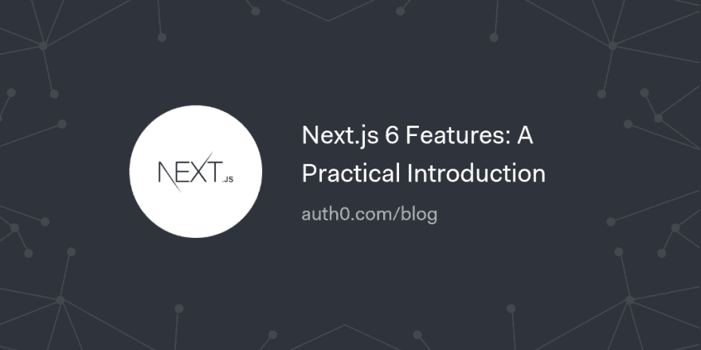

# Next.js 6 特性:实用介绍

> 原文：<https://dev.to/auth0/nextjs-6-features-a-practical-introduction-4j70>

Next.js 是一个用于静态和服务器呈现应用程序的轻量级框架，在构建通用 JavaScript 应用程序方面很受欢迎。在本文中，我们将介绍 Next.js 6 的特性。

[继续阅读▲](https://auth0.com/blog/nextjs-6-features-introduction/?utm_source=dev&utm_medium=sc&utm_campaign=nextjs6_intro)

[T2】](https://res.cloudinary.com/practicaldev/image/fetch/s--5z3NcKXJ--/c_limit%2Cf_auto%2Cfl_progressive%2Cq_auto%2Cw_880/https://thepracticaldev.s3.amazonaws.com/i/rve7em8n0r3vrfrrfsp1.png)