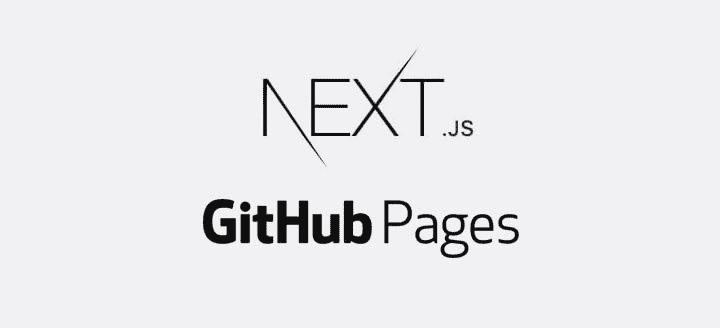

# Github 页面上的 Next.js 应用

> 原文：<https://dev.to/saitonakamura/nextjs-app-on-github-pages--541f>

[T2】](https://res.cloudinary.com/practicaldev/image/fetch/s--m68ssGfQ--/c_limit%2Cf_auto%2Cfl_progressive%2Cq_auto%2Cw_880/https://cdn-images-1.medium.com/max/800/1%2ANZ7KxwBB1NSuVsJP4FeMnQ.jpeg)

> 这是我的媒体的一篇文章

最近，我决定最终创建我的主页。对于这个任务，我决定使用 Next.js，它的静态导出功能令人惊叹。毫不犹豫地，我也决定使用 github 页面，因为我将 github。我当时想:“这应该简单明了，只需将应用程序导出到`docs`文件夹(带有`next build`和`next export -o docs`)中，就大功告成了”。那些已经在咯咯笑的人，其实是对的，因为原来不是小菜一碟。

首先我们有[这个指南](https://github.com/zeit/next.js/wiki/Deploying-a-Next.js-app-into-GitHub-Pages)(它实际上错过了一些重要的信息，这是我添加的，但最好继续阅读帖子)。第一个重要的部分是`.nojekyll`文件，因为 Jekyll 忽略文件夹，它以下划线开始，我们有`_next`。所以你应该在 docs 文件夹中添加一个名为`.nojekyll`的空文件。别担心，不会在`next export`时被删除。你也可以选择使用`gh-pages`分支(有一个很酷的 git 特性叫做 subtree，参见这里的)。所以应该没问题吧？…

[T2】](https://res.cloudinary.com/practicaldev/image/fetch/s--ZTpA_jbx--/c_limit%2Cf_auto%2Cfl_progressive%2Cq_auto%2Cw_880/https://cdn-images-1.medium.com/max/800/1%2Aw0IMUgxXUqA-Nutq6VLU2g.jpeg)

# 第一个问题

如果不是您的个人或组织页面，您的 github 页面将在`http://{username}.github.io/{reponame}`下发布。这意味着默认情况下，到脚本的链接将被断开。但是不用担心，`next.js`有一个选项可以修复它，它叫做`assetPrefix`。问题是你不想为本地开发清除`assetPrefix`，所以最好依靠`process.env.NODE_ENV`，或者任何你用来区分 dev 和 prod 的东西。